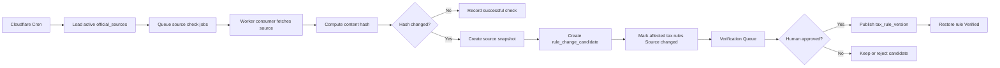

# DueDateHQ Beta Technical Plan

## Architecture

DueDateHQ uses the existing Better-T-Stack structure:

- Frontend: React, TanStack Router, Tailwind CSS, shared shadcn/ui package.
- API: Hono, tRPC.
- Database: Cloudflare D1 with Drizzle.
- Runtime: Cloudflare Workers.
- Deployment: Cloudflare through Alchemy.
- Auth: Better Auth, email/password only for Beta.

The technical goal is to implement a real Beta product while preserving a strict distinction between verified official rules, user-provided deadlines, and unverified obligations.

Technical parity target: implement the useful File In Time workflow baseline as a cloud product, not as a desktop clone. The system should support client setup, source-specific CSV import preview/mapping/review/duplicate handling, obligation-driven task generation, Monday triage, filters/sorting, task status, extension/date-change handling, verified recurrence/upcoming tasks, dashboard/task exports, in-product urgency surfaces, and light bulk operations. It should deliberately omit local database administration, backup/restore UI, Crystal Reports-style reporting, mail merge/labels, extension form printing, arbitrary field renaming, network-user maintenance, detailed rights matrices, client portal, document upload/checklist automation, e-signature, direct end-client notifications, and external email/SMS/Slack/calendar push unless later prioritized.

## System Boundaries

In scope:

- Authenticated user workspace.
- CSV import adapters.
- Manual client and deadline entry.
- Tax obligation library.
- Verification statuses.
- Source monitoring pipeline.
- Official notice monitoring and affected-profile proposal review.
- Verification queue.
- Coverage matrix.
- Monday triage dashboard.
- Feature progress page.
- Dashboard/task export for operational review.
- Light bulk task status updates and firm target date updates.

Out of scope:

- Production-grade authorization model.
- Organization/team permissions.
- MFA, OAuth, password reset, email verification.
- Automatic AI publishing of tax rules.
- AI analysis of customer PII by default.
- Automatic mutation of CPA workspace data from official notice monitoring.
- Bulk official due-date edits.
- Client portal, document upload, document checklist automation, e-signature, direct end-client notifications, and email/SMS/Slack/calendar push.
- Full county/city/industry-specific automation.
- Desktop database management, backup/restore UI, Crystal Reports-style reports, mail merge/labels, extension form printing, arbitrary field renaming, network-user maintenance, detailed rights matrices, and external email/SMS/calendar reminders.

## Data Model

### Auth

Better Auth owns its required tables. Business tables reference the authenticated user and future firm profile.

### Business Tables

`firms`

- `id`
- `name`
- `ownerUserId`
- `createdAt`
- `updatedAt`

### Deadline Domain Model

The core deadline domain uses three levels:

```txt
Client relationship -> Filing/Tax profile -> Deadline task
```

Primary UI copy should say `Filing profile` or `Tax profile`. Internal implementation should avoid exposing tax-subject jargon in the main CPA workflow.

`client_relationships`

- `id`
- `firmId`
- `displayName`
- `relationshipType`: `individual | business | household | related_group`
- `notes`
- `sourceSystem`
- `createdVia`: `csv_import | manual`
- `createdAt`
- `updatedAt`

`filing_profiles`

- `id`
- `firmId`
- `clientRelationshipId`
- `profileName`
- `ein`
- `ssnLast4` nullable
- `entityType`
- `states`
- `county`
- `fiscalYearType`
- `notes`
- `sourceSystem`
- `createdVia`: `csv_import | manual`
- `coverageState`: `ready | needs_review | coverage_gap | unsupported`
- `createdAt`
- `updatedAt`

`import_batches`

- `id`
- `firmId`
- `sourceSystem`: `taxdome | drake | karbon | quickbooks`
- `status`: `previewed | committed | failed`
- `totalRows`
- `acceptedRows`
- `reviewRows`
- `duplicateRows`
- `headerDetected`
- `adapterVersion`
- `createdAt`

`import_profile_relationship_suggestions`

- `id`
- `importBatchId`
- `incomingProfileId`
- `suggestedClientRelationshipId`
- `reason`
- `status`: `pending | accepted | rejected`
- `decidedBy`
- `decidedAt`

`tax_obligations`

- `id`
- `jurisdiction`
- `jurisdictionLevel`: `federal | state | county | city`
- `agencyName`
- `taxCategory`
- `obligationName`
- `entityTypes`
- `knownStatus`: `known | planned | unsupported`
- `createdAt`
- `updatedAt`

`tax_rules`

- `id`
- `obligationId`
- `ruleSummary`
- `dueDateRule`
- `verificationStatus`: `verified | needs_review | source_changed | unsupported`
- `sourceName`
- `sourceUrl`
- `lastVerifiedAt`
- `sourceLastCheckedAt`
- `sourceLastChangedAt`
- `sourceContentHash`
- `verifiedBy`
- `verificationNotes`
- `currentVersion`
- `createdAt`
- `updatedAt`

`deadline_tasks`

- `id`
- `firmId`
- `filingProfileId`
- `taxRuleId` nullable; required only when `sourceType = verified_rule`
- `title`
- `jurisdiction`
- `taxCategory`
- `currentDueDate`
- `originalDueDate`
- `firmTargetDate` nullable
- `recurrenceKey`
- `status`: `not_started | in_progress | waiting_on_client | done`
- `priority`
- `sourceType`: `verified_rule | user_provided`
- `userProvidedSourceNote`
- `createdVia`: `system_rule | manual`
- `createdAt`
- `updatedAt`

`deadline_date_events`

- `id`
- `deadlineTaskId`
- `eventType`: `official_extension | official_relief_change | user_provided_adjustment | firm_target_change`
- `previousCurrentDueDate`
- `newCurrentDueDate`
- `previousFirmTargetDate`
- `newFirmTargetDate`
- `sourceName`
- `sourceUrl`
- `sourceSnapshotId`
- `createdBy`
- `createdAt`
- `notes`

`official_sources`

- `id`
- `jurisdiction`
- `agencyName`
- `sourceType`: `html | pdf | rss | api | manual`
- `sourceUrl`
- `allowlistLevel`: `p0 | later`
- `deadlineScope`
- `monitorFrequencyHours`
- `active`
- `createdAt`
- `updatedAt`

`official_notices`

- `id`
- `sourceId`
- `noticeUrl`
- `noticeTitle`
- `noticePublishedAt`
- `noticeSummary`
- `jurisdiction`
- `deadlineRelevance`: `high | medium | low`
- `detectedAt`
- `aiProviderRunId` nullable
- `createdAt`

`notice_impact_proposals`

- `id`
- `officialNoticeId`
- `firmId`
- `filingProfileId` nullable
- `deadlineTaskId` nullable
- `proposalType`: `task_update | coverage_review_status_update`
- `beforeState`
- `afterState`
- `confidenceLabel`: `high | medium | low`
- `confidenceReasons`
- `status`: `pending | approved | rejected | decide_later`
- `decidedBy`
- `decidedAt`
- `auditLogId`
- `createdAt`

`source_snapshots`

- `id`
- `sourceId`
- `contentHash`
- `snapshotUrl`
- `capturedAt`

`source_check_runs`

- `id`
- `sourceId`
- `checkedAt`
- `status`: `success | failed | skipped`
- `httpStatus`
- `contentHash`
- `previousContentHash`
- `changedDetected`
- `errorMessage`

`rule_change_candidates`

- `id`
- `sourceId`
- `affectedRuleId`
- `detectedAt`
- `changeType`: `content_hash_changed | pdf_updated | feed_item | source_unreachable | keyword_match`
- `extractedSummary`
- `proposedRulePatch`
- `status`: `pending | approved | rejected | decide_later`
- `reviewedBy`
- `reviewedAt`

`tax_rule_versions`

- `id`
- `ruleId`
- `version`
- `ruleSummary`
- `dueDateRule`
- `sourceSnapshotId`
- `publishedAt`
- `publishedBy`

`verification_requests`

- `id`
- `firmId`
- `requestType`: `source_changed | needs_review | user_requested | manual_deadline`
- `taxRuleId`
- `deadlineTaskId`
- `status`: `open | approved | rejected | closed`
- `message`
- `createdAt`
- `updatedAt`

`feature_items`

- `id`
- `category`
- `name`
- `description`
- `specPath`
- `status`: `done | in_progress | blocked | not_started`
- `priority`
- `updatedAt`

## Due Date Rule Format

`tax_rules.dueDateRule` is a structured JSON object that defines how to calculate due dates. A pure function `calculateDueDate(rule, taxYear, fiscalYearEnd?)` interprets the rule and returns concrete dates.

Beta supports three rule types:

Fixed date:

```jsonc
{
  "type": "fixed",
  "month": 4,
  "day": 15,
  "adjustForWeekendHoliday": true
}
```

Quarterly:

```jsonc
{
  "type": "quarterly",
  "quarters": {
    "Q1": { "month": 4, "day": 15 },
    "Q2": { "month": 6, "day": 15 },
    "Q3": { "month": 9, "day": 15 },
    "Q4": { "month": 1, "day": 15, "yearOffset": 1 }
  },
  "adjustForWeekendHoliday": true
}
```

Extension date (optional field on any rule):

```jsonc
{
  "type": "fixed",
  "month": 4,
  "day": 15,
  "adjustForWeekendHoliday": true,
  "extensionRule": {
    "month": 10,
    "day": 15,
    "adjustForWeekendHoliday": true
  }
}
```

When `adjustForWeekendHoliday` is true, dates falling on a weekend or federal holiday shift to the next business day. Beta uses a hardcoded federal holiday list; state-level holidays are out of scope.

`relative_to_fiscal_year_end` rules are deferred to P1. Most solo CPA clients are calendar-year filers.

## Profile to Rule Matching

When a filing profile is created or imported, the system matches it against verified tax rules to generate deadline tasks.

Matching steps:

1. Determine jurisdictions: `["federal"] + profile.states`.
2. Find matching obligations: `tax_obligations WHERE jurisdiction IN (jurisdictions) AND entityTypes CONTAINS profile.entityType AND knownStatus != 'planned'`.
3. Find verified rules: `tax_rules WHERE obligationId = matched_obligation.id AND verificationStatus = 'verified'`.
4. For each verified rule, calculate due dates using `calculateDueDate(rule.dueDateRule, taxYear)` and create `deadline_tasks`.

Constraints:

- One `(filingProfileId, taxRuleId, taxYear, quarter?)` combination produces exactly one task. A composite uniqueness check prevents duplicates.
- Multi-state profiles match independently per state. A profile with `states: ["CA", "NY"]` generates tasks for federal, CA, and NY obligations separately.
- Beta matches on `jurisdiction × entityType` only. Fine-grained `taxCategory` filtering is deferred.

Estimated scale: a typical S-corp in one state generates approximately 12 tasks per year (federal filing + extension + quarterly estimated × 4 + state equivalents). For 80 clients, expect roughly 960 tasks.

## Task Generation Window

The system generates tasks for the current tax year plus the next tax year.

Rules:

- Tasks with due dates before today are generated and shown as overdue so the CPA can triage them.
- Tasks for tax years before the current year are not generated.
- Quarterly rules generate tasks for all quarters within the window.
- On first login after a new tax year begins, the system checks whether next-year tasks have been generated and creates them if missing.

Example: if today is 2026-05-05, the generation window covers 2026 and 2027. A 1040 filing due 2026-04-15 is generated and marked overdue. A 1040 filing due 2027-04-15 is generated normally.

## Seed Data

Beta requires a minimum viable set of verified tax rules before either P0 user story can succeed. Without seed data, imported clients produce no tasks and the dashboard is empty.

Minimum viable rule set:

- IRS federal: 1040, 1120, 1120-S, 1065, 1041 filing and extension rules, plus quarterly estimated tax (Form 1040-ES, 1120-W).
- California FTB: 540, 100, 100S, 565 filing and extension rules, plus quarterly estimated tax.

Format: seed rules are stored as a migration or fixture file containing `tax_obligations` and `tax_rules` rows with `verificationStatus = 'verified'`, `dueDateRule` JSON, and official source URLs.

Entity type coverage: `individual`, `s_corp`, `c_corp`, `partnership`, `sole_prop`.

This seed set covers the two P0 states (federal + California) and the five core entity types. Additional states and obligations are added incrementally.

## API Surface

All business APIs require an authenticated session.

Auth:

- Better Auth handlers for register, login, logout, and session.

Imports:

- `imports.preview`
  - Parses TaxDome, Drake, Karbon, and QuickBooks CSV exports with source-specific adapters.
  - Automatically recognizes field mapping for client name, EIN, state, and entity type where possible.
  - Returns detected source profile, adapter version, recognized columns, unmapped columns, mapping confidence, intelligent deterministic suggestions, accepted profile rows, review rows, duplicate candidates, CPA-confirmed relationship suggestions, and validation messages.
  - Treats TaxDome and Karbon custom fields, Drake low-confidence headers, and QuickBooks accounting-contact fields as review-first mapping inputs when tax identity, filing state, entity type, or fiscal-year meaning is uncertain.
- `imports.commit`
  - Commits accepted rows, reviewed row corrections, duplicate resolutions, and accepted/rejected relationship suggestions.
  - Generates official deadline tasks for the current tax year plus the next tax year immediately only when matching `verified` rules exist. Tasks with due dates before today are marked overdue.
  - Returns a plain-language import summary grouped by filing/tax profile and problem type: ready profiles, generated verified tasks, profile review items, needs-review counts, coverage gaps, and unsupported obligation counts.

Manual entry:

- `clientRelationships.createManual`
- `filingProfiles.createManual`
- `deadlineTasks.createManual`
- `deadlineTasks.requestVerification`

Dashboard:

- `dashboard.summary`
  - Returns default `Due this week`, `This month`, and `Long range` groups after login.
  - Supports fast filters by client relationship, filing/tax profile, state, form/obligation type, entity type, tax type, task status, and verification status.
  - Supports deterministic smart priority sorting for Beta.
- `dashboard.export`
  - Exports a generic DueDateHQ current task view CSV for workload sharing and review, with separate official due date, firm target date, verification status, and evidence/source fields.
- `dashboard.bulkExportCurrentFilteredView`
  - Uses the same generic task-view CSV contract for the current filtered result set.
- `tasks.updateStatus`
  - Supports one-click marking for `done`, `extended`, `waiting_on_client`, and `in_progress`.
- `tasks.bulkUpdateStatus`
- `tasks.updateFirmTargetDate`
- `tasks.bulkUpdateFirmTargetDate`
- `tasks.getEvidence`

Coverage:

- `coverage.matrix`
- `coverage.getRule`
- `coverage.requestCoverage`
- `coverage.addUserProvidedDeadlineFromGap`
- `coverage.dismissGapForNow`

Verification:

- `verificationQueue.list`
- `verificationQueue.approveCandidate`
- `verificationQueue.rejectCandidate`
- `verificationQueue.markReviewed`

Source monitoring:

- `officialSources.list`
- `officialSources.getCheckRuns`
- `officialSources.enqueueCheck`
- `officialSources.recordCheckResult`
- `officialNotices.list`
- `officialNotices.get`
- `noticeImpacts.listAffected`
- `noticeImpacts.approve`
- `noticeImpacts.reject`
- `noticeImpacts.decideLater`
- `noticeImpacts.bulkDecision`

Progress:

- `progress.list`

## Performance and Workflow Targets

- A solo or independent CPA serving about 80 mixed individual and small-business clients across multiple states can see all deadlines needing action this week within 30 seconds of opening the dashboard after login.
- Core dashboard filters return updated results in `< 1 second` for Beta-sized solo CPA workspaces.
- Weekly triage is completable within 5 minutes, compared with the current 30-45 minute spreadsheet/calendar workflow.
- A CPA migrating from TaxDome can complete a 30-client import within 30 minutes; measurable target is `P95 <= 30 minutes for a 30-client import`.
- Import review is non-blocking at the batch level: fuzzy or missing fields route uncertain rows to review while accepted rows and duplicate resolutions can continue toward commit.
- Deadline generation preserves the trust invariant: only `verified` tax rules create official deadline tasks for the current tax year plus next tax year; needs-review, coverage-gap, and unsupported obligations stay visible but are not official confirmed deadlines.
- Official Notice Monitor alerts are in-app only and never mutate workspace data until the CPA approves before/after diffs.

## Source Monitoring Architecture

Cloudflare components:

- Cron Triggers start source monitoring at least daily.
- Queues fan out source checks across official sources.
- Worker consumers fetch bounded source content, hash it, and record check runs.
- D1 stores source metadata, hashes, candidates, and rule versions.
- R2 is optional for source snapshots when storing full HTML/PDF files becomes necessary.

Monitoring rule:

```txt
The monitor may detect changes and create candidates.
It must not publish verified tax rules.
It must not mutate CPA workspace data without CPA confirmation.
```

Flow:



Official Notice Monitor constraints:

- DueDateHQ configures the AI provider/API key at the platform level; individual CPAs do not bring their own AI keys.
- AI analyzes official notices only, and customer PII is not sent to the model by default.
- Affected clients/profiles are matched locally against workspace data.
- Proposed impacts can be `task_update` or `coverage_review_status_update`, both requiring CPA confirmation.
- CPA review shows clear before/after diffs and supports individual or bulk approve/reject/decide-later operations.
- All operations are audit logged.
- Notifications are in-app only: dashboard banner, notice inbox/alert center, and affected review page.
- Confidence is an explainable gate, not a percentage score. High confidence plus affected workspace match alerts the CPA; medium confidence plus match alerts the CPA labeled AI-detected/needs review; low confidence stays internal.

P0 official source allowlist and scope:

- IRS: federal individual and small-business filing/payment/extension/estimated tax deadlines, plus IRS disaster/tax relief deadline changes. Not all IRS tax-law news.
- California FTB: personal income, business/franchise, and disaster/tax relief.
- New York Tax Department: personal income, business/corporate, and disaster/tax relief.
- Texas Comptroller: franchise, sales/use, and disaster/tax relief.
- Florida Department of Revenue: corporate income, sales/use, reemployment, and disaster/tax relief.

## Frontend Pages

`/login`

- Register and login.

`/import`

- CSV source selection, upload, automatic key-field mapping, mapping preview, intelligent non-blocking suggestions, relationship suggestions requiring CPA confirmation, review rows, duplicate review, profile/problem grouped commit summary.

`/clients/new`

- Manual client creation.

`/clients/:id/deadlines/new`

- Manual deadline creation.

`/`

- Monday triage dashboard with default horizon groups, urgency sections, deterministic smart priority sorting, fast filters/sorting, task status updates including `waiting_on_client`, firm target date controls, extension visibility, evidence access, light bulk operations, and export.

`/coverage`

- Transparent coverage matrix with supported source/state status, needs-review and coverage-gap states, monitor and verification status, and coverage-gap actions.

`/notices`

- Notice inbox/alert center with notice detail first, then affected task/profile diffs.

`/notices/:id/affected`

- Affected review page for approving, rejecting, or deciding later on proposed task/profile and coverage/review updates.

`/verification`

- Internal verification queue.

`/progress`

- Feature completion progress page.

## Verification Rules

Only `tax_rules.verificationStatus = verified` can generate official `deadline_tasks` with `sourceType = verified_rule`.

Other statuses:

- `needs_review`: visible in coverage and verification queue, no official task generation.
- `source_changed`: existing tasks get warning, no new official task generation.
- `unsupported`: visible in coverage, no task generation.

Manual deadlines:

- Stored as `deadline_tasks.sourceType = user_provided`.
- Can appear on dashboard.
- Must show `User provided · Not verified by DueDateHQ`.
- Can create a `verification_request`.

Date rules:

- `deadline_tasks.currentDueDate` is the current official or user-provided task date used for work planning. The dashboard shows only this date; it does not show original and current dates side by side.
- `deadline_tasks.originalDueDate` preserves the original official due date where one exists.
- `deadline_tasks.firmTargetDate` is optional firm planning metadata and must not be displayed as an official due date.
- `deadline_date_events` backs the Evidence drawer and records official extensions, official relief/change, user-provided adjustments, and firm target changes.
- Extension state is derived, not stored as a task status. A task is considered extended when `deadline_date_events` contains an `official_extension` event. The dashboard shows an "Extended" badge alongside the task's work-progress status.
- Overdue state is derived. A task is overdue when `currentDueDate < today AND status != done`.

## Deployment Plan

Target:

- Cloudflare account: `Yessenia@dify.ai's Account`.
- Frontend: Cloudflare Vite deployment via Alchemy.
- API: Cloudflare Worker.
- Database: D1.
- Optional snapshots: R2.
- Optional background queue: Cloudflare Queues.

Deployment order:

1. Implement schema and migrations.
2. Apply D1 migration.
3. Deploy Worker API.
4. Deploy frontend.
5. Seed minimum viable verified tax rules (IRS federal + California FTB core obligations) and feature progress items.
6. Verify external URL flows.

## Test Plan

Automated:

- Type check.
- Build.
- API tests for imports, manual deadlines, verification rules, and source monitoring services.
- Import tests covering TaxDome, Drake, Karbon, and QuickBooks CSV fixtures, auto-mapping for client name/EIN/state/entity type when present or confidently inferred, review rows for fuzzy or missing fields, Verified-only task generation within the current-plus-next-year window, and overdue task handling.
- Dashboard tests covering default horizon grouping including overdue, countdown in days, core filter coverage, one-click `done`/`waiting_on_client`/`in_progress` status updates, mark-extended date action, and deterministic priority sorting.

Manual:

- Register and log in.
- Import representative CSV from each source.
- Confirm a 30-client TaxDome import can complete within 30 minutes, with `P95 <= 30 minutes for a 30-client import` as the target.
- Confirm import preview detects headers, mapping, review rows, and likely duplicates before commit.
- Confirm import review groups issues by filing/tax profile/problem type and never auto-merges individual/business relationship suggestions without CPA confirmation.
- Confirm fuzzy or missing import fields produce non-blocking suggestions and do not block the whole batch.
- Manually create client and deadline.
- Confirm only verified rules create official tasks.
- Confirm imported clients with matching Verified rules receive deadline tasks for the current tax year plus the next tax year immediately, with past-due tasks shown as overdue, while needs-review and unsupported obligations stay visible but not official.
- Confirm source changed rule cannot create new official task.
- Confirm verified recurring obligations generate upcoming tasks without manual rollover.
- Confirm dashboard opens after login with `Due this week`, `This month`, and `Long range`; this-week work is visible within 30 seconds and shows countdowns in days.
- Confirm dashboard filters/sorting, extension status, urgency surfaces, smart priority sorting, and export work.
- Confirm task statuses include `waiting_on_client`.
- Confirm optional firm target dates are visually distinct from official due dates and can be bulk-updated.
- Confirm bulk task status update and current-filter export work, and that bulk official due-date edits are unavailable.
- Confirm core dashboard filters respond in `< 1 second` for a Beta-sized solo CPA workspace and the weekly triage flow can be completed within 5 minutes.
- Confirm coverage matrix shows monitor status.
- Confirm coverage gaps offer request verification, add user-provided deadline, and ignore/dismiss actions.
- Confirm evidence drawer shows current due date, original due date, firm target date, date event history, last checked, last changed, and rule versions.
- Confirm verification queue approval publishes a new version.
- Confirm Official Notice Monitor only analyzes official notices, uses platform-level AI configuration, does not send customer PII by default, matches profiles locally, and only alerts CPAs in-app.
- Confirm proposed notice impacts require CPA confirmation with before/after diffs, support `pending`, `approved`, `rejected`, and `decide_later`, and write audit logs.

## Implementation Guardrails

- Do not auto-publish source changes.
- Do not auto-apply official notice impacts to CPA workspace data.
- Do not show unsupported obligations as confirmed deadlines.
- Do not describe Beta as complete 50-state verified coverage.
- Do not confuse firm target dates with official due dates.
- Do not expose internal tax-subject terminology in primary UI copy.
- Do not hide user-provided deadlines from dashboard, but clearly mark them.
- Keep user-facing copy explicit about Beta data coverage.
- Do not treat extension as a task work-progress status. Extension is a derived date state from date events.
- Do not show original and current due dates side by side on dashboard task rows. Show only the current due date; date history belongs in the evidence drawer.
