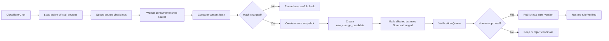

# DueDateHQ Beta Technical Plan

## Architecture

DueDateHQ uses the existing Better-T-Stack structure:

- Frontend: React, TanStack Router, Tailwind CSS, shared shadcn/ui package.
- API: Hono, tRPC.
- Database: Cloudflare D1 with Drizzle.
- Runtime: Cloudflare Workers.
- Deployment: Cloudflare through Alchemy.
- Auth: Better Auth, email/password only for Beta.

The technical goal is to implement a real Beta product while preserving a strict distinction between verified official rules, user-provided deadlines, and unverified obligations.

## System Boundaries

In scope:

- Authenticated user workspace.
- CSV import adapters.
- Manual client and deadline entry.
- Tax obligation library.
- Verification statuses.
- Source monitoring pipeline.
- Verification queue.
- Coverage matrix.
- Monday triage dashboard.
- Feature progress page.

Out of scope:

- Production-grade authorization model.
- Organization/team permissions.
- MFA, OAuth, password reset, email verification.
- Automatic AI publishing of tax rules.
- Full county/city/industry-specific automation.

## Data Model

### Auth

Better Auth owns its required tables. Business tables reference the authenticated user and future firm profile.

### Business Tables

`firms`

- `id`
- `name`
- `ownerUserId`
- `createdAt`
- `updatedAt`

`clients`

- `id`
- `firmId`
- `name`
- `entityType`
- `states`
- `county`
- `fiscalYearType`
- `sourceSystem`
- `createdVia`: `csv_import | manual`
- `createdAt`
- `updatedAt`

`import_batches`

- `id`
- `firmId`
- `sourceSystem`: `taxdome | drake | karbon | quickbooks`
- `status`: `previewed | committed | failed`
- `totalRows`
- `acceptedRows`
- `reviewRows`
- `createdAt`

`tax_obligations`

- `id`
- `jurisdiction`
- `jurisdictionLevel`: `federal | state | county | city`
- `agencyName`
- `taxCategory`
- `obligationName`
- `entityTypes`
- `knownStatus`: `known | planned | unsupported`
- `createdAt`
- `updatedAt`

`tax_rules`

- `id`
- `obligationId`
- `ruleSummary`
- `dueDateRule`
- `verificationStatus`: `verified | needs_review | source_changed | unsupported`
- `sourceName`
- `sourceUrl`
- `lastVerifiedAt`
- `sourceLastCheckedAt`
- `sourceLastChangedAt`
- `sourceContentHash`
- `verifiedBy`
- `verificationNotes`
- `currentVersion`
- `createdAt`
- `updatedAt`

`deadline_tasks`

- `id`
- `firmId`
- `clientId`
- `taxRuleId`
- `title`
- `jurisdiction`
- `taxCategory`
- `dueDate`
- `status`: `not_started | in_progress | extended | done`
- `priority`
- `sourceType`: `verified_rule | user_provided`
- `userProvidedSourceNote`
- `createdVia`: `system_rule | manual`
- `createdAt`
- `updatedAt`

`official_sources`

- `id`
- `jurisdiction`
- `agencyName`
- `sourceType`: `html | pdf | rss | api | manual`
- `sourceUrl`
- `monitorFrequencyHours`
- `active`
- `createdAt`
- `updatedAt`

`source_snapshots`

- `id`
- `sourceId`
- `contentHash`
- `snapshotUrl`
- `capturedAt`

`source_check_runs`

- `id`
- `sourceId`
- `checkedAt`
- `status`: `success | failed | skipped`
- `httpStatus`
- `contentHash`
- `previousContentHash`
- `changedDetected`
- `errorMessage`

`rule_change_candidates`

- `id`
- `sourceId`
- `affectedRuleId`
- `detectedAt`
- `changeType`: `content_hash_changed | pdf_updated | feed_item | source_unreachable | keyword_match`
- `extractedSummary`
- `proposedRulePatch`
- `status`: `pending | approved | rejected`
- `reviewedBy`
- `reviewedAt`

`tax_rule_versions`

- `id`
- `ruleId`
- `version`
- `ruleSummary`
- `dueDateRule`
- `sourceSnapshotId`
- `publishedAt`
- `publishedBy`

`verification_requests`

- `id`
- `firmId`
- `requestType`: `source_changed | needs_review | user_requested | manual_deadline`
- `taxRuleId`
- `deadlineTaskId`
- `status`: `open | approved | rejected | closed`
- `message`
- `createdAt`
- `updatedAt`

`feature_items`

- `id`
- `category`
- `name`
- `description`
- `specPath`
- `status`: `done | in_progress | blocked | not_started`
- `priority`
- `updatedAt`

## API Surface

All business APIs require an authenticated session.

Auth:

- Better Auth handlers for register, login, logout, and session.

Imports:

- `imports.preview`
- `imports.commit`

Manual entry:

- `clients.createManual`
- `deadlineTasks.createManual`
- `deadlineTasks.requestVerification`

Dashboard:

- `dashboard.summary`
- `tasks.updateStatus`
- `tasks.getEvidence`

Coverage:

- `coverage.matrix`
- `coverage.getRule`
- `coverage.requestCoverage`

Verification:

- `verificationQueue.list`
- `verificationQueue.approveCandidate`
- `verificationQueue.rejectCandidate`
- `verificationQueue.markReviewed`

Source monitoring:

- `officialSources.list`
- `officialSources.getCheckRuns`
- `officialSources.enqueueCheck`
- `officialSources.recordCheckResult`

Progress:

- `progress.list`

## Source Monitoring Architecture

Cloudflare components:

- Cron Triggers start source monitoring at least daily.
- Queues fan out source checks across official sources.
- Worker consumers fetch bounded source content, hash it, and record check runs.
- D1 stores source metadata, hashes, candidates, and rule versions.
- R2 is optional for source snapshots when storing full HTML/PDF files becomes necessary.

Monitoring rule:

```txt
The monitor may detect changes and create candidates.
It must not publish verified tax rules.
```

Flow:



## Frontend Pages

`/login`

- Register and login.

`/import`

- CSV source selection, upload, mapping preview, review rows, commit.

`/clients/new`

- Manual client creation.

`/clients/:id/deadlines/new`

- Manual deadline creation.

`/`

- Monday triage dashboard.

`/coverage`

- 50-state coverage matrix with monitor and verification status.

`/verification`

- Internal verification queue.

`/progress`

- Feature completion progress page.

## Verification Rules

Only `tax_rules.verificationStatus = verified` can generate official `deadline_tasks` with `sourceType = verified_rule`.

Other statuses:

- `needs_review`: visible in coverage and verification queue, no official task generation.
- `source_changed`: existing tasks get warning, no new official task generation.
- `unsupported`: visible in coverage, no task generation.

Manual deadlines:

- Stored as `deadline_tasks.sourceType = user_provided`.
- Can appear on dashboard.
- Must show `User provided · Not verified by DueDateHQ`.
- Can create a `verification_request`.

## Deployment Plan

Target:

- Cloudflare account: `Yessenia@dify.ai's Account`.
- Frontend: Cloudflare Vite deployment via Alchemy.
- API: Cloudflare Worker.
- Database: D1.
- Optional snapshots: R2.
- Optional background queue: Cloudflare Queues.

Deployment order:

1. Implement schema and migrations.
2. Apply D1 migration.
3. Deploy Worker API.
4. Deploy frontend.
5. Seed initial feature progress items and representative tax source data.
6. Verify external URL flows.

## Test Plan

Automated:

- Type check.
- Build.
- API tests for imports, manual deadlines, verification rules, and source monitoring services.

Manual:

- Register and log in.
- Import representative CSV from each source.
- Manually create client and deadline.
- Confirm only verified rules create official tasks.
- Confirm source changed rule cannot create new official task.
- Confirm coverage matrix shows monitor status.
- Confirm evidence drawer shows last checked, last changed, and rule versions.
- Confirm verification queue approval publishes a new version.

## Implementation Guardrails

- Do not auto-publish source changes.
- Do not show unsupported obligations as confirmed deadlines.
- Do not hide user-provided deadlines from dashboard, but clearly mark them.
- Keep user-facing copy explicit about Beta data coverage.
