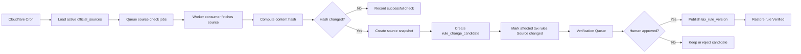

# DueDateHQ Beta Technical Plan

## Architecture

DueDateHQ uses the existing Better-T-Stack structure:

- Frontend: React, TanStack Router, Tailwind CSS, shared shadcn/ui package.
- API: Hono, tRPC.
- Database: Cloudflare D1 with Drizzle.
- Runtime: Cloudflare Workers.
- Deployment: Cloudflare through Alchemy.
- Auth: Better Auth, email/password only for Beta.

The technical goal is to implement a real Beta product while preserving a strict distinction between verified official rules, user-provided deadlines, and unverified obligations.

Technical parity target: implement the useful File In Time workflow baseline as a cloud product, not as a desktop clone. The system should support client setup, source-specific CSV import preview/mapping/review/duplicate handling, obligation-driven task generation, Monday triage, filters/sorting, task status, extension handling, verified recurrence/upcoming tasks, dashboard/task exports, and in-product urgency surfaces. It should deliberately omit local database administration, backup/restore UI, Crystal Reports-style reporting, mail merge/labels, extension form printing, arbitrary field renaming, network-user maintenance, detailed rights matrices, and external email/SMS/calendar reminders unless later prioritized.

## System Boundaries

In scope:

- Authenticated user workspace.
- CSV import adapters.
- Manual client and deadline entry.
- Tax obligation library.
- Verification statuses.
- Source monitoring pipeline.
- Verification queue.
- Coverage matrix.
- Monday triage dashboard.
- Feature progress page.
- Dashboard/task export for operational review.

Out of scope:

- Production-grade authorization model.
- Organization/team permissions.
- MFA, OAuth, password reset, email verification.
- Automatic AI publishing of tax rules.
- Full county/city/industry-specific automation.
- Desktop database management, backup/restore UI, Crystal Reports-style reports, mail merge/labels, extension form printing, arbitrary field renaming, network-user maintenance, detailed rights matrices, and external email/SMS/calendar reminders.

## Data Model

### Auth

Better Auth owns its required tables. Business tables reference the authenticated user and future firm profile.

### Business Tables

`firms`

- `id`
- `name`
- `ownerUserId`
- `createdAt`
- `updatedAt`

`clients`

- `id`
- `firmId`
- `name`
- `ein`
- `entityType`
- `states`
- `county`
- `fiscalYearType`
- `notes`
- `sourceSystem`
- `createdVia`: `csv_import | manual`
- `createdAt`
- `updatedAt`

`import_batches`

- `id`
- `firmId`
- `sourceSystem`: `taxdome | drake | karbon | quickbooks`
- `status`: `previewed | committed | failed`
- `totalRows`
- `acceptedRows`
- `reviewRows`
- `duplicateRows`
- `headerDetected`
- `adapterVersion`
- `createdAt`

`tax_obligations`

- `id`
- `jurisdiction`
- `jurisdictionLevel`: `federal | state | county | city`
- `agencyName`
- `taxCategory`
- `obligationName`
- `entityTypes`
- `knownStatus`: `known | planned | unsupported`
- `createdAt`
- `updatedAt`

`tax_rules`

- `id`
- `obligationId`
- `ruleSummary`
- `dueDateRule`
- `verificationStatus`: `verified | needs_review | source_changed | unsupported`
- `sourceName`
- `sourceUrl`
- `lastVerifiedAt`
- `sourceLastCheckedAt`
- `sourceLastChangedAt`
- `sourceContentHash`
- `verifiedBy`
- `verificationNotes`
- `currentVersion`
- `createdAt`
- `updatedAt`

`deadline_tasks`

- `id`
- `firmId`
- `clientId`
- `taxRuleId` nullable; required only when `sourceType = verified_rule`
- `title`
- `jurisdiction`
- `taxCategory`
- `dueDate`
- `originalDueDate`
- `extensionDueDate`
- `recurrenceKey`
- `status`: `not_started | in_progress | extended | done`
- `priority`
- `sourceType`: `verified_rule | user_provided`
- `userProvidedSourceNote`
- `createdVia`: `system_rule | manual`
- `createdAt`
- `updatedAt`

`official_sources`

- `id`
- `jurisdiction`
- `agencyName`
- `sourceType`: `html | pdf | rss | api | manual`
- `sourceUrl`
- `monitorFrequencyHours`
- `active`
- `createdAt`
- `updatedAt`

`source_snapshots`

- `id`
- `sourceId`
- `contentHash`
- `snapshotUrl`
- `capturedAt`

`source_check_runs`

- `id`
- `sourceId`
- `checkedAt`
- `status`: `success | failed | skipped`
- `httpStatus`
- `contentHash`
- `previousContentHash`
- `changedDetected`
- `errorMessage`

`rule_change_candidates`

- `id`
- `sourceId`
- `affectedRuleId`
- `detectedAt`
- `changeType`: `content_hash_changed | pdf_updated | feed_item | source_unreachable | keyword_match`
- `extractedSummary`
- `proposedRulePatch`
- `status`: `pending | approved | rejected`
- `reviewedBy`
- `reviewedAt`

`tax_rule_versions`

- `id`
- `ruleId`
- `version`
- `ruleSummary`
- `dueDateRule`
- `sourceSnapshotId`
- `publishedAt`
- `publishedBy`

`verification_requests`

- `id`
- `firmId`
- `requestType`: `source_changed | needs_review | user_requested | manual_deadline`
- `taxRuleId`
- `deadlineTaskId`
- `status`: `open | approved | rejected | closed`
- `message`
- `createdAt`
- `updatedAt`

`feature_items`

- `id`
- `category`
- `name`
- `description`
- `specPath`
- `status`: `done | in_progress | blocked | not_started`
- `priority`
- `updatedAt`

## API Surface

All business APIs require an authenticated session.

Auth:

- Better Auth handlers for register, login, logout, and session.

Imports:

- `imports.preview`
  - Parses TaxDome, Drake, Karbon, and QuickBooks CSV exports with source-specific adapters.
  - Automatically recognizes field mapping for client name, EIN, state, and entity type where possible.
  - Returns mapping confidence, intelligent deterministic suggestions, accepted rows, review rows, duplicate candidates, and validation messages.
- `imports.commit`
  - Commits accepted rows, reviewed row corrections, and duplicate resolutions.
  - Generates full-year official deadline tasks immediately only when matching `verified` rules exist.
  - Returns generated task counts plus needs-review and unsupported obligation counts.

Manual entry:

- `clients.createManual`
- `deadlineTasks.createManual`
- `deadlineTasks.requestVerification`

Dashboard:

- `dashboard.summary`
  - Returns default `Due this week`, `This month`, and `Long range` groups after login.
  - Supports fast filters by client, state, form/obligation type, entity type, tax type, task status, and verification status.
  - Supports deterministic smart priority sorting for Beta.
- `dashboard.export`
- `tasks.updateStatus`
  - Supports one-click marking for `done`, `extended`, and `in_progress`.
- `tasks.getEvidence`

Coverage:

- `coverage.matrix`
- `coverage.getRule`
- `coverage.requestCoverage`

Verification:

- `verificationQueue.list`
- `verificationQueue.approveCandidate`
- `verificationQueue.rejectCandidate`
- `verificationQueue.markReviewed`

Source monitoring:

- `officialSources.list`
- `officialSources.getCheckRuns`
- `officialSources.enqueueCheck`
- `officialSources.recordCheckResult`

Progress:

- `progress.list`

## Performance and Workflow Targets

- A solo or independent CPA serving about 80 multi-state clients can see all deadlines needing action this week within 30 seconds of opening the dashboard after login.
- Core dashboard filters return updated results in `< 1 second` for Beta-sized solo CPA workspaces.
- Weekly triage is completable within 5 minutes, compared with the current 30-45 minute spreadsheet/calendar workflow.
- A CPA migrating from TaxDome can complete a 30-client import within 30 minutes; measurable target is `P95 <= 30 minutes for a 30-client import`.
- Import review is non-blocking at the batch level: fuzzy or missing fields route uncertain rows to review while accepted rows and duplicate resolutions can continue toward commit.
- Deadline generation preserves the trust invariant: only `verified` tax rules create official full-year deadline tasks; needs-review and unsupported obligations stay visible but are not official confirmed deadlines.

## Source Monitoring Architecture

Cloudflare components:

- Cron Triggers start source monitoring at least daily.
- Queues fan out source checks across official sources.
- Worker consumers fetch bounded source content, hash it, and record check runs.
- D1 stores source metadata, hashes, candidates, and rule versions.
- R2 is optional for source snapshots when storing full HTML/PDF files becomes necessary.

Monitoring rule:

```txt
The monitor may detect changes and create candidates.
It must not publish verified tax rules.
```

Flow:



## Frontend Pages

`/login`

- Register and login.

`/import`

- CSV source selection, upload, automatic key-field mapping, mapping preview, intelligent non-blocking suggestions, review rows, duplicate review, commit.

`/clients/new`

- Manual client creation.

`/clients/:id/deadlines/new`

- Manual deadline creation.

`/`

- Monday triage dashboard with default horizon groups, urgency sections, deterministic smart priority sorting, fast filters/sorting, task status updates, extension visibility, evidence access, and export.

`/coverage`

- 50-state coverage matrix with monitor and verification status.

`/verification`

- Internal verification queue.

`/progress`

- Feature completion progress page.

## Verification Rules

Only `tax_rules.verificationStatus = verified` can generate official `deadline_tasks` with `sourceType = verified_rule`.

Other statuses:

- `needs_review`: visible in coverage and verification queue, no official task generation.
- `source_changed`: existing tasks get warning, no new official task generation.
- `unsupported`: visible in coverage, no task generation.

Manual deadlines:

- Stored as `deadline_tasks.sourceType = user_provided`.
- Can appear on dashboard.
- Must show `User provided · Not verified by DueDateHQ`.
- Can create a `verification_request`.

## Deployment Plan

Target:

- Cloudflare account: `Yessenia@dify.ai's Account`.
- Frontend: Cloudflare Vite deployment via Alchemy.
- API: Cloudflare Worker.
- Database: D1.
- Optional snapshots: R2.
- Optional background queue: Cloudflare Queues.

Deployment order:

1. Implement schema and migrations.
2. Apply D1 migration.
3. Deploy Worker API.
4. Deploy frontend.
5. Seed initial feature progress items and representative tax source data.
6. Verify external URL flows.

## Test Plan

Automated:

- Type check.
- Build.
- API tests for imports, manual deadlines, verification rules, and source monitoring services.
- Import tests covering TaxDome, Drake, Karbon, and QuickBooks CSV fixtures, auto-mapping for client name/EIN/state/entity type, review rows for fuzzy or missing fields, and Verified-only full-year task generation.
- Dashboard tests covering default horizon grouping, countdown in days, core filter coverage, one-click `done`/`extended`/`in_progress` status updates, and deterministic priority sorting.

Manual:

- Register and log in.
- Import representative CSV from each source.
- Confirm a 30-client TaxDome import can complete within 30 minutes, with `P95 <= 30 minutes for a 30-client import` as the target.
- Confirm import preview detects headers, mapping, review rows, and likely duplicates before commit.
- Confirm fuzzy or missing import fields produce non-blocking suggestions and do not block the whole batch.
- Manually create client and deadline.
- Confirm only verified rules create official tasks.
- Confirm imported clients with matching Verified rules receive full-year deadline calendar/tasks immediately, while needs-review and unsupported obligations stay visible but not official.
- Confirm source changed rule cannot create new official task.
- Confirm verified recurring obligations generate upcoming tasks without manual rollover.
- Confirm dashboard opens after login with `Due this week`, `This month`, and `Long range`; this-week work is visible within 30 seconds and shows countdowns in days.
- Confirm dashboard filters/sorting, extension status, urgency surfaces, smart priority sorting, and export work.
- Confirm core dashboard filters respond in `< 1 second` for a Beta-sized solo CPA workspace and the weekly triage flow can be completed within 5 minutes.
- Confirm coverage matrix shows monitor status.
- Confirm evidence drawer shows last checked, last changed, and rule versions.
- Confirm verification queue approval publishes a new version.

## Implementation Guardrails

- Do not auto-publish source changes.
- Do not show unsupported obligations as confirmed deadlines.
- Do not hide user-provided deadlines from dashboard, but clearly mark them.
- Keep user-facing copy explicit about Beta data coverage.
