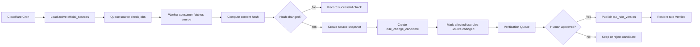

# DueDateHQ Beta 技术方案

## 架构

DueDateHQ 使用当前 Better-T-Stack 结构：

- Frontend：React、TanStack Router、Tailwind CSS、共享 shadcn/ui package。
- API：Hono、tRPC。
- Database：Cloudflare D1 + Drizzle。
- Runtime：Cloudflare Workers。
- Deployment：Cloudflare + Alchemy。
- Auth：Better Auth，Beta 阶段仅支持邮箱密码。

技术目标是实现真实 Beta 产品，同时严格区分已核验官方规则、用户手动录入截止日期和未核验义务。

技术 parity 目标：把 File In Time 有价值的工作流 baseline 实现为云端产品，而不是桌面软件复刻。系统应支持 client setup、source-specific CSV import preview/mapping/review/duplicate handling、obligation-driven task generation、Monday triage、filters/sorting、task status、extension/date-change handling、verified recurrence/upcoming tasks、dashboard/task exports、产品内 urgency surfaces 和轻量 bulk operations。除非后续明确优先，否则应主动排除 local database administration、backup/restore UI、Crystal Reports-style reporting、mail merge/labels、extension form printing、arbitrary field renaming、network-user maintenance、detailed rights matrices、client portal、document upload/checklist automation、e-signature、direct end-client notifications 和外部 email/SMS/Slack/calendar push。

## 系统边界

范围内：

- 认证用户 workspace。
- CSV import adapters。
- 手动客户和截止日期录入。
- 税务义务库。
- 核验状态。
- 官方来源监听 pipeline。
- Official notice monitoring 和 affected-profile proposal review。
- 核验队列。
- 覆盖矩阵。
- Monday triage dashboard。
- 功能进度页。
- 用于运营复核的 dashboard/task export。
- 轻量 bulk task status updates 和 firm target date updates。

范围外：

- 生产级授权模型。
- 组织/团队权限。
- MFA、OAuth、密码重置、邮箱验证。
- AI 自动发布税务规则。
- 默认使用 customer PII 做 AI 分析。
- Official notice monitoring 自动修改 CPA workspace data。
- Bulk official due-date edits。
- Client portal、document upload、document checklist automation、e-signature、direct end-client notifications，以及 email/SMS/Slack/calendar push。
- 完整县/市/行业级自动化。
- Desktop database management、backup/restore UI、Crystal Reports-style reports、mail merge/labels、extension form printing、arbitrary field renaming、network-user maintenance、detailed rights matrices，以及外部 email/SMS/calendar reminders。

## 数据模型

### Auth

Better Auth 管理认证表。业务表引用认证用户和未来 firm profile。

### 业务表

`firms`

- `id`
- `name`
- `ownerUserId`
- `createdAt`
- `updatedAt`

### Deadline Domain Model

核心 deadline domain 使用三层：

```txt
Client relationship -> Filing/Tax profile -> Deadline task
```

主 UI 文案应使用 `Filing profile` 或 `Tax profile`。内部实现不要在 CPA 主流程暴露 tax-subject jargon。

`client_relationships`

- `id`
- `firmId`
- `displayName`
- `relationshipType`: `individual | business | household | related_group`
- `notes`
- `sourceSystem`
- `createdVia`: `csv_import | manual`
- `createdAt`
- `updatedAt`

`filing_profiles`

- `id`
- `firmId`
- `clientRelationshipId`
- `profileName`
- `ein`
- `ssnLast4` nullable
- `entityType`
- `states`
- `county`
- `fiscalYearType`
- `notes`
- `sourceSystem`
- `createdVia`: `csv_import | manual`
- `coverageState`: `ready | needs_review | coverage_gap | unsupported`
- `createdAt`
- `updatedAt`

`import_batches`

- `id`
- `firmId`
- `sourceSystem`: `taxdome | drake | karbon | quickbooks`
- `status`: `previewed | committed | failed`
- `totalRows`
- `acceptedRows`
- `reviewRows`
- `duplicateRows`
- `headerDetected`
- `adapterVersion`
- `createdAt`

`import_profile_relationship_suggestions`

- `id`
- `importBatchId`
- `incomingProfileId`
- `suggestedClientRelationshipId`
- `reason`
- `status`: `pending | accepted | rejected`
- `decidedBy`
- `decidedAt`

`tax_obligations`

- `id`
- `jurisdiction`
- `jurisdictionLevel`: `federal | state | county | city`
- `agencyName`
- `taxCategory`
- `obligationName`
- `entityTypes`
- `knownStatus`: `known | planned | unsupported`
- `createdAt`
- `updatedAt`

`tax_rules`

- `id`
- `obligationId`
- `ruleSummary`
- `dueDateRule`
- `verificationStatus`: `verified | needs_review | source_changed | unsupported`
- `sourceName`
- `sourceUrl`
- `lastVerifiedAt`
- `sourceLastCheckedAt`
- `sourceLastChangedAt`
- `sourceContentHash`
- `verifiedBy`
- `verificationNotes`
- `currentVersion`
- `createdAt`
- `updatedAt`

`deadline_tasks`

- `id`
- `firmId`
- `filingProfileId`
- `taxRuleId` nullable；仅在 `sourceType = verified_rule` 时必填
- `title`
- `jurisdiction`
- `taxCategory`
- `currentDueDate`
- `originalDueDate`
- `firmTargetDate` nullable
- `recurrenceKey`
- `status`: `not_started | in_progress | waiting_on_client | extended | done`
- `priority`
- `sourceType`: `verified_rule | user_provided`
- `userProvidedSourceNote`
- `createdVia`: `system_rule | manual`
- `createdAt`
- `updatedAt`

`deadline_date_events`

- `id`
- `deadlineTaskId`
- `eventType`: `official_extension | official_relief_change | user_provided_adjustment | firm_target_change`
- `previousCurrentDueDate`
- `newCurrentDueDate`
- `previousFirmTargetDate`
- `newFirmTargetDate`
- `sourceName`
- `sourceUrl`
- `sourceSnapshotId`
- `createdBy`
- `createdAt`
- `notes`

`official_sources`

- `id`
- `jurisdiction`
- `agencyName`
- `sourceType`: `html | pdf | rss | api | manual`
- `sourceUrl`
- `allowlistLevel`: `p0 | later`
- `deadlineScope`
- `monitorFrequencyHours`
- `active`
- `createdAt`
- `updatedAt`

`official_notices`

- `id`
- `sourceId`
- `noticeUrl`
- `noticeTitle`
- `noticePublishedAt`
- `noticeSummary`
- `jurisdiction`
- `deadlineRelevance`: `high | medium | low`
- `detectedAt`
- `aiProviderRunId` nullable
- `createdAt`

`notice_impact_proposals`

- `id`
- `officialNoticeId`
- `firmId`
- `filingProfileId` nullable
- `deadlineTaskId` nullable
- `proposalType`: `task_update | coverage_review_status_update`
- `beforeState`
- `afterState`
- `confidenceLabel`: `high | medium | low`
- `confidenceReasons`
- `status`: `pending | approved | rejected | decide_later`
- `decidedBy`
- `decidedAt`
- `auditLogId`
- `createdAt`

`source_snapshots`

- `id`
- `sourceId`
- `contentHash`
- `snapshotUrl`
- `capturedAt`

`source_check_runs`

- `id`
- `sourceId`
- `checkedAt`
- `status`: `success | failed | skipped`
- `httpStatus`
- `contentHash`
- `previousContentHash`
- `changedDetected`
- `errorMessage`

`rule_change_candidates`

- `id`
- `sourceId`
- `affectedRuleId`
- `detectedAt`
- `changeType`: `content_hash_changed | pdf_updated | feed_item | source_unreachable | keyword_match`
- `extractedSummary`
- `proposedRulePatch`
- `status`: `pending | approved | rejected | decide_later`
- `reviewedBy`
- `reviewedAt`

`tax_rule_versions`

- `id`
- `ruleId`
- `version`
- `ruleSummary`
- `dueDateRule`
- `sourceSnapshotId`
- `publishedAt`
- `publishedBy`

`verification_requests`

- `id`
- `firmId`
- `requestType`: `source_changed | needs_review | user_requested | manual_deadline`
- `taxRuleId`
- `deadlineTaskId`
- `status`: `open | approved | rejected | closed`
- `message`
- `createdAt`
- `updatedAt`

`feature_items`

- `id`
- `category`
- `name`
- `description`
- `specPath`
- `status`: `done | in_progress | blocked | not_started`
- `priority`
- `updatedAt`

## API 表面

所有业务 API 都需要认证 session。

Auth：

- Better Auth handlers：注册、登录、登出、session。

Imports：

- `imports.preview`
  - 使用来源专属 adapter 解析 TaxDome、Drake、Karbon、QuickBooks CSV 导出。
  - 在可能时自动识别 client name、EIN、state 和 entity type 字段映射。
  - 返回 mapping confidence、确定性智能建议、accepted profile rows、review rows、duplicate candidates、relationship suggestions 和 validation messages。
- `imports.commit`
  - 提交 accepted rows、已修正行、duplicate resolutions，以及 accepted/rejected relationship suggestions。
  - 仅当存在匹配的 `verified` rules 时，立即生成全年官方 deadline tasks。
  - 返回按 filing/tax profile 和 problem type 分组的平实 import summary：ready profiles、generated verified tasks、profile review items、needs-review counts、coverage gaps 和 unsupported obligation counts。

Manual entry：

- `clientRelationships.createManual`
- `filingProfiles.createManual`
- `deadlineTasks.createManual`
- `deadlineTasks.requestVerification`

Dashboard：

- `dashboard.summary`
  - 登录后返回默认 `本周到期`、`本月预警`、`长期计划` 分组。
  - 支持按 client relationship、filing/tax profile、state、form/obligation type、entity type、tax type、task status 和 verification status 快速筛选。
  - 支持 Beta 阶段确定性 smart priority sorting。
- `dashboard.export`
- `dashboard.bulkExportCurrentFilteredView`
- `tasks.updateStatus`
  - 支持一键标记 `done`、`extended`、`waiting_on_client` 和 `in_progress`。
- `tasks.bulkUpdateStatus`
- `tasks.updateFirmTargetDate`
- `tasks.bulkUpdateFirmTargetDate`
- `tasks.getEvidence`

Coverage：

- `coverage.matrix`
- `coverage.getRule`
- `coverage.requestCoverage`
- `coverage.addUserProvidedDeadlineFromGap`
- `coverage.dismissGapForNow`

Verification：

- `verificationQueue.list`
- `verificationQueue.approveCandidate`
- `verificationQueue.rejectCandidate`
- `verificationQueue.markReviewed`

Source monitoring：

- `officialSources.list`
- `officialSources.getCheckRuns`
- `officialSources.enqueueCheck`
- `officialSources.recordCheckResult`
- `officialNotices.list`
- `officialNotices.get`
- `noticeImpacts.listAffected`
- `noticeImpacts.approve`
- `noticeImpacts.reject`
- `noticeImpacts.decideLater`
- `noticeImpacts.bulkDecision`

Progress：

- `progress.list`

## 性能与工作流目标

- 服务约 80 个混合个人与小企业多州客户的 solo/independent CPA 登录后打开 dashboard，可在 30 秒内看到本周所有需要行动的截止日期。
- 核心 dashboard filters 在 Beta 规模 solo CPA workspace 内返回更新结果的目标时间为 `< 1 second`。
- 每周分诊可在 5 分钟内完成，对比当前 30-45 分钟的表格/日历流程。
- 从 TaxDome 迁移的 CPA 可在 30 分钟内完成 30-client import；可衡量目标是 `P95 <= 30 minutes for a 30-client import`。
- Import review 在 batch 层面非阻塞：模糊或缺失字段将不确定行送入 review，同时 accepted rows 和 duplicate resolutions 可以继续走向 commit。
- Deadline generation 保持信任不变量：只有 `verified` tax rules 创建官方全年 deadline tasks；needs-review、coverage-gap 和 unsupported obligations 保持可见，但不是官方已确认截止日期。
- Official Notice Monitor alerts 只在产品内，并且在 CPA approve before/after diffs 前不得修改 workspace data。

## 来源监听架构

Cloudflare 组件：

- Cron Triggers 至少每天启动一次来源监听。
- Queues 将官方来源检查任务 fan out。
- Worker consumer 拉取有界来源内容、计算 hash，并记录 check run。
- D1 保存来源元数据、hash、候选变更和规则版本。
- R2 后续可用于保存完整 HTML/PDF 快照。

监听规则：

```txt
The monitor may detect changes and create candidates.
It must not publish verified tax rules.
监听器可以检测变化并创建候选，但不能发布 Verified 税务规则。
It must not mutate CPA workspace data without CPA confirmation.
未经 CPA 确认，不得修改 CPA workspace data。
```

流程：



Official Notice Monitor 约束：

- DueDateHQ 在平台层配置 AI provider/API key；单个 CPA 不配置自己的 AI key。
- AI 只分析 official notices，默认不发送 customer PII 给模型。
- Affected clients/profiles 在 workspace 数据本地匹配。
- Proposed impacts 可以是 `task_update` 或 `coverage_review_status_update`，两者都需要 CPA 确认。
- CPA review 展示清晰 before/after diffs，并支持单个或批量 approve/reject/decide-later。
- 所有操作 audit logged。
- Notifications 只在产品内：dashboard banner、notice inbox/alert center、affected review page。
- Confidence 是可解释 gate，不是百分比分数。High confidence + affected workspace match 提醒 CPA；medium confidence + match 提醒 CPA 并标记 AI-detected/needs review；low confidence 只留在内部队列。

P0 官方来源 allowlist 和范围：

- IRS：federal individual 和 small-business filing/payment/extension/estimated tax deadlines，以及 IRS disaster/tax relief deadline changes。不是所有 IRS tax-law news。
- California FTB：personal income、business/franchise、disaster/tax relief。
- New York Tax Department：personal income、business/corporate、disaster/tax relief。
- Texas Comptroller：franchise、sales/use、disaster/tax relief。
- Florida Department of Revenue：corporate income、sales/use、reemployment、disaster/tax relief。

## 前端页面

`/login`

- 注册和登录。

`/import`

- CSV 来源选择、上传、自动关键字段映射、映射预览、智能非阻塞建议、必须 CPA 确认的 relationship suggestions、行 review、duplicate review、按 profile/problem 分组的提交摘要。

`/clients/new`

- 手动创建客户。

`/clients/:id/deadlines/new`

- 手动创建截止日期。

`/`

- Monday triage dashboard，包含默认时间分组、urgency sections、确定性 smart priority sorting、fast filters/sorting、包含 `waiting_on_client` 的 task status updates、firm target date controls、extension visibility、evidence access、轻量 bulk operations 和 export。

`/coverage`

- 透明覆盖矩阵，展示 supported source/state status、needs-review 和 coverage-gap 状态、监听/核验状态，以及 coverage-gap actions。

`/notices`

- Notice inbox/alert center，先展示 notice detail。

`/notices/:id/affected`

- Affected review page，用于 approve、reject 或 decide later proposed task/profile 和 coverage/review updates。

`/verification`

- 内部核验队列。

`/progress`

- 功能完成进度页。

## 核验规则

只有 `tax_rules.verificationStatus = verified` 可以生成 `sourceType = verified_rule` 的官方 `deadline_tasks`。

其他状态：

- `needs_review`：显示在 coverage 和 verification queue，不生成官方任务。
- `source_changed`：已有任务显示 warning，不生成新的官方任务。
- `unsupported`：显示在 coverage，不生成任务。

手动 deadline：

- 保存为 `deadline_tasks.sourceType = user_provided`。
- 可以显示在 dashboard。
- 必须显示 `User provided · Not verified by DueDateHQ`。
- 可以创建 `verification_request`。

日期规则：

- `deadline_tasks.currentDueDate` 是用于工作规划的当前官方或 user-provided task date。
- `deadline_tasks.originalDueDate` 保存原始 official due date（如果存在）。
- `deadline_tasks.firmTargetDate` 是可选 firm planning metadata，不得展示为 official due date。
- `deadline_date_events` 支撑 Evidence drawer，记录 official extensions、official relief/change、user-provided adjustments 和 firm target changes。

## 部署计划

目标：

- Cloudflare 账号：`Yessenia@dify.ai's Account`。
- Frontend：通过 Alchemy 部署 Cloudflare Vite。
- API：Cloudflare Worker。
- Database：D1。
- 可选快照：R2。
- 可选后台队列：Cloudflare Queues。

部署顺序：

1. 实现 schema 和 migrations。
2. 应用 D1 migration。
3. 部署 Worker API。
4. 部署前端。
5. Seed 初始 feature progress items 和代表性税务来源数据。
6. 验证外部 URL 流程。

## 测试计划

自动化：

- 类型检查。
- 构建。
- API tests：imports、manual deadlines、verification rules、source monitoring services。
- Import tests 覆盖 TaxDome、Drake、Karbon、QuickBooks CSV fixtures，client name/EIN/state/entity type 自动映射，模糊或缺失字段 review rows，以及 Verified-only 全年 task generation。
- Dashboard tests 覆盖默认时间分组、按天倒计时、核心筛选范围、一键 `done`/`extended`/`waiting_on_client`/`in_progress` 状态更新，以及确定性 priority sorting。

手动：

- 注册登录。
- 导入每个来源的代表 CSV。
- 确认 30-client TaxDome import 可在 30 分钟内完成，目标为 `P95 <= 30 minutes for a 30-client import`。
- 确认 import preview 在 commit 前检测 headers、mapping、review rows 和 likely duplicates。
- 确认 import review 按 filing/tax profile/problem type 分组，并且不在 CPA 确认前自动合并 individual/business relationship suggestions。
- 确认模糊或缺失 import fields 会产生非阻塞建议，并且不会阻塞整个 batch。
- 手动创建客户和截止日期。
- 确认只有 verified rules 创建官方任务。
- 确认有匹配 Verified rules 的导入客户会立即获得全年 deadline calendar/tasks，同时 needs-review 和 unsupported obligations 保持可见但不是官方任务。
- 确认 source changed rule 不会创建新的官方任务。
- 确认 verified recurring obligations 不需要 manual rollover 就能生成 upcoming tasks。
- 确认 dashboard 登录后默认打开 `本周到期`、`本月预警`、`长期计划`；本周工作在 30 秒内可见，并显示按天倒计时。
- 确认 dashboard filters/sorting、extension status、urgency surfaces、smart priority sorting 和 export 可用。
- 确认 task statuses 包含 `waiting_on_client`。
- 确认可选 firm target dates 与 official due dates 视觉区分，并且可 bulk update。
- 确认 bulk task status update 和 current-filter export 可用，且 bulk official due-date edits 不可用。
- 确认核心 dashboard filters 在 Beta 规模 solo CPA workspace 内 `< 1 second` 响应，并且每周分诊流程可在 5 分钟内完成。
- 确认 coverage matrix 显示 monitor status。
- 确认 coverage gaps 提供 request verification、add user-provided deadline、ignore/dismiss actions。
- 确认 evidence drawer 显示 current due date、original due date、firm target date、date event history、last checked、last changed 和 rule versions。
- 确认 verification queue approval 会发布新版本。
- 确认 Official Notice Monitor 只分析 official notices，使用平台级 AI 配置，默认不发送 customer PII，本地匹配 profiles，并且只在产品内提醒 CPA。
- 确认 proposed notice impacts 必须 CPA 查看 before/after diffs 后确认，支持 `pending`、`approved`、`rejected`、`decide_later`，并写入 audit logs。

## 实现护栏

- 不自动发布来源变化。
- 不自动把 official notice impacts 应用到 CPA workspace data。
- 不把 unsupported obligations 展示为已确认截止日期。
- 不把 Beta 描述为完整 50 州已核验覆盖。
- 不混淆 firm target dates 和 official due dates。
- 不在主 UI 暴露内部 tax-subject terminology。
- 不把 user-provided deadlines 从 dashboard 隐藏，但必须明确标注。
- 用户文案必须明确说明 Beta 数据覆盖状态。
