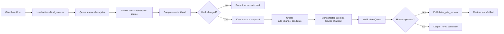

# DueDateHQ Beta 技术方案

## 架构

DueDateHQ 使用当前 Better-T-Stack 结构：

- Frontend：React、TanStack Router、Tailwind CSS、共享 shadcn/ui package。
- API：Hono、tRPC。
- Database：Cloudflare D1 + Drizzle。
- Runtime：Cloudflare Workers。
- Deployment：Cloudflare + Alchemy。
- Auth：Better Auth，Beta 阶段仅支持邮箱密码。

技术目标是实现真实 Beta 产品，同时严格区分已核验官方规则、用户手动录入截止日期和未核验义务。

技术 parity 目标：把 File In Time 有价值的工作流 baseline 实现为云端产品，而不是桌面软件复刻。系统应支持 client setup、source-specific CSV import preview/mapping/review/duplicate handling、obligation-driven task generation、Monday triage、filters/sorting、task status、extension handling、verified recurrence/upcoming tasks、dashboard/task exports 和产品内 urgency surfaces。除非后续明确优先，否则应主动排除 local database administration、backup/restore UI、Crystal Reports-style reporting、mail merge/labels、extension form printing、arbitrary field renaming、network-user maintenance、detailed rights matrices 和外部 email/SMS/calendar reminders。

## 系统边界

范围内：

- 认证用户 workspace。
- CSV import adapters。
- 手动客户和截止日期录入。
- 税务义务库。
- 核验状态。
- 官方来源监听 pipeline。
- 核验队列。
- 覆盖矩阵。
- Monday triage dashboard。
- 功能进度页。
- 用于运营复核的 dashboard/task export。

范围外：

- 生产级授权模型。
- 组织/团队权限。
- MFA、OAuth、密码重置、邮箱验证。
- AI 自动发布税务规则。
- 完整县/市/行业级自动化。
- Desktop database management、backup/restore UI、Crystal Reports-style reports、mail merge/labels、extension form printing、arbitrary field renaming、network-user maintenance、detailed rights matrices，以及外部 email/SMS/calendar reminders。

## 数据模型

### Auth

Better Auth 管理认证表。业务表引用认证用户和未来 firm profile。

### 业务表

`firms`

- `id`
- `name`
- `ownerUserId`
- `createdAt`
- `updatedAt`

`clients`

- `id`
- `firmId`
- `name`
- `entityType`
- `states`
- `county`
- `fiscalYearType`
- `notes`
- `sourceSystem`
- `createdVia`: `csv_import | manual`
- `createdAt`
- `updatedAt`

`import_batches`

- `id`
- `firmId`
- `sourceSystem`: `taxdome | drake | karbon | quickbooks`
- `status`: `previewed | committed | failed`
- `totalRows`
- `acceptedRows`
- `reviewRows`
- `duplicateRows`
- `headerDetected`
- `adapterVersion`
- `createdAt`

`tax_obligations`

- `id`
- `jurisdiction`
- `jurisdictionLevel`: `federal | state | county | city`
- `agencyName`
- `taxCategory`
- `obligationName`
- `entityTypes`
- `knownStatus`: `known | planned | unsupported`
- `createdAt`
- `updatedAt`

`tax_rules`

- `id`
- `obligationId`
- `ruleSummary`
- `dueDateRule`
- `verificationStatus`: `verified | needs_review | source_changed | unsupported`
- `sourceName`
- `sourceUrl`
- `lastVerifiedAt`
- `sourceLastCheckedAt`
- `sourceLastChangedAt`
- `sourceContentHash`
- `verifiedBy`
- `verificationNotes`
- `currentVersion`
- `createdAt`
- `updatedAt`

`deadline_tasks`

- `id`
- `firmId`
- `clientId`
- `taxRuleId` nullable；仅在 `sourceType = verified_rule` 时必填
- `title`
- `jurisdiction`
- `taxCategory`
- `dueDate`
- `originalDueDate`
- `extensionDueDate`
- `recurrenceKey`
- `status`: `not_started | in_progress | extended | done`
- `priority`
- `sourceType`: `verified_rule | user_provided`
- `userProvidedSourceNote`
- `createdVia`: `system_rule | manual`
- `createdAt`
- `updatedAt`

`official_sources`

- `id`
- `jurisdiction`
- `agencyName`
- `sourceType`: `html | pdf | rss | api | manual`
- `sourceUrl`
- `monitorFrequencyHours`
- `active`
- `createdAt`
- `updatedAt`

`source_snapshots`

- `id`
- `sourceId`
- `contentHash`
- `snapshotUrl`
- `capturedAt`

`source_check_runs`

- `id`
- `sourceId`
- `checkedAt`
- `status`: `success | failed | skipped`
- `httpStatus`
- `contentHash`
- `previousContentHash`
- `changedDetected`
- `errorMessage`

`rule_change_candidates`

- `id`
- `sourceId`
- `affectedRuleId`
- `detectedAt`
- `changeType`: `content_hash_changed | pdf_updated | feed_item | source_unreachable | keyword_match`
- `extractedSummary`
- `proposedRulePatch`
- `status`: `pending | approved | rejected`
- `reviewedBy`
- `reviewedAt`

`tax_rule_versions`

- `id`
- `ruleId`
- `version`
- `ruleSummary`
- `dueDateRule`
- `sourceSnapshotId`
- `publishedAt`
- `publishedBy`

`verification_requests`

- `id`
- `firmId`
- `requestType`: `source_changed | needs_review | user_requested | manual_deadline`
- `taxRuleId`
- `deadlineTaskId`
- `status`: `open | approved | rejected | closed`
- `message`
- `createdAt`
- `updatedAt`

`feature_items`

- `id`
- `category`
- `name`
- `description`
- `specPath`
- `status`: `done | in_progress | blocked | not_started`
- `priority`
- `updatedAt`

## API 表面

所有业务 API 都需要认证 session。

Auth：

- Better Auth handlers：注册、登录、登出、session。

Imports：

- `imports.preview`
- `imports.commit`

Manual entry：

- `clients.createManual`
- `deadlineTasks.createManual`
- `deadlineTasks.requestVerification`

Dashboard：

- `dashboard.summary`
- `dashboard.export`
- `tasks.updateStatus`
- `tasks.getEvidence`

Coverage：

- `coverage.matrix`
- `coverage.getRule`
- `coverage.requestCoverage`

Verification：

- `verificationQueue.list`
- `verificationQueue.approveCandidate`
- `verificationQueue.rejectCandidate`
- `verificationQueue.markReviewed`

Source monitoring：

- `officialSources.list`
- `officialSources.getCheckRuns`
- `officialSources.enqueueCheck`
- `officialSources.recordCheckResult`

Progress：

- `progress.list`

## 来源监听架构

Cloudflare 组件：

- Cron Triggers 至少每天启动一次来源监听。
- Queues 将官方来源检查任务 fan out。
- Worker consumer 拉取有界来源内容、计算 hash，并记录 check run。
- D1 保存来源元数据、hash、候选变更和规则版本。
- R2 后续可用于保存完整 HTML/PDF 快照。

监听规则：

```txt
The monitor may detect changes and create candidates.
It must not publish verified tax rules.
监听器可以检测变化并创建候选，但不能发布 Verified 税务规则。
```

流程：



## 前端页面

`/login`

- 注册和登录。

`/import`

- CSV 来源选择、上传、映射预览、行 review、提交。

`/clients/new`

- 手动创建客户。

`/clients/:id/deadlines/new`

- 手动创建截止日期。

`/`

- Monday triage dashboard，包含 urgency sections、filters/sorting、task status updates、extension visibility、evidence access 和 export。

`/coverage`

- 50 州覆盖矩阵，展示监听和核验状态。

`/verification`

- 内部核验队列。

`/progress`

- 功能完成进度页。

## 核验规则

只有 `tax_rules.verificationStatus = verified` 可以生成 `sourceType = verified_rule` 的官方 `deadline_tasks`。

其他状态：

- `needs_review`：显示在 coverage 和 verification queue，不生成官方任务。
- `source_changed`：已有任务显示 warning，不生成新的官方任务。
- `unsupported`：显示在 coverage，不生成任务。

手动 deadline：

- 保存为 `deadline_tasks.sourceType = user_provided`。
- 可以显示在 dashboard。
- 必须显示 `User provided · Not verified by DueDateHQ`。
- 可以创建 `verification_request`。

## 部署计划

目标：

- Cloudflare 账号：`Yessenia@dify.ai's Account`。
- Frontend：通过 Alchemy 部署 Cloudflare Vite。
- API：Cloudflare Worker。
- Database：D1。
- 可选快照：R2。
- 可选后台队列：Cloudflare Queues。

部署顺序：

1. 实现 schema 和 migrations。
2. 应用 D1 migration。
3. 部署 Worker API。
4. 部署前端。
5. Seed 初始 feature progress items 和代表性税务来源数据。
6. 验证外部 URL 流程。

## 测试计划

自动化：

- 类型检查。
- 构建。
- API tests：imports、manual deadlines、verification rules、source monitoring services。

手动：

- 注册登录。
- 导入每个来源的代表 CSV。
- 确认 import preview 在 commit 前检测 headers、mapping、review rows 和 likely duplicates。
- 手动创建客户和截止日期。
- 确认只有 verified rules 创建官方任务。
- 确认 source changed rule 不会创建新的官方任务。
- 确认 verified recurring obligations 不需要 manual rollover 就能生成 upcoming tasks。
- 确认 dashboard filters/sorting、extension status、urgency surfaces 和 export 可用。
- 确认 coverage matrix 显示 monitor status。
- 确认 evidence drawer 显示 last checked、last changed 和 rule versions。
- 确认 verification queue approval 会发布新版本。

## 实现护栏

- 不自动发布来源变化。
- 不把 unsupported obligations 展示为已确认截止日期。
- 不把 user-provided deadlines 从 dashboard 隐藏，但必须明确标注。
- 用户文案必须明确说明 Beta 数据覆盖状态。
