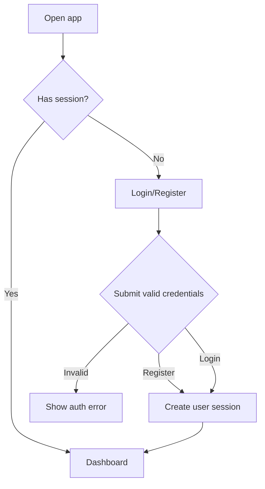

# Auth

## Goal

Allow external Beta users to register, log in, and access their own DueDateHQ workspace.

## User Flow

1. User opens the hosted product.
2. User registers with email and password.
3. User lands in the product workspace.
4. Returning user logs in and resumes work.
5. User can log out.

## Flow Diagram

## Pages

- `/login`
  - Register form.
  - Login form.
  - Error state for invalid credentials.
  - Loading state.

Authenticated pages redirect unauthenticated users to `/login`.

## API

Use Better Auth handlers for:

- Register.
- Login.
- Logout.
- Session lookup.

Business tRPC procedures must require a valid session.

## Data Model

Better Auth owns auth tables.

Business tables reference:

- `userId`
- `firmId`

## Acceptance Criteria

- User can register with email/password.
- User can log in after registration.
- User can log out.
- Unauthenticated users cannot access business API data.
- Auth implementation does not expose data across users.

## Out of Scope

- OAuth.
- MFA.
- Password reset.
- Email verification.
- Organizations and team invitations.
