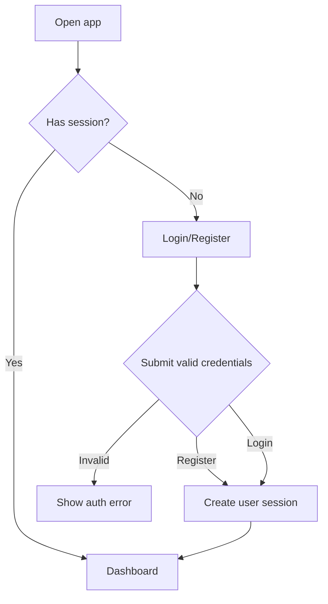

# Auth

## Goal

允许外部 Beta 用户注册、登录，并访问自己的 DueDateHQ workspace。

## User Flow

1. 用户打开已部署产品。
2. 用户用邮箱和密码注册。
3. 用户进入产品 workspace。
4. 回访用户登录并继续工作。
5. 用户可以登出。

## Flow Diagram

## Pages

- `/login`
  - 注册表单。
  - 登录表单。
  - 无效凭据错误状态。
  - 加载状态。

未登录用户访问需要认证的页面时重定向到 `/login`。

## API

使用 Better Auth handlers：

- Register。
- Login。
- Logout。
- Session lookup。

业务 tRPC procedures 必须要求有效 session。

## Data Model

Better Auth 管理认证表。

业务表引用：

- `userId`
- `firmId`

## Acceptance Criteria

- 用户可以用邮箱/密码注册。
- 用户注册后可以登录。
- 用户可以登出。
- 未登录用户不能访问业务 API 数据。
- 认证实现不能跨用户泄露数据。

## Out of Scope

- OAuth。
- MFA。
- 密码重置。
- 邮箱验证。
- 组织和团队邀请。
