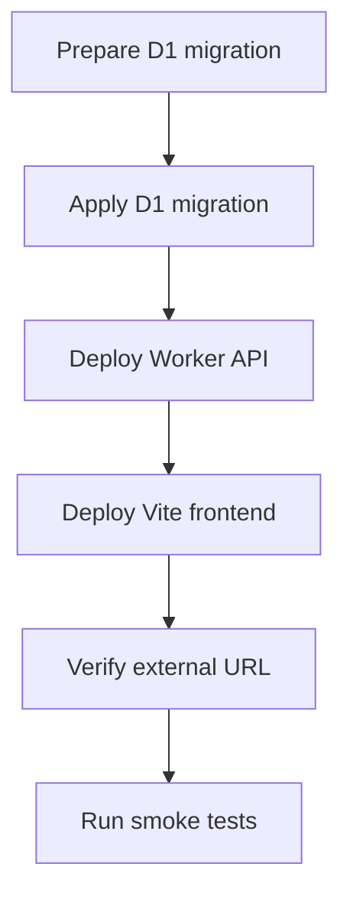

# Cloudflare Deployment

## Goal

Deploy DueDateHQ as an externally accessible Beta product using the existing Cloudflare-oriented stack.

## User Flow

1. Engineer applies database migrations.
2. Engineer deploys Worker API.
3. Engineer deploys frontend.
4. External user visits product URL.
5. User registers and uses product.

## Flow Diagram

## Pages

Deployment affects all hosted pages:

- `/login`
- `/`
- `/import`
- `/coverage`
- `/verification`
- `/progress`

## API

All tRPC endpoints must be reachable from deployed frontend through configured server URL.

## Data Model

Deployment requires D1 tables for all implemented features.

## Acceptance Criteria

- Product is accessible from an external URL.
- Worker API responds.
- Frontend can reach API.
- D1 migrations are applied.
- Auth and core flows work in deployed environment.
- Cloudflare account is confirmed as `Yessenia@dify.ai's Account` unless explicitly changed.

## Out of Scope

- Custom domain.
- Production incident monitoring.
- Multi-environment promotion pipeline.
