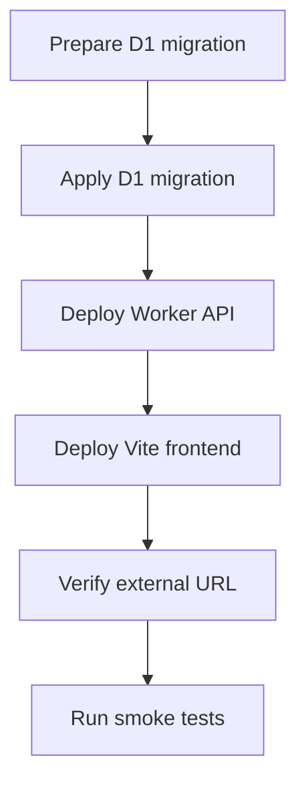

# Cloudflare Deployment

## Goal

使用当前 Cloudflare 技术栈，将 DueDateHQ 部署为外部可访问的 Beta 产品。

## User Flow

1. 工程师应用数据库迁移。
2. 工程师部署 Worker API。
3. 工程师部署前端。
4. 外部用户访问产品 URL。
5. 用户注册并使用产品。

## Flow Diagram

## Pages

部署影响所有 hosted pages：

- `/login`
- `/`
- `/import`
- `/coverage`
- `/verification`
- `/progress`

## API

所有 tRPC endpoints 必须能通过配置好的 server URL 被已部署前端访问。

## Data Model

部署需要 D1 中存在所有已实现功能的表。

## Acceptance Criteria

- 产品可通过外部 URL 访问。
- Worker API 响应正常。
- 前端可以访问 API。
- D1 migrations 已应用。
- Auth 和核心流程在部署环境可用。
- 除非明确改变，否则 Cloudflare 账号确认为 `Yessenia@dify.ai's Account`。

## Out of Scope

- 自定义域名。
- 生产级 incident monitoring。
- 多环境 promotion pipeline。
