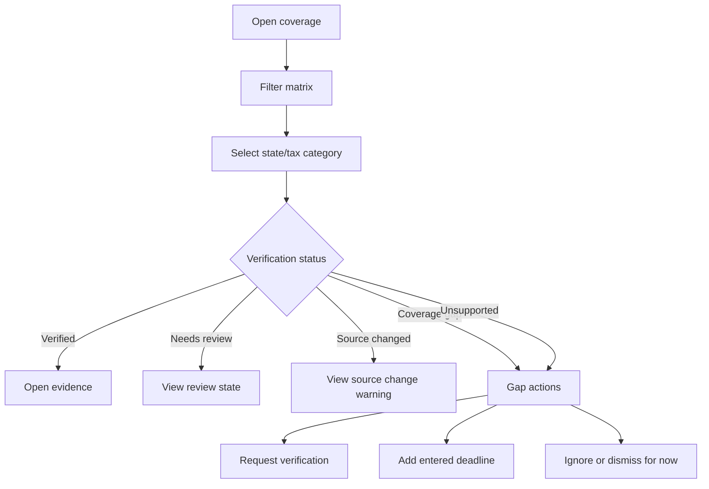

# Coverage Matrix

## Goal

Show users which states, tax categories, obligations, and official sources DueDateHQ supports or knows about, which rules are verified, and where coverage gaps remain.

This is a transparency improvement over File In Time-style bundled service lists. Users should see supported coverage, coverage gaps, source monitoring, and verification status directly instead of assuming every known obligation is schedulable. Beta must not imply complete 50-state verified coverage.

## User Flow

1. User opens `/coverage`.
2. User filters by state, entity type, tax category, or verification status.
3. User sees coverage cells and monitor status.
4. User opens a coverage detail.
5. User can view evidence or act on coverage gaps.

## Flow Diagram

## Pages

- `/coverage`
  - Coverage matrix.
  - Filter controls.
  - Rule detail panel.
  - Coverage-gap actions.

## API

- `coverage.matrix`
- `coverage.getRule`
- `coverage.requestCoverage`
- `coverage.addEnteredDeadlineFromGap`
- `coverage.dismissGapForNow`

## Data Model

Reads from:

- `tax_obligations`
- `tax_rules`
- `official_sources`
- `source_check_runs`
- `verification_requests`

Display fields:

- State.
- Tax category.
- Obligation name.
- Verification status.
- Coverage state.
- Monitor status.
- Last checked.
- Last changed.
- Last verified.
- Source agency.
- Supported source/scope.

## Acceptance Criteria

- Matrix can list all 50 states for transparency without claiming complete verified coverage.
- Matrix distinguishes known obligations from verified rules.
- Verified cells link to evidence.
- Supported sources/states are explicit.
- Source changed cells show warning.
- Coverage-gap cells are visible and actionable.
- Unsupported cells do not imply scheduling support.
- Monitor status is visible when an official source exists.
- Needs-review, coverage-gap, and unsupported entries are visible without being presented as verified official deadlines.
- Coverage gaps support request DueDateHQ verification, add entered deadline, and ignore/dismiss for now.
- P0 official sources are IRS, California FTB, New York Tax Department, Texas Comptroller, and Florida Department of Revenue.

## Out of Scope

- Public SEO page implementation.
- Full city/county coverage in Beta.
- Promising complete 50-state verified coverage in Beta.
