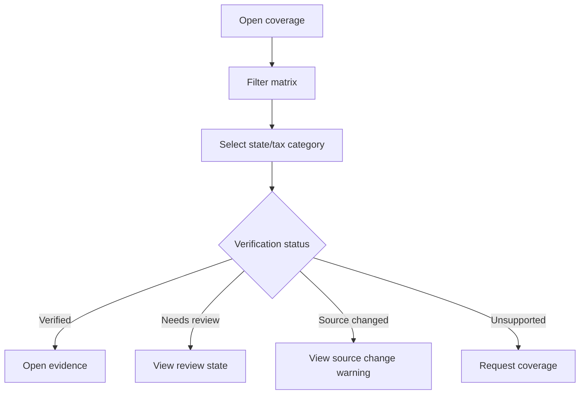

# Coverage Matrix

## Goal

Show users which states, tax categories, and obligations DueDateHQ knows about, which rules are verified, and which sources are monitored.

## User Flow

1. User opens `/coverage`.
2. User filters by state, entity type, tax category, or verification status.
3. User sees coverage cells and monitor status.
4. User opens a coverage detail.
5. User can view evidence or request coverage.

## Flow Diagram

## Pages

- `/coverage`
  - Coverage matrix.
  - Filter controls.
  - Rule detail panel.
  - Request coverage action.

## API

- `coverage.matrix`
- `coverage.getRule`
- `coverage.requestCoverage`

## Data Model

Reads from:

- `tax_obligations`
- `tax_rules`
- `official_sources`
- `source_check_runs`
- `verification_requests`

Display fields:

- State.
- Tax category.
- Obligation name.
- Verification status.
- Monitor status.
- Last checked.
- Last changed.
- Last verified.
- Source agency.

## Acceptance Criteria

- Matrix includes all 50 states.
- Matrix distinguishes known obligations from verified rules.
- Verified cells link to evidence.
- Source changed cells show warning.
- Unsupported cells do not imply scheduling support.
- Monitor status is visible when an official source exists.

## Out of Scope

- Public SEO page implementation.
- Full city/county coverage in Beta.
