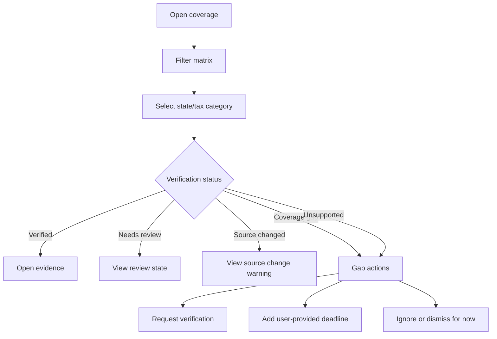

# Coverage Matrix

## Goal

向用户展示 DueDateHQ 支持或已知哪些州、税种、义务和官方来源，哪些规则已核验，以及哪些 coverage gaps 仍然存在。

这是相比 File In Time-style bundled service lists 的透明度改进。用户应该直接看到 supported coverage、coverage gaps、source monitoring 和 verification status，而不是默认认为每个 known obligation 都可以安全安排。Beta 不能暗示完整 50 州已核验覆盖。

## User Flow

1. 用户打开 `/coverage`。
2. 用户按 state、entity type、tax category 或 verification status 筛选。
3. 用户看到 coverage cells 和 monitor status。
4. 用户打开 coverage detail。
5. 用户可以查看 evidence 或处理 coverage gaps。

## Flow Diagram

## Pages

- `/coverage`
  - Coverage matrix。
  - 筛选控件。
  - Rule detail panel。
  - Coverage-gap actions。

## API

- `coverage.matrix`
- `coverage.getRule`
- `coverage.requestCoverage`
- `coverage.addUserProvidedDeadlineFromGap`
- `coverage.dismissGapForNow`

## Data Model

读取：

- `tax_obligations`
- `tax_rules`
- `official_sources`
- `source_check_runs`
- `verification_requests`

展示字段：

- State。
- Tax category。
- Obligation name。
- Verification status。
- Coverage state。
- Monitor status。
- Last checked。
- Last changed。
- Last verified。
- Source agency。
- Supported source/scope。

## Acceptance Criteria

- Matrix 可以列出 50 个州以保持透明，但不能声称 Beta 已完成 verified coverage。
- Matrix 区分 known obligations 和 verified rules。
- Verified cells 链接到 evidence。
- Supported sources/states 明确展示。
- Source changed cells 显示 warning。
- Coverage-gap cells 可见且可操作。
- Unsupported cells 不暗示已支持安排。
- 存在官方来源时显示 monitor status。
- Needs-review、coverage-gap 和 unsupported entries 可见，但不能被呈现为 verified official deadlines。
- Coverage gaps 支持 request DueDateHQ verification、add user-provided deadline、ignore/dismiss for now。
- P0 官方来源是 IRS、California FTB、New York Tax Department、Texas Comptroller、Florida Department of Revenue。

## Out of Scope

- Public SEO page 实现。
- Beta 阶段完整 city/county coverage。
- Beta 阶段承诺完整 50 州已核验覆盖。
