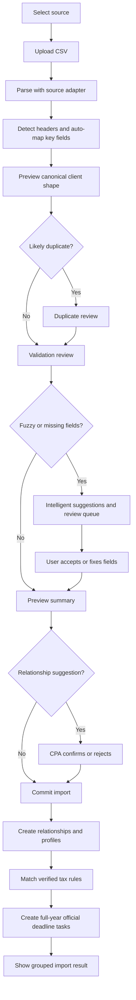

# CSV Imports

## Goal

Let CPAs import client relationships and filing/tax profiles from TaxDome, Drake, Karbon, and QuickBooks CSV exports, preview rows, review field mapping, resolve likely duplicates, confirm suggested individual/business relationships, fix missing fields, and create official full-year deadline tasks only when imported profiles match Verified tax rules. The P0 migration target is a CPA completing a 30-client import within 30 minutes.

## User Flow

1. User opens `/import`.
2. User selects source system.
3. User uploads CSV.
4. System automatically recognizes field mapping for client name, EIN, state, and entity type where possible.
5. System previews field mapping.
6. System detects headers, validation issues, fuzzy or missing fields, and likely duplicate clients.
7. System suggests possible relationships between individuals and businesses, but does not auto-merge them.
8. System provides intelligent, non-blocking suggestions and sends uncertain rows to review.
9. User reviews uncertain rows, duplicate candidates, and relationship suggestions.
10. User commits import.
11. System creates client relationships and filing/tax profiles.
12. System generates each profile's full-year official deadline calendar/tasks only from verified tax rules.
13. User sees a profile/problem grouped import summary and can open dashboard.

## Flow Diagram

## Pages

- `/import`
  - Source selection.
  - File upload.
  - Header detection.
  - Mapping preview.
  - Duplicate review.
  - Relationship suggestion review.
  - Row review.
  - Commit summary grouped by filing/tax profile and problem.

## API

- `imports.preview`
  - Input: source system, CSV file or text.
  - Output: batch id, header detection result, column mapping, automatically recognized key fields, mapping confidence, accepted profile rows, review rows, duplicate candidates, relationship suggestions, suggestions, validation messages.

- `imports.commit`
  - Input: batch id, reviewed row corrections, duplicate resolutions, and accepted/rejected relationship suggestions.
  - Output: ready profile count, created/updated client relationship count, updated/skipped duplicate count, created full-year deadline task count, profile review item count, needs-review obligation count, coverage-gap count, unsupported obligation count.

## Data Model

`import_batches`

- Source system.
- Status.
- Total rows.
- Accepted rows.
- Review rows.
- Duplicate rows.
- Header detected.
- Adapter version.

`client_relationships`

- Created from canonical import rows or CPA-confirmed relationship suggestions.

`filing_profiles`

- Created from canonical import rows.

`deadline_tasks`

- Generated from verified rules only.

Canonical filing/tax profile shape:

- Client name.
- EIN.
- SSN last four when present.
- Entity type.
- States.
- County.
- Fiscal year type.
- Source system.
- Source row id.

Relationship suggestion shape:

- Incoming profile row id.
- Suggested existing or new client relationship id.
- Reason.
- Suggested action: confirm relationship or keep separate.
- Status: pending, accepted, or rejected.

Duplicate candidate shape:

- Incoming row id.
- Existing client id.
- Matched fields.
- Differing fields.
- Suggested action: create, update existing, or skip.

## Competitor Parity Notes

File In Time treats import as a review workflow, not a blind upload. DueDateHQ must match preview, mapping, header handling, review before commit, and duplicate resolution. DueDateHQ should be better by using source-specific adapters that start from known TaxDome, Drake, Karbon, and QuickBooks exports instead of making every user map a generic delimited file from scratch. It should also group review by filing/tax profile and problem type so CPAs are not forced to reason through every generated task.

## Acceptance Criteria

- TaxDome adapter supports representative TaxDome client export fields.
- Drake adapter supports representative Drake client export fields.
- Karbon adapter supports representative Karbon contact export fields.
- QuickBooks adapter supports representative QuickBooks customer export fields.
- A CPA migrating from TaxDome can complete import of 30 clients within 30 minutes.
- Import performance target is `P95 <= 30 minutes for a 30-client import`.
- System automatically recognizes field mapping for client name, EIN, state, and entity type.
- Fuzzy or missing fields receive intelligent, non-blocking suggestions and send uncertain rows to review instead of blocking the full import.
- Possible relationships between individuals and businesses are suggested but never auto-merged.
- CPA must explicitly confirm or reject relationship suggestions.
- User-facing copy says `Filing profile` or `Tax profile` and avoids internal tax-subject jargon.
- Missing required fields are reviewable, not silently dropped.
- Header detection and mapping preview are visible before commit.
- Likely duplicate clients are shown with field differences and a user-selected resolution.
- Import commit creates client relationships and filing/tax profiles.
- After import, matching Verified rules immediately generate each filing/tax profile's full-year deadline calendar/tasks.
- Only verified rules generate official deadline tasks.
- Needs-review, coverage-gap, and unsupported obligations remain visible but are not official confirmed deadlines.
- Related P0 capabilities include CSV import, field mapping, calendar/task auto-generation, entity type auto-recognition, and intelligent field matching.
- Import summary explains ready profiles, generated verified tasks, profile review items, needs-review items, coverage gaps, and unsupported obligations in plain language.

## Out of Scope

- Perfect compatibility with every historical export variant.
- Direct API integrations with source products.
- Storing raw CSV files permanently.
- Mail merge, labels, or client export formats unrelated to deadline onboarding.
