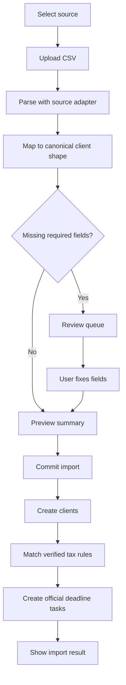

# CSV Imports

## Goal

Let CPAs import clients from TaxDome, Drake, Karbon, and QuickBooks CSV exports, review field mapping, fix missing fields, and generate verified deadline tasks.

## User Flow

1. User opens `/import`.
2. User selects source system.
3. User uploads CSV.
4. System previews field mapping.
5. User reviews uncertain rows.
6. User commits import.
7. System creates clients.
8. System generates official deadline tasks only from verified tax rules.
9. User sees import summary and can open dashboard.

## Flow Diagram

## Pages

- `/import`
  - Source selection.
  - File upload.
  - Mapping preview.
  - Row review.
  - Commit summary.

## API

- `imports.preview`
  - Input: source system, CSV file or text.
  - Output: batch id, column mapping, accepted rows, review rows, validation messages.

- `imports.commit`
  - Input: batch id and reviewed row corrections.
  - Output: created client count, created deadline task count, needs-review obligation count, unsupported obligation count.

## Data Model

`import_batches`

- Source system.
- Status.
- Total rows.
- Accepted rows.
- Review rows.

`clients`

- Created from canonical import rows.

`deadline_tasks`

- Generated from verified rules only.

Canonical client shape:

- Client name.
- Entity type.
- States.
- County.
- Fiscal year type.
- Source system.
- Source row id.

## Acceptance Criteria

- TaxDome adapter supports representative TaxDome client export fields.
- Drake adapter supports representative Drake client export fields.
- Karbon adapter supports representative Karbon contact export fields.
- QuickBooks adapter supports representative QuickBooks customer export fields.
- Missing required fields are reviewable, not silently dropped.
- Import commit creates clients.
- Only verified rules generate official deadline tasks.
- Import summary explains generated, needs-review, and unsupported obligations.

## Out of Scope

- Perfect compatibility with every historical export variant.
- Direct API integrations with source products.
- Storing raw CSV files permanently.
