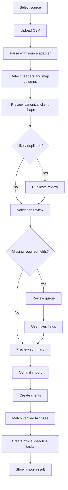

# CSV Imports

## Goal

Let CPAs import clients from TaxDome, Drake, Karbon, and QuickBooks CSV exports, preview rows, review field mapping, resolve likely duplicates, fix missing fields, and create official deadline tasks only when imported clients match Verified tax rules.

## User Flow

1. User opens `/import`.
2. User selects source system.
3. User uploads CSV.
4. System previews field mapping.
5. System detects headers, validation issues, and likely duplicate clients.
6. User reviews uncertain rows and duplicate candidates.
7. User commits import.
8. System creates clients.
9. System generates official deadline tasks only from verified tax rules.
10. User sees import summary and can open dashboard.

## Flow Diagram

## Pages

- `/import`
  - Source selection.
  - File upload.
  - Header detection.
  - Mapping preview.
  - Duplicate review.
  - Row review.
  - Commit summary.

## API

- `imports.preview`
  - Input: source system, CSV file or text.
  - Output: batch id, header detection result, column mapping, accepted rows, review rows, duplicate candidates, validation messages.

- `imports.commit`
  - Input: batch id, reviewed row corrections, and duplicate resolutions.
  - Output: created client count, updated/skipped duplicate count, created deadline task count, needs-review obligation count, unsupported obligation count.

## Data Model

`import_batches`

- Source system.
- Status.
- Total rows.
- Accepted rows.
- Review rows.
- Duplicate rows.
- Header detected.
- Adapter version.

`clients`

- Created from canonical import rows.

`deadline_tasks`

- Generated from verified rules only.

Canonical client shape:

- Client name.
- Entity type.
- States.
- County.
- Fiscal year type.
- Source system.
- Source row id.

Duplicate candidate shape:

- Incoming row id.
- Existing client id.
- Matched fields.
- Differing fields.
- Suggested action: create, update existing, or skip.

## Competitor Parity Notes

File In Time treats import as a review workflow, not a blind upload. DueDateHQ must match preview, mapping, header handling, review before commit, and duplicate resolution. DueDateHQ should be better by using source-specific adapters that start from known TaxDome, Drake, Karbon, and QuickBooks exports instead of making every user map a generic delimited file from scratch.

## Acceptance Criteria

- TaxDome adapter supports representative TaxDome client export fields.
- Drake adapter supports representative Drake client export fields.
- Karbon adapter supports representative Karbon contact export fields.
- QuickBooks adapter supports representative QuickBooks customer export fields.
- Missing required fields are reviewable, not silently dropped.
- Header detection and mapping preview are visible before commit.
- Likely duplicate clients are shown with field differences and a user-selected resolution.
- Import commit creates clients.
- Only verified rules generate official deadline tasks.
- Import summary explains generated, needs-review, and unsupported obligations.

## Out of Scope

- Perfect compatibility with every historical export variant.
- Direct API integrations with source products.
- Storing raw CSV files permanently.
- Mail merge, labels, or client export formats unrelated to deadline onboarding.
