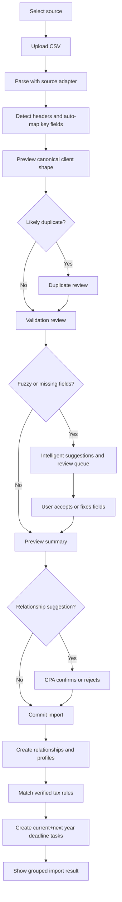

# CSV Imports

## Goal

让 CPA 从 TaxDome、Drake、Karbon、QuickBooks CSV 导出中导入 client relationships 和 filing/tax profiles，preview rows、review 字段映射、处理 likely duplicates、确认个人/企业 relationship suggestions、修正缺失字段，并且只在导入 profiles 匹配 Verified tax rules 时创建官方当前税年加下一税年 deadline tasks。P0 迁移目标是 CPA 在 30 分钟内完成 30-client import。

## User Flow

1. 用户打开 `/import`。
2. 用户选择来源系统。
3. 用户上传 CSV。
4. 系统在可能时自动识别 client name、EIN、state 和 entity type 字段映射。
5. 系统预览字段映射。
6. 系统检测 headers、validation issues、模糊或缺失字段和 likely duplicate clients。
7. 系统建议个人与企业之间的潜在关系，但不自动合并。
8. 系统提供智能、非阻塞建议，并将不确定行送入 review。
9. 用户 review 不确定行、duplicate candidates 和 relationship suggestions。
10. 用户提交导入。
11. 系统创建 client relationships 和 filing/tax profiles。
12. 系统只根据 verified tax rules 创建每个 profile 的当前税年加下一税年的官方 deadline tasks。
13. 用户看到按 profile/problem 分组的导入摘要并可打开 dashboard。

## Flow Diagram

## Pages

- `/import`
  - 来源选择。
  - 文件上传。
  - Header detection。
  - 映射预览。
  - Duplicate review。
  - Relationship suggestion review。
  - 行 review。
  - 按 filing/tax profile 和 problem 分组的提交摘要。

## API

- `imports.preview`
  - 输入：来源系统、CSV 文件或文本。
  - 输出：batch id、detected source profile、adapter version、header detection result、列映射、自动识别的关键字段、未映射 source columns、mapping confidence、accepted profile rows、review rows、duplicate candidates、relationship suggestions、suggestions、validation messages。

- `imports.commit`
  - 输入：batch id、已修正行、duplicate resolutions，以及 accepted/rejected relationship suggestions。
  - 输出：ready profile count、created/updated client relationship count、updated/skipped duplicate count、当前税年加下一税年 deadline task 数、profile review item count、needs-review 义务数、coverage-gap 数、unsupported 义务数。

## Data Model

`import_batches`

- 来源系统。
- 状态。
- 总行数。
- Accepted rows。
- Review rows。
- Duplicate rows。
- Header detected。
- Adapter version。

`client_relationships`

- 从 canonical import rows 或 CPA-confirmed relationship suggestions 创建。

`filing_profiles`

- 从 canonical import rows 创建。

`deadline_tasks`

- 只从 verified rules 生成。

Canonical filing/tax profile shape：

- Client name。
- EIN。
- SSN last four（如存在）。
- Entity type。
- States。
- County。
- Fiscal year type。
- Source system。
- Source row id。

Relationship suggestion shape：

- Incoming profile row id。
- Suggested existing or new client relationship id。
- Reason。
- Suggested action：confirm relationship 或 keep separate。
- Status：pending、accepted 或 rejected。

Duplicate candidate shape：

- Incoming row id。
- Existing client id。
- Matched fields。
- Differing fields。
- Suggested action：create、update existing 或 skip。

## Source Adapter Profiles

详细调研见 `.trellis/tasks/05-05-due-date-hq-docs-specs/research/csv-source-export-format-research.md`。
补充 official-source profile 调研见 `.trellis/tasks/05-05-due-date-hq-docs-specs/research/csv-export-import-profiles-taxdome-drake-karbon-quickbooks.md`。

| Source | P0 adapter profiles | Strong fields | Review-first fields and caveats |
|---|---|---|---|
| TaxDome | `taxdome_accounts_v1`、`taxdome_contacts_v1` | Account name、contact name、first/last name、company name、state/province、email、phone、linked accounts/contacts、tags、custom fields | EIN、SSN、filing entity type、fiscal year 和 tax-state 字段通常依赖 firm-defined custom fields。Linked accounts/contacts 只生成 relationship suggestions，不能自动合并 records。 |
| Drake | `drake_client_export_v1` | 官方文档确认 Drake Tax 可将 client data files 导出为 CSV，但没有公开稳定字段列表 | Drake adapter 应按样本驱动。支持 client id、SSN/EIN、taxpayer/company name、address、state、return type、entity 等可能 aliases，但 headers 缺失或置信度低时必须进入 mapping review。 |
| Karbon | `karbon_import_file_v1`、`karbon_bulk_update_v1` | Organization name、first/last name、client identifier、fiscal year end、email、phone、address、client group、belongs-to/associated-organization fields | Bulk update data 可能是 multi-tab XLSX 而不是 single CSV。Business Number 不一定是美国 EIN。Belongs-to 和 associated organization fields 只生成 relationship suggestions。 |
| QuickBooks | `quickbooks_online_customer_contact_v1`、`quickbooks_desktop_customer_vendor_v1` | Customer/name、company/full name、first/last name、email、phone、billing address、billing state、customer/entity type（如被选中） | QuickBooks customer exports 主要是 contact/accounting data，不是 tax-profile data。EIN/SSN 通常不存在，除非存储在 custom、notes 或用户选择的其他列中。Bank transaction CSV 不是有效 client import file。 |

所有 adapters 必须：

- 将 ZIP、SSN、EIN、phone numbers、source IDs 等 identifiers 当作字符串保存，保留 leading zeros。
- 优先使用 header-based mapping；没有可靠 headers 时要求用户 mapping。
- Commit 前展示 detected source profile、adapter version、recognized columns、unmapped columns 和需要 review 的字段。
- 在 mapping preview 中展示 source custom fields，而不是丢弃。
- 对不确定 entity type、tax ID、tax state、fiscal year 和 relationship fields 进入 review，而不是阻塞整个 import。
- 在 import batches 中保存 adapter versions，便于追踪 source-format changes。

## Export Compatibility Boundary

DueDateHQ 的 P0 CSV compatibility 主要表示从 TaxDome、Drake、Karbon、QuickBooks 导出的 CSV 中导入 client/profile data。Dashboard/task CSV export 是独立的 operational feature。

Outbound CSV exports 不能暗示双向 product compatibility，除非目标产品的官方 import schema 已被记录并明确支持：

- 默认 DueDateHQ task export 是用于 workload sharing 和 review 的 generic current task view CSV。
- Product-specific task export 目前只对 Karbon work-item profile 有较可信落点，并且应在确认 exact template requirements 前保持 optional。
- TaxDome、Drake、QuickBooks task-import compatibility 不是 Beta 承诺；它们在 P0 中的支持范围是作为 source client/profile import。

## Competitor Parity Notes

File In Time 把 import 当作 review workflow，而不是盲目 upload。DueDateHQ 必须覆盖 preview、mapping、header handling、commit 前 review 和 duplicate resolution。DueDateHQ 应该通过 source-specific adapters 做得更好，让 TaxDome、Drake、Karbon、QuickBooks 用户不必每次从 generic delimited file 开始手工 mapping。同时 review 应按 filing/tax profile 和 problem type 分组，避免 CPA 被迫逐条理解每个 generated task。

## Acceptance Criteria

- TaxDome adapter 支持 account 和 contact export profiles，包括 linked accounts/contacts 与 custom fields。
- Drake adapter 支持 sample-driven Drake client exports，并在 public-header confidence 低时要求 mapping review。
- Karbon adapter 支持 import/contact-list exports，以及以 CSV 提供的 bulk-contact-update organization/person data。
- QuickBooks adapter 支持 QBO customer/contact-list exports 和 QuickBooks Desktop customer/vendor list exports；bank transaction CSV 会因 source type 错误被拒绝。
- 从 TaxDome 迁移的 CPA 可在 30 分钟内完成 30 个客户导入。
- 导入性能目标为 `P95 <= 30 minutes for a 30-client import`。
- 当字段存在或可高置信推断时，系统自动识别 client name、EIN、state 和 entity type 字段映射；不确定值进入 review。
- 模糊或缺失字段获得智能、非阻塞建议，不确定行进入 review，而不是阻塞整个导入。
- 个人与企业之间的潜在关系可以被建议，但绝不能自动合并。
- CPA 必须明确确认或拒绝 relationship suggestions。
- User-facing copy 使用 `Filing profile` 或 `Tax profile`，避免内部 tax-subject jargon。
- 缺失必填字段可以 review，不会被静默丢弃。
- Header detection 和 mapping preview 在 commit 前可见。
- Likely duplicate clients 展示 field differences，并由用户选择处理方式。
- Import commit 创建 client relationships 和 filing/tax profiles。
- 导入后，匹配的 Verified rules 立即生成每个 filing/tax profile 当前税年加下一税年的 deadline tasks。已过期 tasks 标记为逾期。
- 只有 verified rules 生成官方 deadline tasks。
- 匹配使用 `jurisdiction × entityType`：系统将 `["federal"] + profile.states` 作为管辖区列表，与包含 profile entity type 的义务匹配。
- 多州 profiles 按州独立匹配。
- Needs-review、coverage-gap 和 unsupported obligations 保持可见，但不是官方已确认截止日期。
- 相关 P0 能力包括 CSV import、field mapping、calendar/task auto-generation、entity type auto-recognition 和 intelligent field matching。
- 导入摘要用平实语言解释 ready profiles、generated verified tasks、profile review items、needs-review items、coverage gaps 和 unsupported obligations。

## Out of Scope

- 完美兼容每一种历史导出格式。
- 与来源产品直接 API 集成。
- 永久存储原始 CSV 文件。
- 与 deadline onboarding 无关的 mail merge、labels 或 client export formats。
