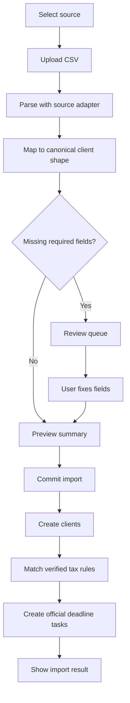

# CSV Imports

## Goal

让 CPA 从 TaxDome、Drake、Karbon、QuickBooks CSV 导出中导入客户，review 字段映射，修正缺失字段，并生成已核验截止日期任务。

## User Flow

1. 用户打开 `/import`。
2. 用户选择来源系统。
3. 用户上传 CSV。
4. 系统预览字段映射。
5. 用户 review 不确定行。
6. 用户提交导入。
7. 系统创建客户。
8. 系统只根据 verified tax rules 创建官方 deadline tasks。
9. 用户看到导入摘要并可打开 dashboard。

## Flow Diagram

## Pages

- `/import`
  - 来源选择。
  - 文件上传。
  - 映射预览。
  - 行 review。
  - 提交摘要。

## API

- `imports.preview`
  - 输入：来源系统、CSV 文件或文本。
  - 输出：batch id、列映射、accepted rows、review rows、validation messages。

- `imports.commit`
  - 输入：batch id 和已修正行。
  - 输出：创建客户数、创建任务数、needs-review 义务数、unsupported 义务数。

## Data Model

`import_batches`

- 来源系统。
- 状态。
- 总行数。
- Accepted rows。
- Review rows。

`clients`

- 从 canonical import rows 创建。

`deadline_tasks`

- 只从 verified rules 生成。

Canonical client shape：

- Client name。
- Entity type。
- States。
- County。
- Fiscal year type。
- Source system。
- Source row id。

## Acceptance Criteria

- TaxDome adapter 支持代表性 TaxDome client export 字段。
- Drake adapter 支持代表性 Drake client export 字段。
- Karbon adapter 支持代表性 Karbon contact export 字段。
- QuickBooks adapter 支持代表性 QuickBooks customer export 字段。
- 缺失必填字段可以 review，不会被静默丢弃。
- Import commit 创建客户。
- 只有 verified rules 生成官方 deadline tasks。
- 导入摘要解释 generated、needs-review、unsupported obligations。

## Out of Scope

- 完美兼容每一种历史导出格式。
- 与来源产品直接 API 集成。
- 永久存储原始 CSV 文件。
