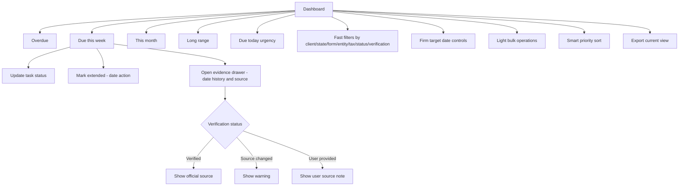

# Dashboard

## Goal

Give solo or independent CPAs serving about 80 mixed individual and small-business clients a fast working surface for weekly deadline prioritization, with clear verification evidence, urgency surfaces, deterministic smart priority sorting, filters/sorting, extension/date-change handling, optional firm target dates, light bulk operations, and export for each official or user-provided deadline.

## User Flow

1. User logs in.
2. User lands on the default dashboard grouped into `Overdue`, `Due this week`, `This month`, and `Long range`.
3. Within 30 seconds of opening after login, user sees all deadlines needing action this week with countdowns in days.
4. User reviews overdue items, due today, `Due this week`, `This month`, and `Long range`.
5. User filters and sorts tasks by client relationship, filing/tax profile, state, form/obligation type, entity type, tax type, task status, and verification status.
6. User opens evidence drawer for date history and source details.
7. User one-click marks a deadline `Done`, `Waiting on client`, or `In progress`.
8. User marks a deadline as extended via a date action that records the new due date.
9. User optionally sets or bulk-updates firm target dates for triage.
10. User exports the current task view for workload review.

## Flow Diagram

## Pages

- `/`
  - Dashboard sections.
  - Filters.
  - Task rows.
  - Evidence drawer.

## API

- `dashboard.summary`
- `dashboard.export`
- `dashboard.bulkExportCurrentFilteredView`
- `tasks.updateStatus`
- `tasks.bulkUpdateStatus`
- `tasks.updateFirmTargetDate`
- `tasks.bulkUpdateFirmTargetDate`
- `tasks.getEvidence`

## Data Model

Reads:

- `client_relationships`
- `filing_profiles`
- `deadline_tasks`
- `tax_rules`
- `tax_rule_versions`
- `official_sources`
- `source_check_runs`

Task statuses (work-progress):

- `not_started`
- `in_progress`
- `waiting_on_client`
- `done`

Derived date states (shown as badges, not statuses):

- Extended: derived from `deadline_date_events` with `official_extension` type.
- Overdue: derived from `currentDueDate < today AND status != done`.

Task row fields:

- Client relationship.
- Filing/tax profile.
- Obligation.
- Jurisdiction/state.
- Form/obligation type.
- Tax category.
- Current due date (only this date is shown; original due date and date history are in the evidence drawer).
- Optional firm target date.
- Days remaining (or days overdue).
- Status.
- Priority.
- Extended badge when applicable.
- Verification badge.

Source types:

- `verified_rule`
- `user_provided`

## CSV Export Contract

The dashboard export is a DueDateHQ current task view CSV, not a blanket promise that every third-party product can import DueDateHQ tasks.

Minimum columns:

- Client relationship.
- Filing/tax profile.
- Obligation.
- Jurisdiction.
- Tax category.
- Current official due date.
- Original due date.
- Firm target date.
- Status.
- Verification status.
- Source type.
- Source name.
- Source URL.
- Last verified at.
- Source last changed at.
- Priority.
- Extension status.
- Notes.

Product-specific export profiles are out of scope unless a target product has a documented task/work import schema. Research found Karbon work-item export is the only plausible optional target for later validation; TaxDome, Drake, and QuickBooks task-import compatibility is not part of the Beta commitment.

## Competitor Parity Notes

File In Time supports weekly task views, status updates, extension flags, startup reminders, calendar counts, filtering/sorting, Excel export, and broad batch changes. DueDateHQ should match the useful workflow with a default dashboard triage surface, richer trust badges, evidence drawer access, in-dashboard urgency for due today/this week/this month, light bulk status/firm-target/export operations, and export of the current task view. External reminder channels, bulk official due-date edits, and heavy reporting stay out of Beta.

## Acceptance Criteria

- Dashboard groups tasks into four sections: `Overdue`, `Due this week`, `This month`, and `Long range`.
- On login, the dashboard defaults to `Overdue`, `Due this week`, `This month`, and `Long range`.
- Within 30 seconds of opening after login, a solo or independent CPA serving about 80 mixed individual and small-business clients across multiple states can see all deadlines needing action this week.
- Due today, due this week, and due this month urgency is visible in the dashboard.
- This-week task rows show a specific countdown in days.
- Task row shows current due date, optional firm target date, countdown (or days overdue), client relationship, filing/tax profile, jurisdiction, form/obligation type, tax category, task status, priority, extended badge, and verification badge.
- The dashboard shows only the current due date on each task row. Original due date and date change history are accessible through the evidence drawer, not displayed inline.
- Firm target date is clearly separated from official due date and never represented as official.
- Filters and sorting cover date horizon, client relationship, filing/tax profile, jurisdiction/state, form/obligation type, entity type, tax type, task status, and verification status.
- Core dashboard filters return updated results in `< 1 second` for Beta-sized solo CPA workspaces.
- Smart priority sorting is available and can be deterministic rule-based priority in Beta.
- Verified tasks can open evidence drawer.
- Source changed tasks show warning.
- User-provided tasks show not verified label.
- Extension state is shown as a badge derived from date events, not as a task status. A task can be extended and simultaneously have any work-progress status.
- Evidence drawer shows current due date, original due date, firm target date, and date event history including extensions, relief changes, and user adjustments.
- Task work-progress status can be one-click marked `Done`, `Waiting on client`, or `In progress`.
- A separate "Mark Extended" date action records the extension with a new due date and creates a `deadline_date_event` with `official_extension` type.
- Bulk task status update, bulk firm target date update, and current filtered view export are supported.
- Bulk official due-date edits are not supported.
- The full weekly triage flow is completable within 5 minutes, compared with the current 30-45 minute spreadsheet/calendar workflow.
- Current task view can be exported for workload sharing or review.
- Current task view export keeps official due date, firm target date, verification status, and source evidence in separate columns.
- Export copy does not imply TaxDome, Drake, or QuickBooks can import DueDateHQ tasks unless that target profile is later verified.

## Out of Scope

- Calendar sync.
- Email/SMS reminders.
- Slack push, calendar push, and direct customer notification.
- Client portal, document upload, document checklist automation, and e-signature.
- Multi-user assignment workflow.
- Crystal Reports-style reports.
- Mail merge and labels.
- Extension form printing.
- Bulk official due-date editing.
- Arbitrary field renaming and heavy saved-view configuration.
