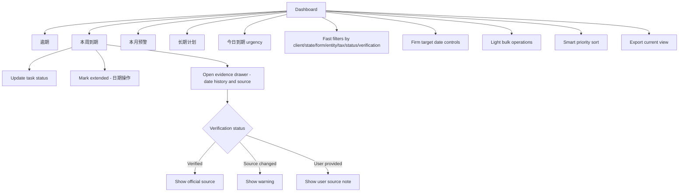

# Dashboard

## Goal

为服务约 80 个混合个人与小企业客户的 solo/independent CPA 提供快速的每周截止日期分诊工作台，并为每个官方或 user-provided deadline 提供清晰核验证据、urgency surfaces、确定性智能优先级排序、filters/sorting、extension/date-change handling、可选 firm target dates、轻量 bulk operations 和 export。

## User Flow

1. 用户登录。
2. 用户进入默认 dashboard，分区为 `逾期`、`本周到期`、`本月预警`、`长期计划`。
3. 登录并打开产品后 30 秒内，用户看到本周所有需要行动的截止日期，并显示按天倒计时。
4. 用户查看逾期项目、due today、`本周到期`、`本月预警`、`长期计划`。
5. 用户按 client relationship、filing/tax profile、州、表单/义务类型、实体类型、税种、任务状态和核验状态筛选并排序任务。
6. 用户为可疑日期打开 evidence。
7. 用户一键将截止日期标记为 `已完成`、`Waiting on client` 或 `进行中`。
8. 用户通过日期操作将截止日期标记为已延期，记录新到期日。
9. 用户可选设置或批量更新 firm target dates 用于 triage。
10. 用户导出当前 task view 进行 workload review。

## Flow Diagram

## Pages

- `/`
  - Dashboard sections。
  - Filters。
  - Task rows。
  - Evidence drawer。

## API

- `dashboard.summary`
- `dashboard.export`
- `dashboard.bulkExportCurrentFilteredView`
- `tasks.updateStatus`
- `tasks.bulkUpdateStatus`
- `tasks.updateFirmTargetDate`
- `tasks.bulkUpdateFirmTargetDate`
- `tasks.getEvidence`

## Data Model

读取：

- `client_relationships`
- `filing_profiles`
- `deadline_tasks`
- `tax_rules`
- `tax_rule_versions`
- `official_sources`
- `source_check_runs`

Task statuses（工作进度）：

- `not_started`
- `in_progress`
- `waiting_on_client`
- `done`

派生日期状态（显示为 badge，不是 status）：

- Extended：从 `deadline_date_events` 中 `official_extension` 类型派生。
- 逾期：从 `currentDueDate < today AND status != done` 派生。

Task row fields：

- Client relationship。
- Filing/tax profile。
- Obligation。
- Jurisdiction/state。
- Form/obligation type。
- Tax category。
- 当前到期日（只显示此日期；原始到期日和日期变更历史在 evidence drawer 中）。
- Optional firm target date。
- 剩余天数（或逾期天数）。
- Status。
- Priority。
- 适用时展示 Extended badge。
- Verification badge。

Source types：

- `verified_rule`
- `user_provided`

## CSV Export Contract

Dashboard export 是 DueDateHQ current task view CSV，不是承诺每个第三方产品都可以导入 DueDateHQ tasks。

最小列：

- Client relationship。
- Filing/tax profile。
- Obligation。
- Jurisdiction。
- Tax category。
- Current official due date。
- Original due date。
- Firm target date。
- Status。
- Verification status。
- Source type。
- Source name。
- Source URL。
- Last verified at。
- Source last changed at。
- Priority。
- Extension status。
- Notes。

除非目标产品有已记录的 task/work import schema，否则 product-specific export profiles 不在范围内。调研显示 Karbon work-item export 是唯一可作为后续验证的 optional target；TaxDome、Drake、QuickBooks task-import compatibility 不属于 Beta 承诺。

## Competitor Parity Notes

File In Time 支持 weekly task views、status updates、extension flags、startup reminders、calendar counts、filtering/sorting、Excel export 和广泛 batch changes。DueDateHQ 应以默认 dashboard triage surface、更强 trust badges、evidence drawer access、dashboard 内 due today/this week/this month urgency、轻量 bulk status/firm-target/export operations，以及 current task view export 覆盖有价值工作流。外部 reminder channels、bulk official due-date edits 和重型 reporting 不进入 Beta。

## Acceptance Criteria

- Dashboard 将任务分为四个区间：`逾期`、`本周到期`、`本月预警`、`长期计划`。
- 登录后，dashboard 默认分区为 `逾期`、`本周到期`、`本月预警`、`长期计划`。
- 登录并打开产品后 30 秒内，服务约 80 个混合个人与小企业多州客户的 solo/independent CPA 能看到本周所有需要行动的截止日期。
- Dashboard 内可见 due today、due this week、due this month urgency。
- 本周 task row 显示具体剩余天数倒计时。
- Task row 显示 current due date、可选 firm target date、countdown（或逾期天数）、client relationship、filing/tax profile、jurisdiction、form/obligation type、tax category、task status、priority、extended badge、verification badge。
- Dashboard 每行只显示当前到期日。原始到期日和日期变更历史通过 evidence drawer 访问，不在行内显示。
- Firm target date 与 official due date 明确分离，绝不作为 official 展示。
- Filters 和 sorting 覆盖 date horizon、client relationship、filing/tax profile、jurisdiction/state、form/obligation type、entity type、tax type、task status 和 verification status。
- 核心 dashboard filters 在 Beta 规模 solo CPA workspaces 内返回更新结果的目标时间为 `< 1 second`。
- 支持 smart priority sorting，Beta 阶段可以用确定性规则优先级实现。
- Verified tasks 可以打开 evidence drawer。
- Source changed tasks 显示 warning。
- User-provided tasks 显示 not verified label。
- Extension 状态显示为从 date events 派生的 badge，不是 task status。一个 task 可以同时处于 extended 状态和任意工作进度状态。
- Evidence drawer 显示 current due date、original due date、firm target date 和 date event history，包括 extensions、relief changes 和 user adjustments。
- Task 工作进度状态可以一键标记为 `已完成`、`Waiting on client` 或 `进行中`。
- 单独的 "Mark Extended" 日期操作记录延期及新到期日，并创建 `deadline_date_event`（`official_extension` 类型）。
- 支持 bulk task status update、bulk firm target date update 和 current filtered view export。
- 不支持 bulk official due-date edits。
- 完整每周分诊流程可在 5 分钟内完成，对比当前 30-45 分钟的表格/日历流程。
- Current task view 可以导出用于 workload sharing 或 review。
- Current task view export 将 official due date、firm target date、verification status 和 source evidence 放在独立列。
- Export copy 不暗示 TaxDome、Drake 或 QuickBooks 可以导入 DueDateHQ tasks，除非该 target profile 后续完成验证。

## Out of Scope

- Calendar sync。
- Email/SMS reminders。
- Slack push、calendar push 和 direct customer notification。
- Client portal、document upload、document checklist automation 和 e-signature。
- 多用户任务分配工作流。
- Crystal Reports-style reports。
- Mail merge 和 labels。
- Extension form printing。
- Bulk official due-date editing。
- Arbitrary field renaming 和重型 saved-view configuration。
