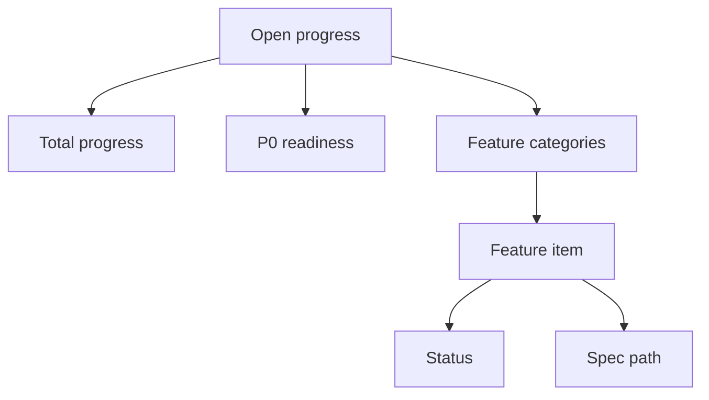

# Feature Progress Page

## Goal

Show product, engineering, and reviewers which DueDateHQ features are complete, in progress, blocked, or not started.

## User Flow

1. User opens `/progress`.
2. User sees total progress.
3. User sees P0 readiness.
4. User expands feature categories.
5. User sees linked spec path for each feature.

## Flow Diagram

## Pages

- `/progress`
  - Overall progress bar.
  - P0 readiness bar.
  - Feature groups.
  - Status labels.
  - Spec links.

## API

- `progress.list`

## Data Model

`feature_items`

- Category.
- Name.
- Description.
- Spec path.
- Status.
- Priority.
- Updated at.

Initial categories:

- Auth.
- CSV imports.
- Manual entry.
- Tax obligation library.
- Tax rule verification.
- Official source monitoring.
- Coverage matrix.
- Monday triage dashboard.
- Cloudflare deployment.
- GTM.
- Docs/specs.

## Acceptance Criteria

- Progress page shows all major specs.
- Each item maps to a spec path.
- Overall progress is derived from feature item status.
- Page clearly shows completed and incomplete items.

## Out of Scope

- Project management integrations.
- Editing feature status from the public UI in Beta.
