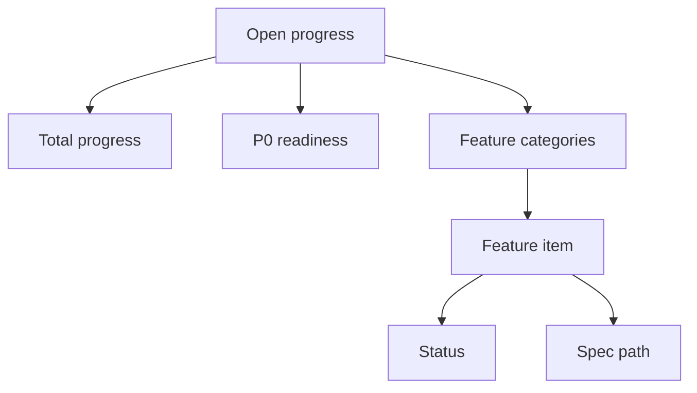

# Feature Progress Page

## Goal

向产品、工程和评审者展示 DueDateHQ 哪些功能已完成、进行中、阻塞或未开始。

## User Flow

1. 用户打开 `/progress`。
2. 用户看到 total progress。
3. 用户看到 P0 readiness。
4. 用户展开功能分类。
5. 用户看到每个功能对应的 spec path。

## Flow Diagram

## Pages

- `/progress`
  - Overall progress bar。
  - P0 readiness bar。
  - Feature groups。
  - Status labels。
  - Spec links。

## API

- `progress.list`

## Data Model

`feature_items`

- Category。
- Name。
- Description。
- Spec path。
- Status。
- Priority。
- Updated at。

初始分类：

- Auth。
- CSV imports。
- Manual entry。
- Tax obligation library。
- Tax rule verification。
- Official source monitoring。
- Coverage matrix。
- Dashboard。
- Cloudflare deployment。
- GTM。
- Docs/specs。

## Acceptance Criteria

- Progress page 显示所有 major specs。
- 每个 item 映射到 spec path。
- Overall progress 从 feature item status 推导。
- 页面清楚显示 completed 和 incomplete items。

## Out of Scope

- Project management integrations。
- Beta 阶段从 public UI 编辑功能状态。
