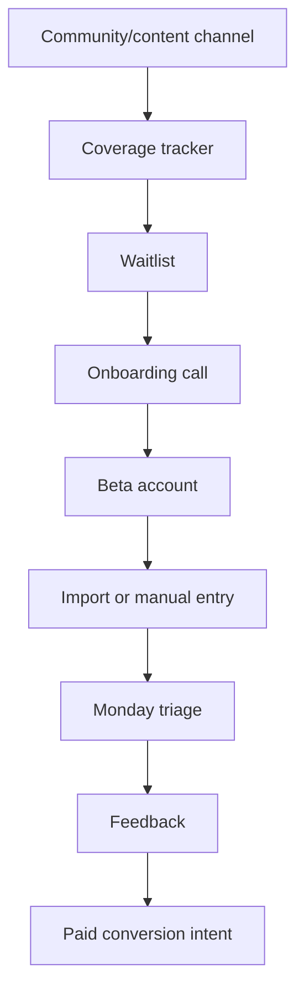

# Go-to-Market

## Goal

Find the first Beta users and validate that DueDateHQ solves a painful workflow for solo and independent CPAs managing mixed individual and small-business clients.

## User Flow

1. CPA discovers public coverage tracker or community post.
2. CPA joins waitlist.
3. CPA completes onboarding call.
4. CPA imports redacted CSV or manually enters clients.
5. CPA completes Monday triage.
6. CPA provides feedback and paid intent.

## Flow Diagram

## Pages

- Public waitlist or landing page later.
- Public tax deadline coverage tracker later.
- In-product onboarding entry after login.

## API

Initial GTM can be tracked manually. Later endpoints:

- `waitlist.create`
- `betaFeedback.create`
- `coverage.requestCoverage`

## Data Model

Later:

- `waitlist_signups`
- `beta_feedback`
- `coverage_requests`

## Acceptance Criteria

- Product plan identifies first user segment.
- Pricing is defined.
- Outreach channels are defined.
- Lead magnet is defined.
- Early success metrics are defined.

## Out of Scope

- Paid ads.
- Affiliate program.
- Public launch campaign.

## First Segment

Solo and independent CPAs managing 30-100 mixed individual and small-business clients, often across multiple states.

## Pricing

- First 20 Beta users free with feedback commitment.
- Pro plan: `$49/month`.

## Channels

- Reddit r/taxpros and r/Accounting.
- LinkedIn CPA owner posts.
- State CPA Society groups.
- AICPA and CPA conference communities.
- CPA Practice Advisor content and listings.

## Metrics

- 20 waitlist signups.
- 10 onboarding calls.
- 5 real CSV imports.
- 3 paid conversion intents.
