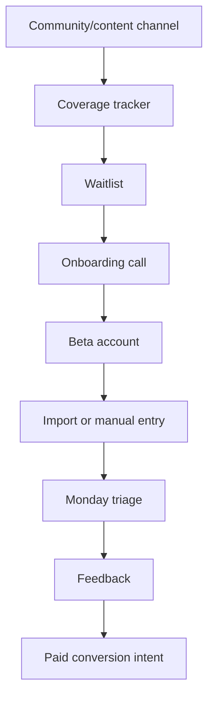

# Go-to-Market

## Goal

找到第一批 Beta 用户，并验证 DueDateHQ 是否真正解决管理混合个人与小企业客户的 solo/independent CPA 的高痛点工作流。

## User Flow

1. CPA 从公开 coverage tracker 或社区帖子发现产品。
2. CPA 加入 waitlist。
3. CPA 完成 onboarding call。
4. CPA 导入去敏 CSV 或手动录入客户。
5. CPA 完成 Monday triage。
6. CPA 提供反馈和付费意向。

## Flow Diagram

## Pages

- 后续 public waitlist 或 landing page。
- 后续 public tax deadline coverage tracker。
- 登录后产品内 onboarding 入口。

## API

初始 GTM 可以手动跟踪。后续 endpoints：

- `waitlist.create`
- `betaFeedback.create`
- `coverage.requestCoverage`

## Data Model

后续：

- `waitlist_signups`
- `beta_feedback`
- `coverage_requests`

## Acceptance Criteria

- 产品方案识别第一批用户细分。
- 定价已定义。
- 触达渠道已定义。
- Lead magnet 已定义。
- 早期成功指标已定义。

## Out of Scope

- 付费广告。
- Affiliate program。
- 公开发布 campaign。

## First Segment

管理 30-100 个混合个人与小企业客户、通常跨多州的 solo/independent CPA。

## Pricing

- 前 20 个 Beta 用户免费，但需要反馈承诺。
- Pro plan：`$49/month`。

## Channels

- Reddit r/taxpros 和 r/Accounting。
- LinkedIn CPA owner 内容。
- 州 CPA Society 群组。
- AICPA 和 CPA 会议社区。
- CPA Practice Advisor 内容和目录。

## Metrics

- 20 个 waitlist signups。
- 10 个 onboarding calls。
- 5 个真实 CSV imports。
- 3 个付费转化意向。
