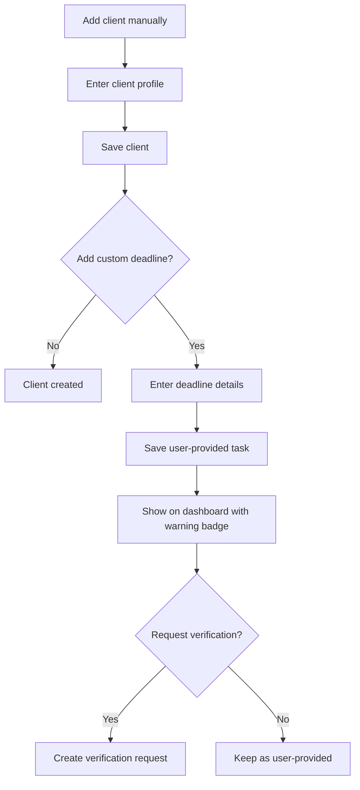

# Manual Client and Deadline Entry

## Goal

Support CPAs who need to add clients or deadlines manually, including new clients, CSV failures, special obligations, tax-relevant notes, and user-known deadlines that DueDateHQ has not verified.

## User Flow

1. User opens manual client entry.
2. User creates a client with tax-relevant profile fields.
3. User optionally adds one or more custom one-time or recurring deadlines.
4. Custom deadlines appear on dashboard.
5. Custom deadlines are clearly marked as user-provided.
6. User can request DueDateHQ verification.

## Flow Diagram

## Pages

- `/clients/new`
  - Client name.
  - Entity type.
  - States.
  - County.
  - Fiscal year type.
  - Notes.

- `/clients/:id/deadlines/new`
  - Tax type.
  - Jurisdiction.
  - Form or obligation.
  - Due date.
  - Filing/payment marker.
  - Recurrence optional.
  - Source note.
  - Request verification option.

## API

- `clients.createManual`
- `deadlineTasks.createManual`
- `deadlineTasks.requestVerification`

## Data Model

`clients.createdVia = manual`

`deadline_tasks`

- `sourceType = user_provided`
- `createdVia = manual`
- `userProvidedSourceNote`
- `taxRuleId` nullable.

Manual recurrence stays user-provided unless and until a reviewer creates or updates a Verified tax rule. It must never appear as an official DueDateHQ recurring deadline before verification.

`verification_requests`

- Created when user requests verification.

## Acceptance Criteria

- Manual clients are saved and visible.
- Manual client setup supports the tax profile fields needed for scheduling: name, entity type, jurisdiction/state context, county where relevant, fiscal year type, and notes.
- Manual deadlines appear on dashboard.
- Manual deadlines are never labeled as DueDateHQ verified.
- Manual recurring deadlines are clearly labeled as user-provided and not verified by DueDateHQ.
- Manual deadlines can be converted into verification requests.
- Verification request does not mutate the user's original task until approved.

## Out of Scope

- Bulk manual entry spreadsheet grid.
- CPA client portal.
- Automatic verification of user-entered dates.
- Arbitrary field renaming, broad custom fields, mail merge, labels, or desktop-style client database administration.
