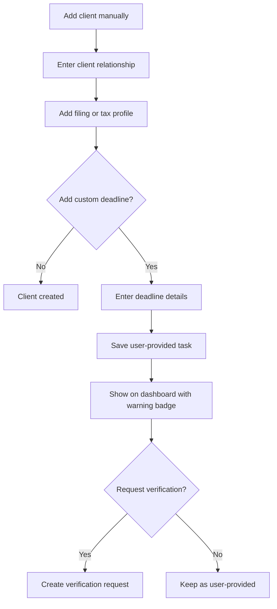

# Manual Client and Deadline Entry

## Goal

Support CPAs who need to add client relationships, filing/tax profiles, or deadlines manually, including new clients, CSV failures, special obligations, tax-relevant notes, and user-known deadlines that DueDateHQ has not verified.

## User Flow

1. User opens manual client entry.
2. User creates a client relationship.
3. User adds one or more filing/tax profiles with tax-relevant fields.
4. User optionally adds one or more custom one-time or recurring deadlines.
5. Custom deadlines appear on dashboard.
6. Custom deadlines are clearly marked as user-provided.
7. User can request DueDateHQ verification.

## Flow Diagram

## Pages

- `/clients/new`
  - Client relationship display name.
  - Relationship type.

- `/clients/:id/profiles/new`
  - Filing/tax profile name.
  - Entity type.
  - States.
  - County.
  - Fiscal year type.
  - Notes.

- `/clients/:id/deadlines/new`
  - Tax type.
  - Jurisdiction.
  - Form or obligation.
  - Due date.
  - Filing/payment marker.
  - Recurrence optional.
  - Source note.
  - Request verification option.

## API

- `clientRelationships.createManual`
- `filingProfiles.createManual`
- `deadlineTasks.createManual`
- `deadlineTasks.requestVerification`

## Data Model

`client_relationships.createdVia = manual`

`filing_profiles.createdVia = manual`

`deadline_tasks`

- `sourceType = user_provided`
- `createdVia = manual`
- `userProvidedSourceNote`
- `taxRuleId` nullable.
- `currentDueDate`
- `originalDueDate` nullable.
- `firmTargetDate` nullable.

Manual recurrence stays user-provided unless and until a reviewer creates or updates a Verified tax rule. It must never appear as an official DueDateHQ recurring deadline before verification.

Firm target dates are optional planning metadata. They must never be labeled or treated as official due dates.

`verification_requests`

- Created when user requests verification.

## Competitor Parity Notes

File In Time supports manual client setup, client notes, client/entity type context, custom services, and recurring service-driven tasks. DueDateHQ should match the useful manual-entry path for client setup and special deadlines, but keep a stronger trust boundary:

- Manual clients use tax-relevant profile fields and notes without adding broad arbitrary custom fields in Beta.
- User-entered deadlines can be one-time or recurring, but remain `User provided` until a reviewer creates or updates a Verified tax rule.
- Manual custom deadlines cannot create official DueDateHQ tasks, extension dates, or recurring official deadlines without verified source evidence.
- The workflow avoids desktop-era client database administration, mail merge, labels, and custom field renaming.

## Acceptance Criteria

- Manual client relationships and filing/tax profiles are saved and visible.
- Manual profile setup supports the tax profile fields needed for scheduling: name, entity type, jurisdiction/state context, county where relevant, fiscal year type, and notes.
- User-facing copy says `Filing profile` or `Tax profile` and avoids internal tax-subject jargon.
- Manual deadlines appear on dashboard.
- Manual deadlines are never labeled as DueDateHQ verified.
- Manual deadlines show current due date and optional firm target date as separate concepts.
- Manual recurring deadlines are clearly labeled as user-provided and not verified by DueDateHQ.
- Manual deadlines can be converted into verification requests.
- Verification request does not mutate the user's original task until approved.

## Out of Scope

- Bulk manual entry spreadsheet grid.
- CPA client portal.
- Automatic verification of user-entered dates.
- Arbitrary field renaming, broad custom fields, mail merge, labels, or desktop-style client database administration.
