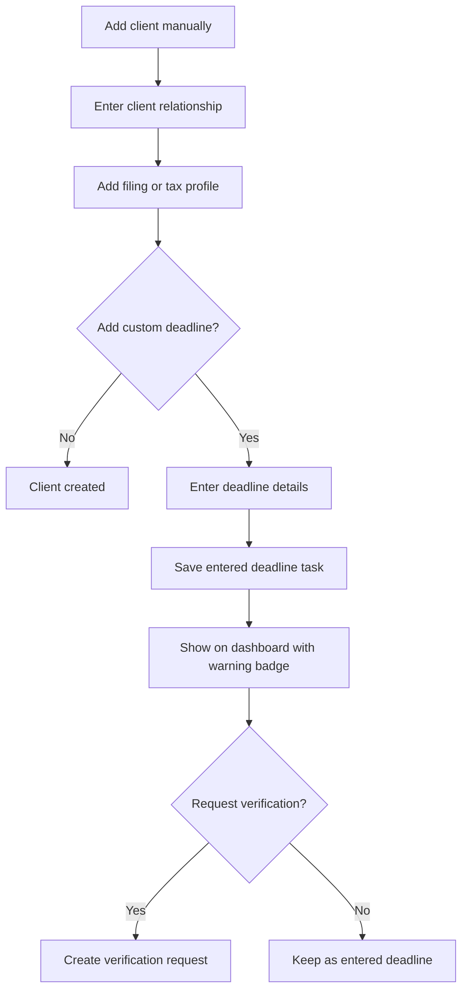

# Manual Client and Deadline Entry

## Goal

支持 CPA 手动添加 client relationships、filing/tax profiles 或截止日期，包括新增客户、CSV 失败、特殊义务、税务相关 notes，以及用户已知但 DueDateHQ 尚未核验的截止日期。

## User Flow

1. 用户打开手动客户录入。
2. 用户创建 client relationship。
3. 用户添加一个或多个包含税务相关字段的 filing/tax profiles。
4. 用户可选添加一个或多个一次性或 recurring 自定义截止日期。
5. 自定义截止日期显示在 dashboard。
6. 自定义截止日期明确标记为 Entered deadline。
7. 用户可以请求 DueDateHQ 核验。

## Flow Diagram

## Pages

- `/clients/new`
  - Client relationship display name。
  - Relationship type。

- `/clients/:id/profiles/new`
  - Filing/tax profile name。
  - Entity type。
  - States。
  - County。
  - Fiscal year type。
  - Notes。

- `/clients/:id/deadlines/new`
  - Tax type。
  - Jurisdiction。
  - Form or obligation。
  - Due date。
  - Filing/payment marker。
  - Recurrence optional。
  - Source note。
  - Request verification option。

## API

- `clientRelationships.createManual`
- `filingProfiles.createManual`
- `deadlineTasks.createManual`
- `deadlineTasks.requestVerification`

## Data Model

`client_relationships.createdVia = manual`

`filing_profiles.createdVia = manual`

`deadline_tasks`

- `sourceType = entered_deadline`
- `createdVia = manual`
- `enteredDeadlineReferenceNote`
- `taxRuleId` nullable。
- `currentDueDate`
- `originalDueDate` nullable。
- `firmTargetDate` nullable。

Manual recurrence 保持 Entered deadline，除非审核员创建或更新 Verified tax rule。核验前，它绝不能显示为官方 DueDateHQ recurring deadline。

Firm target dates 是可选 planning metadata，绝不能标记或当作 official due dates。

`verification_requests`

- 用户请求核验时创建。

## Competitor Parity Notes

File In Time 支持手动 client setup、client notes、client/entity type context、custom services，以及 service-driven recurring tasks。DueDateHQ 应覆盖有价值的 manual-entry path，用于 client setup 和特殊 deadlines，但保持更强的信任边界：

- 手动客户使用税务相关 profile fields 和 notes，Beta 不加入广泛 arbitrary custom fields。
- 用户录入的 deadlines 可以是 one-time 或 recurring，但在审核员创建或更新 Verified tax rule 之前都保持 `Entered deadline`。
- 没有 verified source evidence 时，manual custom deadlines 不能创建官方 DueDateHQ tasks、extension dates 或 recurring official deadlines。
- 该工作流避免 desktop-era client database administration、mail merge、labels 和 custom field renaming。

## Acceptance Criteria

- 手动 client relationships 和 filing/tax profiles 可以保存并可见。
- 手动 profile setup 支持安排截止日期所需的 tax profile fields：name、entity type、jurisdiction/state context、相关 county、fiscal year type 和 notes。
- User-facing copy 使用 `Filing profile` 或 `Tax profile`，避免内部 tax-subject jargon。
- 手动截止日期显示在 dashboard。
- 手动截止日期绝不标记为 DueDateHQ verified。
- 手动截止日期将 current due date 和可选 firm target date 作为不同概念展示。
- 手动 recurring deadlines 明确标记为 Entered deadline 且未经 DueDateHQ 核验。
- 手动截止日期可以转为 verification request。
- Verification request 不会在批准前改变用户原始任务。

## Out of Scope

- 批量手动表格录入。
- CPA 客户门户。
- 自动核验用户输入日期。
- Arbitrary field renaming、广泛 custom fields、mail merge、labels 或桌面式 client database administration。
