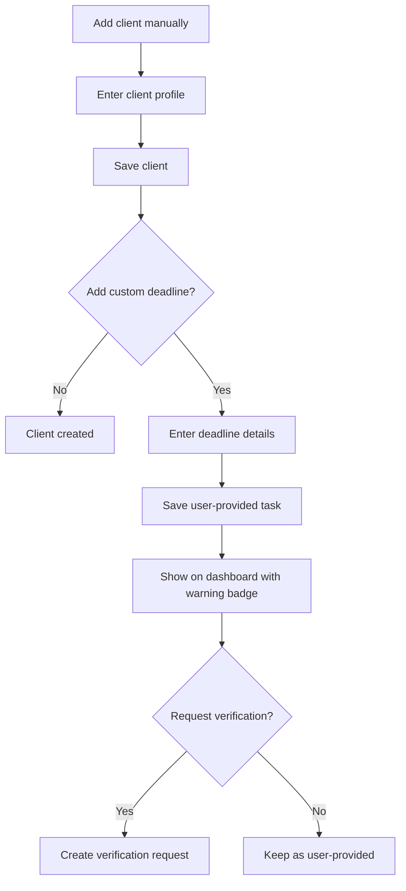

# Manual Client and Deadline Entry

## Goal

支持 CPA 手动添加客户或截止日期，包括新增客户、CSV 失败、特殊义务，以及用户已知但 DueDateHQ 尚未核验的截止日期。

## User Flow

1. 用户打开手动客户录入。
2. 用户创建客户。
3. 用户可选添加一个或多个自定义截止日期。
4. 自定义截止日期显示在 dashboard。
5. 自定义截止日期明确标记为 user-provided。
6. 用户可以请求 DueDateHQ 核验。

## Flow Diagram

## Pages

- `/clients/new`
  - Client name。
  - Entity type。
  - States。
  - County。
  - Fiscal year type。
  - Notes。

- `/clients/:id/deadlines/new`
  - Tax type。
  - Jurisdiction。
  - Form or obligation。
  - Due date。
  - Filing/payment marker。
  - Recurrence optional。
  - Source note。
  - Request verification option。

## API

- `clients.createManual`
- `deadlineTasks.createManual`
- `deadlineTasks.requestVerification`

## Data Model

`clients.createdVia = manual`

`deadline_tasks`

- `sourceType = user_provided`
- `createdVia = manual`
- `userProvidedSourceNote`
- `taxRuleId` nullable。

`verification_requests`

- 用户请求核验时创建。

## Acceptance Criteria

- 手动客户可以保存并可见。
- 手动截止日期显示在 dashboard。
- 手动截止日期绝不标记为 DueDateHQ verified。
- 手动截止日期可以转为 verification request。
- Verification request 不会在批准前改变用户原始任务。

## Out of Scope

- 批量手动表格录入。
- CPA 客户门户。
- 自动核验用户输入日期。
