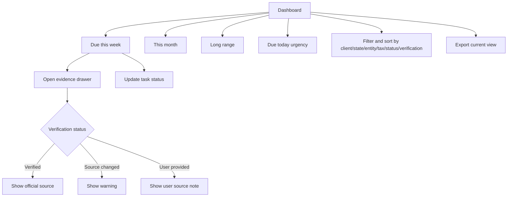

# Monday Triage Dashboard

## Goal

Give CPAs a fast working surface for weekly deadline prioritization, with clear verification evidence, urgency surfaces, filters/sorting, extension handling, and export for each official or user-provided deadline.

## User Flow

1. User logs in.
2. User lands on dashboard.
3. User reviews due today, `Due this week`, `This month`, and `Long range`.
4. User filters and sorts tasks.
5. User opens evidence for questionable dates.
6. User updates task status or marks a verified extension state.
7. User exports the current task view for workload review.

## Flow Diagram

## Pages

- `/`
  - Dashboard sections.
  - Filters.
  - Task rows.
  - Evidence drawer.

## API

- `dashboard.summary`
- `dashboard.export`
- `tasks.updateStatus`
- `tasks.getEvidence`

## Data Model

Reads:

- `clients`
- `deadline_tasks`
- `tax_rules`
- `tax_rule_versions`
- `official_sources`
- `source_check_runs`

Task statuses:

- `not_started`
- `in_progress`
- `extended`
- `done`

Task row fields:

- Client.
- Obligation.
- Jurisdiction/state.
- Tax category.
- Due date.
- Days remaining.
- Status.
- Extension status and extension due date when supported.
- Verification badge.

Source types:

- `verified_rule`
- `user_provided`

## Competitor Parity Notes

File In Time supports weekly task views, status updates, extension flags, startup reminders, calendar counts, filtering/sorting, and Excel export. DueDateHQ should match the useful workflow with a default Monday triage surface, richer trust badges, evidence drawer access, in-dashboard urgency for due today/this week/this month, and export of the current task view. External reminder channels and heavy reporting stay out of Beta.

## Acceptance Criteria

- Dashboard groups tasks into three time horizons.
- Due today, due this week, and due this month urgency is visible in the dashboard.
- Task row shows due date, countdown, client, jurisdiction, tax category, task status, and verification badge.
- Filters and sorting cover date horizon, client, jurisdiction/state, entity type, tax type, task status, and verification status.
- Verified tasks can open evidence drawer.
- Source changed tasks show warning.
- User-provided tasks show not verified label.
- Verified extension dates and `extended` status are visible when supported by rule evidence.
- Task status can be updated.
- Current task view can be exported for workload sharing or review.

## Out of Scope

- Calendar sync.
- Email/SMS reminders.
- Multi-user assignment workflow.
- Crystal Reports-style reports.
- Mail merge and labels.
- Extension form printing.
- Arbitrary field renaming and heavy saved-view configuration.
