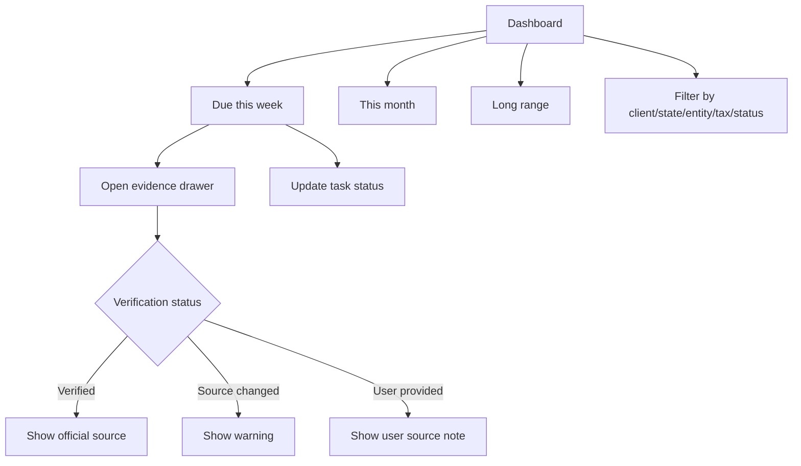

# Monday Triage Dashboard

## Goal

Give CPAs a fast working surface for weekly deadline prioritization, with clear verification evidence for each official deadline.

## User Flow

1. User logs in.
2. User lands on dashboard.
3. User reviews `Due this week`, `This month`, and `Long range`.
4. User filters tasks.
5. User opens evidence for questionable dates.
6. User updates task status.

## Flow Diagram

## Pages

- `/`
  - Dashboard sections.
  - Filters.
  - Task rows.
  - Evidence drawer.

## API

- `dashboard.summary`
- `tasks.updateStatus`
- `tasks.getEvidence`

## Data Model

Reads:

- `clients`
- `deadline_tasks`
- `tax_rules`
- `tax_rule_versions`
- `official_sources`
- `source_check_runs`

Task statuses:

- `not_started`
- `in_progress`
- `extended`
- `done`

Source types:

- `verified_rule`
- `user_provided`

## Acceptance Criteria

- Dashboard groups tasks into three time horizons.
- Task row shows due date, countdown, client, jurisdiction, tax category, task status, and verification badge.
- Verified tasks can open evidence drawer.
- Source changed tasks show warning.
- User-provided tasks show not verified label.
- Task status can be updated.

## Out of Scope

- Calendar sync.
- Email/SMS reminders.
- Multi-user assignment workflow.
