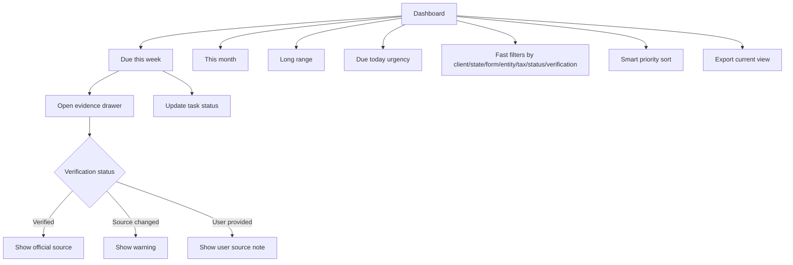

# Monday Triage Dashboard

## Goal

Give solo or independent CPAs serving about 80 multi-state clients a fast working surface for weekly deadline prioritization, with clear verification evidence, urgency surfaces, deterministic smart priority sorting, filters/sorting, extension handling, and export for each official or user-provided deadline.

## User Flow

1. User logs in.
2. User lands on the default dashboard grouped into `Due this week`, `This month`, and `Long range`.
3. Within 30 seconds of opening after login, user sees all deadlines needing action this week with countdowns in days.
4. User reviews due today, `Due this week`, `This month`, and `Long range`.
5. User filters and sorts tasks by client, state, form/obligation type, entity type, tax type, task status, and verification status.
6. User opens evidence for questionable dates.
7. User one-click marks a deadline `Done`, `Extended`, or `In progress`.
8. User exports the current task view for workload review.

## Flow Diagram

## Pages

- `/`
  - Dashboard sections.
  - Filters.
  - Task rows.
  - Evidence drawer.

## API

- `dashboard.summary`
- `dashboard.export`
- `tasks.updateStatus`
- `tasks.getEvidence`

## Data Model

Reads:

- `clients`
- `deadline_tasks`
- `tax_rules`
- `tax_rule_versions`
- `official_sources`
- `source_check_runs`

Task statuses:

- `not_started`
- `in_progress`
- `extended`
- `done`

Task row fields:

- Client.
- Obligation.
- Jurisdiction/state.
- Form/obligation type.
- Tax category.
- Due date.
- Days remaining.
- Status.
- Priority.
- Extension status and extension due date when supported.
- Verification badge.

Source types:

- `verified_rule`
- `user_provided`

## Competitor Parity Notes

File In Time supports weekly task views, status updates, extension flags, startup reminders, calendar counts, filtering/sorting, and Excel export. DueDateHQ should match the useful workflow with a default Monday triage surface, richer trust badges, evidence drawer access, in-dashboard urgency for due today/this week/this month, and export of the current task view. External reminder channels and heavy reporting stay out of Beta.

## Acceptance Criteria

- Dashboard groups tasks into three time horizons.
- On login, the dashboard defaults to `Due this week`, `This month`, and `Long range`.
- Within 30 seconds of opening after login, a solo or independent CPA serving about 80 multi-state clients can see all deadlines needing action this week.
- Due today, due this week, and due this month urgency is visible in the dashboard.
- This-week task rows show a specific countdown in days.
- Task row shows due date, countdown, client, jurisdiction, form/obligation type, tax category, task status, priority, and verification badge.
- Filters and sorting cover date horizon, client, jurisdiction/state, form/obligation type, entity type, tax type, task status, and verification status.
- Core dashboard filters return updated results in `< 1 second` for Beta-sized solo CPA workspaces.
- Smart priority sorting is available and can be deterministic rule-based priority in Beta.
- Verified tasks can open evidence drawer.
- Source changed tasks show warning.
- User-provided tasks show not verified label.
- Verified extension dates and `extended` status are visible when supported by rule evidence.
- Task status can be one-click marked `Done`, `Extended`, or `In progress`.
- The full weekly triage flow is completable within 5 minutes, compared with the current 30-45 minute spreadsheet/calendar workflow.
- Current task view can be exported for workload sharing or review.

## Out of Scope

- Calendar sync.
- Email/SMS reminders.
- Multi-user assignment workflow.
- Crystal Reports-style reports.
- Mail merge and labels.
- Extension form printing.
- Arbitrary field renaming and heavy saved-view configuration.
