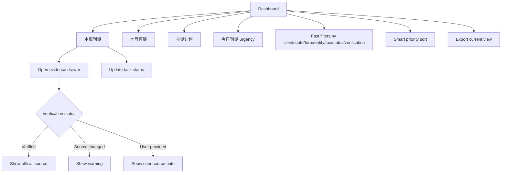

# Monday Triage Dashboard

## Goal

为服务约 80 个多州客户的 solo/independent CPA 提供快速的每周截止日期分诊工作台，并为每个官方或 user-provided deadline 提供清晰核验证据、urgency surfaces、确定性智能优先级排序、filters/sorting、extension handling 和 export。

## User Flow

1. 用户登录。
2. 用户进入默认 dashboard，分区为 `本周到期`、`本月预警`、`长期计划`。
3. 登录并打开产品后 30 秒内，用户看到本周所有需要行动的截止日期，并显示按天倒计时。
4. 用户查看 due today、`本周到期`、`本月预警`、`长期计划`。
5. 用户按客户、州、表单/义务类型、实体类型、税种、任务状态和核验状态筛选并排序任务。
6. 用户为可疑日期打开 evidence。
7. 用户一键将截止日期标记为 `已完成`、`已延期` 或 `进行中`。
8. 用户导出当前 task view 进行 workload review。

## Flow Diagram

## Pages

- `/`
  - Dashboard sections。
  - Filters。
  - Task rows。
  - Evidence drawer。

## API

- `dashboard.summary`
- `dashboard.export`
- `tasks.updateStatus`
- `tasks.getEvidence`

## Data Model

读取：

- `clients`
- `deadline_tasks`
- `tax_rules`
- `tax_rule_versions`
- `official_sources`
- `source_check_runs`

Task statuses：

- `not_started`
- `in_progress`
- `extended`
- `done`

Task row fields：

- Client。
- Obligation。
- Jurisdiction/state。
- Form/obligation type。
- Tax category。
- Due date。
- Days remaining。
- Status。
- Priority。
- 支持时显示 extension status 和 extension due date。
- Verification badge。

Source types：

- `verified_rule`
- `user_provided`

## Competitor Parity Notes

File In Time 支持 weekly task views、status updates、extension flags、startup reminders、calendar counts、filtering/sorting 和 Excel export。DueDateHQ 应以默认 Monday triage surface、更强 trust badges、evidence drawer access、dashboard 内 due today/this week/this month urgency，以及 current task view export 覆盖有价值工作流。外部 reminder channels 和重型 reporting 不进入 Beta。

## Acceptance Criteria

- Dashboard 将任务分为三个时间区间。
- 登录后，dashboard 默认分区为 `本周到期`、`本月预警`、`长期计划`。
- 登录并打开产品后 30 秒内，服务约 80 个多州客户的 solo/independent CPA 能看到本周所有需要行动的截止日期。
- Dashboard 内可见 due today、due this week、due this month urgency。
- 本周 task row 显示具体剩余天数倒计时。
- Task row 显示 due date、countdown、client、jurisdiction、form/obligation type、tax category、task status、priority、verification badge。
- Filters 和 sorting 覆盖 date horizon、client、jurisdiction/state、form/obligation type、entity type、tax type、task status 和 verification status。
- 核心 dashboard filters 在 Beta 规模 solo CPA workspaces 内返回更新结果的目标时间为 `< 1 second`。
- 支持 smart priority sorting，Beta 阶段可以用确定性规则优先级实现。
- Verified tasks 可以打开 evidence drawer。
- Source changed tasks 显示 warning。
- User-provided tasks 显示 not verified label。
- Rule evidence 支持时，verified extension dates 和 `extended` status 可见。
- Task status 可以一键标记为 `已完成`、`已延期` 或 `进行中`。
- 完整每周分诊流程可在 5 分钟内完成，对比当前 30-45 分钟的表格/日历流程。
- Current task view 可以导出用于 workload sharing 或 review。

## Out of Scope

- Calendar sync。
- Email/SMS reminders。
- 多用户任务分配工作流。
- Crystal Reports-style reports。
- Mail merge 和 labels。
- Extension form printing。
- Arbitrary field renaming 和重型 saved-view configuration。
