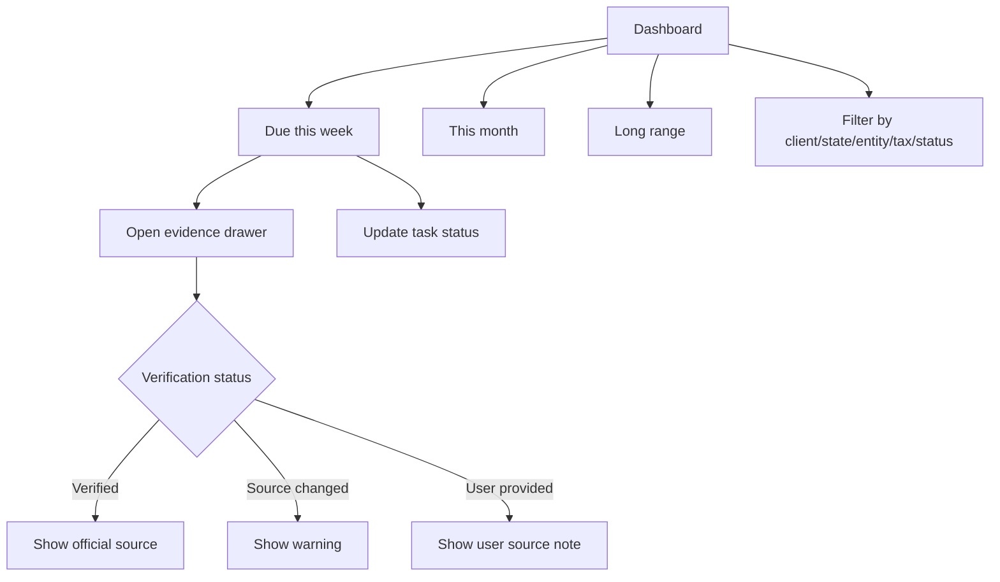

# Monday Triage Dashboard

## Goal

为 CPA 提供快速的每周截止日期分诊工作台，并为每个官方截止日期提供清晰核验证据。

## User Flow

1. 用户登录。
2. 用户进入 dashboard。
3. 用户查看 `Due this week`、`This month`、`Long range`。
4. 用户筛选任务。
5. 用户为可疑日期打开 evidence。
6. 用户更新任务状态。

## Flow Diagram

## Pages

- `/`
  - Dashboard sections。
  - Filters。
  - Task rows。
  - Evidence drawer。

## API

- `dashboard.summary`
- `tasks.updateStatus`
- `tasks.getEvidence`

## Data Model

读取：

- `clients`
- `deadline_tasks`
- `tax_rules`
- `tax_rule_versions`
- `official_sources`
- `source_check_runs`

Task statuses：

- `not_started`
- `in_progress`
- `extended`
- `done`

Source types：

- `verified_rule`
- `user_provided`

## Acceptance Criteria

- Dashboard 将任务分为三个时间区间。
- Task row 显示 due date、countdown、client、jurisdiction、tax category、task status、verification badge。
- Verified tasks 可以打开 evidence drawer。
- Source changed tasks 显示 warning。
- User-provided tasks 显示 not verified label。
- Task status 可以更新。

## Out of Scope

- Calendar sync。
- Email/SMS reminders。
- 多用户任务分配工作流。
