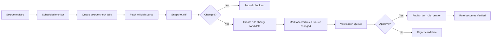

# Official Source Monitoring

## Goal

Detect changes to official tax sources within 24 hours and route affected rules through a verification workflow before publishing updates.

Product principle:

```txt
24h detect, not blindly auto-verify.
```

## User Flow

1. System stores official sources for IRS, state tax agencies, Comptrollers, and Secretaries of State.
2. Scheduled monitor checks active sources.
3. System records source check run.
4. If content hash changes, system creates a source snapshot and rule change candidate.
5. Affected rules are marked `Source changed`.
6. Reviewer approves or rejects the candidate.
7. Approved candidate publishes a new tax rule version and restores `Verified`.

## Flow Diagram



## Pages

- `/coverage`
  - Shows monitor status, last checked, last changed, verification status.

- Evidence Drawer
  - Shows source last checked, source last changed, current rule version, previous rule version.

- `/verification`
  - Shows `Needs review`, `Source changed`, and `User requested` queues.

- `/progress`
  - Shows Official Source Monitoring feature status.

## API

- `officialSources.list`
- `officialSources.getCheckRuns`
- `officialSources.enqueueCheck`
- `officialSources.recordCheckResult`
- `verificationQueue.list`
- `verificationQueue.approveCandidate`
- `verificationQueue.rejectCandidate`

## Data Model

`official_sources`

- `id`
- `jurisdiction`
- `agencyName`
- `sourceType`: `html | pdf | rss | api | manual`
- `sourceUrl`
- `monitorFrequencyHours`
- `active`

`source_snapshots`

- `id`
- `sourceId`
- `contentHash`
- `snapshotUrl`
- `capturedAt`

`source_check_runs`

- `id`
- `sourceId`
- `checkedAt`
- `status`
- `httpStatus`
- `contentHash`
- `previousContentHash`
- `changedDetected`
- `errorMessage`

`rule_change_candidates`

- `id`
- `sourceId`
- `affectedRuleId`
- `detectedAt`
- `changeType`
- `extractedSummary`
- `proposedRulePatch`
- `status`: `pending | approved | rejected`

`tax_rule_versions`

- `ruleId`
- `version`
- `ruleSummary`
- `dueDateRule`
- `sourceSnapshotId`
- `publishedAt`
- `publishedBy`

## Cloudflare Runtime

- Cron Triggers start scheduled monitoring.
- Queues distribute source check jobs.
- D1 stores sources, runs, candidates, and rule versions.
- R2 may store raw HTML/PDF snapshots later.

## Acceptance Criteria

- Each official source has monitor status and last checked time.
- Source hash changes create a `rule_change_candidate`.
- Affected verified rules become `Source changed`.
- `Source changed` rules cannot generate new official tasks.
- Approval publishes a new `tax_rule_version`.
- Approval restores rule status to `Verified`.
- No unreviewed source change can publish a verified rule.

## Out of Scope

- Full LLM legal interpretation without review.
- Browser automation for source sites.
- Monitoring sources that require login in initial Beta.
