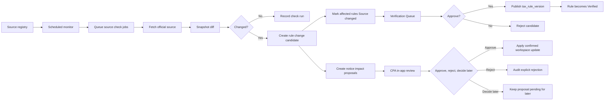

# Official Source Monitoring

## Goal

Detect changes to supported official tax sources and official notices within 24 hours, route affected rules or workspace impacts through review, and require CPA confirmation before any proposed notice impact changes workspace state.

Product principle:

```txt
24h detect, not blindly auto-verify.
```

This is a DueDateHQ differentiator from File In Time-style bundled due-date data. The system monitors sources, marks affected rules `Source changed`, records versions, and requires a reviewer before a changed rule can become `Verified` again. The Official Notice Monitor can also push likely relevant in-app alerts, but it must not automatically mutate CPA workspace data.

## User Flow

1. System stores official sources for the P0 allowlist: IRS, California FTB, New York Tax Department, Texas Comptroller, and Florida Department of Revenue.
2. Scheduled monitor checks active sources.
3. System records source check run.
4. If content hash changes or an allowed official notice appears, system creates a source snapshot and rule/notice change candidate.
5. Affected rules are marked `Source changed`.
6. AI may analyze official notice text using DueDateHQ platform-level provider configuration; customer PII is not sent to the model by default.
7. DueDateHQ matches affected client filing/tax profiles locally.
8. Reviewer or CPA reviews proposed impacts with before/after diffs.
9. Approved rule candidate publishes a new tax rule version and restores `Verified`; approved workspace proposals apply only after CPA confirmation.

## Flow Diagram



## Pages

- `/coverage`
  - Shows monitor status, last checked, last changed, verification status.

- Evidence Drawer
  - Shows source last checked, source last changed, current rule version, previous rule version.

- `/notices`
  - Notice inbox/alert center. Notice detail appears first.

- `/notices/:id/affected`
  - Affected review page. Affected task/profile diffs appear after the notice detail.

- `/verification`
  - Shows `Needs review`, `Source changed`, and `User requested` queues.

- `/progress`
  - Shows Official Source Monitoring feature status.

## API

- `officialSources.list`
- `officialSources.getCheckRuns`
- `officialSources.enqueueCheck`
- `officialSources.recordCheckResult`
- `verificationQueue.list`
- `verificationQueue.approveCandidate`
- `verificationQueue.rejectCandidate`
- `officialNotices.list`
- `officialNotices.get`
- `noticeImpacts.listAffected`
- `noticeImpacts.approve`
- `noticeImpacts.reject`
- `noticeImpacts.decideLater`
- `noticeImpacts.bulkDecision`

## Data Model

`official_sources`

- `id`
- `jurisdiction`
- `agencyName`
- `sourceType`: `html | pdf | rss | api | manual`
- `sourceUrl`
- `allowlistLevel`: `p0 | later`
- `deadlineScope`
- `monitorFrequencyHours`
- `active`

`source_snapshots`

- `id`
- `sourceId`
- `contentHash`
- `snapshotUrl`
- `capturedAt`

`source_check_runs`

- `id`
- `sourceId`
- `checkedAt`
- `status`
- `httpStatus`
- `contentHash`
- `previousContentHash`
- `changedDetected`
- `errorMessage`

`rule_change_candidates`

- `id`
- `sourceId`
- `affectedRuleId`
- `detectedAt`
- `changeType`
- `extractedSummary`
- `proposedRulePatch`
- `status`: `pending | approved | rejected | decide_later`

`official_notices`

- `id`
- `sourceId`
- `noticeUrl`
- `noticeTitle`
- `noticePublishedAt`
- `noticeSummary`
- `jurisdiction`
- `deadlineRelevance`: `high | medium | low`
- `detectedAt`

`notice_impact_proposals`

- `id`
- `officialNoticeId`
- `firmId`
- `filingProfileId` nullable
- `deadlineTaskId` nullable
- `proposalType`: `task_update | coverage_review_status_update`
- `beforeState`
- `afterState`
- `confidenceLabel`: `high | medium | low`
- `confidenceReasons`
- `status`: `pending | approved | rejected | decide_later`
- `decidedBy`
- `decidedAt`
- `auditLogId`

`tax_rule_versions`

- `ruleId`
- `version`
- `ruleSummary`
- `dueDateRule`
- `sourceSnapshotId`
- `publishedAt`
- `publishedBy`

## Cloudflare Runtime

- Cron Triggers start scheduled monitoring.
- Queues distribute source check jobs.
- D1 stores sources, runs, candidates, and rule versions.
- R2 may store raw HTML/PDF snapshots later.

AI and matching constraints:

- DueDateHQ configures the AI provider/API key at the platform level.
- AI analyzes official notices only.
- Customer PII is not sent to the model by default.
- Affected clients and filing/tax profiles are matched locally.
- Confidence is explainable via source allowlist, deadline relevance, jurisdiction, affected taxpayer/entity/location, date/date range, and local matches.
- Do not show fake percentage confidence scores.

P0 source and scope allowlist:

- IRS: federal individual and small-business filing/payment/extension/estimated tax deadlines, plus IRS disaster/tax relief deadline changes. Not all IRS tax-law news.
- California FTB: personal income, business/franchise, and disaster/tax relief.
- New York Tax Department: personal income, business/corporate, and disaster/tax relief.
- Texas Comptroller: franchise, sales/use, and disaster/tax relief.
- Florida Department of Revenue: corporate income, sales/use, reemployment, and disaster/tax relief.

## Acceptance Criteria

- Each official source has monitor status and last checked time.
- Source hash changes create a `rule_change_candidate`.
- Affected verified rules become `Source changed`.
- `Source changed` rules cannot generate new official tasks.
- Approval publishes a new `tax_rule_version`.
- Approval restores rule status to `Verified`.
- No unreviewed source change can publish a verified rule.
- Source last checked, source last changed, and rule version are visible wherever official task evidence is shown.
- Notice impacts can propose task updates or coverage/review status updates.
- Notice impacts require CPA confirmation before changing workspace state.
- CPA sees clear before/after diffs and can approve, reject, or decide later individually or in bulk.
- `rejected` means the CPA explicitly refuses the proposed change, not merely hides a notification.
- Every notice-impact operation is audit logged.
- In-app notifications are limited to dashboard banner, notice inbox/alert center, and affected review page.
- High confidence plus affected workspace match alerts the CPA in-app.
- Medium confidence plus affected workspace match alerts the CPA in-app labeled AI-detected/needs review.
- Low confidence stays in an internal queue only.
- Notice UI is two-layer: notice detail first, affected task/profile diffs second.

## Out of Scope

- Full LLM legal interpretation without review.
- Customer-specific PII analysis by default.
- Automatic mutation of CPA workspace data.
- Browser automation for source sites.
- Monitoring sources that require login in initial Beta.
- Direct customer notification, email/SMS/Slack/calendar push, or calendar sync in Beta.
