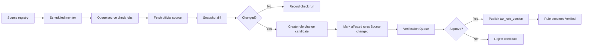

# Official Source Monitoring

## Goal

在 24 小时内检测官方税务来源变化，并将受影响规则送入核验工作流，审核通过后才发布更新。

产品原则：

```txt
24h detect, not blindly auto-verify.
24 小时内发现变化，但不盲目自动核验。
```

## User Flow

1. 系统保存 IRS、州税务局、Comptroller、Secretary of State 等官方来源。
2. 定时 monitor 检查 active sources。
3. 系统记录 source check run。
4. 如果 content hash 变化，系统创建 source snapshot 和 rule change candidate。
5. 受影响规则标记为 `Source changed`。
6. 审核员批准或拒绝 candidate。
7. 批准后发布新的 tax rule version，并恢复 `Verified`。

## Flow Diagram



## Pages

- `/coverage`
  - 显示 monitor status、last checked、last changed、verification status。

- Evidence Drawer
  - 显示 source last checked、source last changed、current rule version、previous rule version。

- `/verification`
  - 展示 `Needs review`、`Source changed`、`User requested` 队列。

- `/progress`
  - 显示 Official Source Monitoring 功能状态。

## API

- `officialSources.list`
- `officialSources.getCheckRuns`
- `officialSources.enqueueCheck`
- `officialSources.recordCheckResult`
- `verificationQueue.list`
- `verificationQueue.approveCandidate`
- `verificationQueue.rejectCandidate`

## Data Model

`official_sources`

- `id`
- `jurisdiction`
- `agencyName`
- `sourceType`: `html | pdf | rss | api | manual`
- `sourceUrl`
- `monitorFrequencyHours`
- `active`

`source_snapshots`

- `id`
- `sourceId`
- `contentHash`
- `snapshotUrl`
- `capturedAt`

`source_check_runs`

- `id`
- `sourceId`
- `checkedAt`
- `status`
- `httpStatus`
- `contentHash`
- `previousContentHash`
- `changedDetected`
- `errorMessage`

`rule_change_candidates`

- `id`
- `sourceId`
- `affectedRuleId`
- `detectedAt`
- `changeType`
- `extractedSummary`
- `proposedRulePatch`
- `status`: `pending | approved | rejected`

`tax_rule_versions`

- `ruleId`
- `version`
- `ruleSummary`
- `dueDateRule`
- `sourceSnapshotId`
- `publishedAt`
- `publishedBy`

## Cloudflare Runtime

- Cron Triggers 启动 scheduled monitoring。
- Queues 分发 source check jobs。
- D1 存储 sources、runs、candidates、rule versions。
- R2 后续可保存原始 HTML/PDF snapshots。

## Acceptance Criteria

- 每个官方来源都有 monitor status 和 last checked time。
- Source hash 变化会创建 `rule_change_candidate`。
- 受影响 verified rules 变为 `Source changed`。
- `Source changed` rules 不能生成新的官方任务。
- Approval 发布新的 `tax_rule_version`。
- Approval 恢复 rule status 为 `Verified`。
- 未审核的 source change 不能发布 verified rule。

## Out of Scope

- 未经 review 的完整 LLM 法律解释。
- 官方来源网站的 browser automation。
- Beta 初期监听需要登录的来源。
