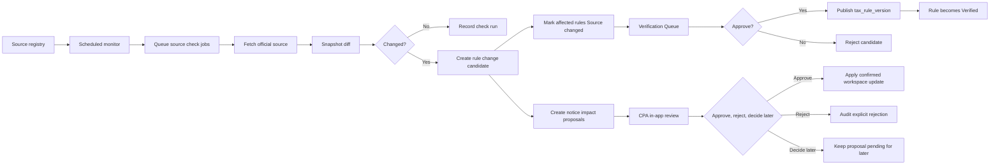

# Official Source Monitoring

## Goal

在 24 小时内检测 supported 官方税务来源和 official notices 变化，将受影响规则或 workspace impacts 送入 review，并在 proposed notice impact 改变 workspace state 前要求 CPA 确认。

产品原则：

```txt
24h detect, not blindly auto-verify.
24 小时内发现变化，但不盲目自动核验。
```

这是 DueDateHQ 相比 File In Time-style bundled due-date data 的差异点。系统监听 sources，将受影响 rules 标记为 `Source changed`，记录 versions，并要求 reviewer 批准后 changed rule 才能再次成为 `Verified`。Official Notice Monitor 可以推送 likely relevant 产品内提醒，但不得自动修改 CPA workspace data。

## User Flow

1. 系统保存 P0 allowlist 官方来源：IRS、California FTB、New York Tax Department、Texas Comptroller、Florida Department of Revenue。
2. 定时 monitor 检查 active sources。
3. 系统记录 source check run。
4. 如果 content hash 变化或出现允许范围内的 official notice，系统创建 source snapshot 和 rule/notice change candidate。
5. 受影响规则标记为 `Source changed`。
6. AI 可以使用 DueDateHQ 平台级 provider 配置分析 official notice text；默认不发送 customer PII 给模型。
7. DueDateHQ 在本地匹配受影响 client filing/tax profiles。
8. Reviewer 或 CPA 查看带 before/after diffs 的 proposed impacts。
9. Approved rule candidate 发布新的 tax rule version 并恢复 `Verified`；approved workspace proposals 只有在 CPA 确认后才应用。

## Flow Diagram



## Pages

- `/coverage`
  - 显示 monitor status、last checked、last changed、verification status。

- Evidence Drawer
  - 显示 source last checked、source last changed、current rule version、previous rule version。

- `/notices`
  - Notice inbox/alert center。先展示 notice detail。

- `/notices/:id/affected`
  - Affected review page。Notice detail 后展示 affected task/profile diffs。

- `/verification`
  - 展示 `Needs review`、`Source changed`、`User requested` 队列。

- `/progress`
  - 显示 Official Source Monitoring 功能状态。

## API

- `officialSources.list`
- `officialSources.getCheckRuns`
- `officialSources.enqueueCheck`
- `officialSources.recordCheckResult`
- `verificationQueue.list`
- `verificationQueue.approveCandidate`
- `verificationQueue.rejectCandidate`
- `officialNotices.list`
- `officialNotices.get`
- `noticeImpacts.listAffected`
- `noticeImpacts.approve`
- `noticeImpacts.reject`
- `noticeImpacts.decideLater`
- `noticeImpacts.bulkDecision`

## Data Model

`official_sources`

- `id`
- `jurisdiction`
- `agencyName`
- `sourceType`: `html | pdf | rss | api | manual`
- `sourceUrl`
- `allowlistLevel`: `p0 | later`
- `deadlineScope`
- `monitorFrequencyHours`
- `active`

`source_snapshots`

- `id`
- `sourceId`
- `contentHash`
- `snapshotUrl`
- `capturedAt`

`source_check_runs`

- `id`
- `sourceId`
- `checkedAt`
- `status`
- `httpStatus`
- `contentHash`
- `previousContentHash`
- `changedDetected`
- `errorMessage`

`rule_change_candidates`

- `id`
- `sourceId`
- `affectedRuleId`
- `detectedAt`
- `changeType`
- `extractedSummary`
- `proposedRulePatch`
- `status`: `pending | approved | rejected | decide_later`

`official_notices`

- `id`
- `sourceId`
- `noticeUrl`
- `noticeTitle`
- `noticePublishedAt`
- `noticeSummary`
- `jurisdiction`
- `deadlineRelevance`: `high | medium | low`
- `detectedAt`

`notice_impact_proposals`

- `id`
- `officialNoticeId`
- `firmId`
- `filingProfileId` nullable
- `deadlineTaskId` nullable
- `proposalType`: `task_update | coverage_review_status_update`
- `beforeState`
- `afterState`
- `confidenceLabel`: `high | medium | low`
- `confidenceReasons`
- `status`: `pending | approved | rejected | decide_later`
- `decidedBy`
- `decidedAt`
- `auditLogId`

`tax_rule_versions`

- `ruleId`
- `version`
- `ruleSummary`
- `dueDateRule`
- `sourceSnapshotId`
- `publishedAt`
- `publishedBy`

## Cloudflare Runtime

- Cron Triggers 启动 scheduled monitoring。
- Queues 分发 source check jobs。
- D1 存储 sources、runs、candidates、rule versions。
- R2 后续可保存原始 HTML/PDF snapshots。

AI 和匹配约束：

- DueDateHQ 在平台层配置 AI provider/API key。
- AI 只分析 official notices。
- 默认不发送 customer PII 给模型。
- Affected clients 和 filing/tax profiles 在本地匹配。
- Confidence 必须可由 source allowlist、deadline relevance、jurisdiction、affected taxpayer/entity/location、date/date range 和 local matches 解释。
- 不显示虚假百分比 confidence scores。

P0 source 和 scope allowlist：

- IRS：federal individual 和 small-business filing/payment/extension/estimated tax deadlines，以及 IRS disaster/tax relief deadline changes。不是所有 IRS tax-law news。
- California FTB：personal income、business/franchise、disaster/tax relief。
- New York Tax Department：personal income、business/corporate、disaster/tax relief。
- Texas Comptroller：franchise、sales/use、disaster/tax relief。
- Florida Department of Revenue：corporate income、sales/use、reemployment、disaster/tax relief。

## Acceptance Criteria

- 每个官方来源都有 monitor status 和 last checked time。
- Source hash 变化会创建 `rule_change_candidate`。
- 受影响 verified rules 变为 `Source changed`。
- `Source changed` rules 不能生成新的官方任务。
- Approval 发布新的 `tax_rule_version`。
- Approval 恢复 rule status 为 `Verified`。
- 未审核的 source change 不能发布 verified rule。
- Source last checked、source last changed 和 rule version 必须在 official task evidence 出现的地方可见。
- Notice impacts 可以提出 task updates 或 coverage/review status updates。
- Notice impacts 改变 workspace state 前必须由 CPA 确认。
- CPA 看到清晰 before/after diffs，并可单个或批量 approve、reject、decide later。
- `rejected` 表示 CPA 明确拒绝 proposed change，不只是隐藏 notification。
- 每个 notice-impact 操作都 audit logged。
- 产品内通知仅限 dashboard banner、notice inbox/alert center、affected review page。
- High confidence + affected workspace match 触发 CPA 产品内提醒。
- Medium confidence + affected workspace match 触发 CPA 产品内提醒，并标记 AI-detected/needs review。
- Low confidence 只进入内部队列。
- Notice UI 分两层：先 notice detail，再 affected task/profile diffs。

## Out of Scope

- 未经 review 的完整 LLM 法律解释。
- 默认分析 customer-specific PII。
- 自动修改 CPA workspace data。
- 官方来源网站的 browser automation。
- Beta 初期监听需要登录的来源。
- Beta 阶段 direct customer notification、email/SMS/Slack/calendar push 或 calendar sync。
