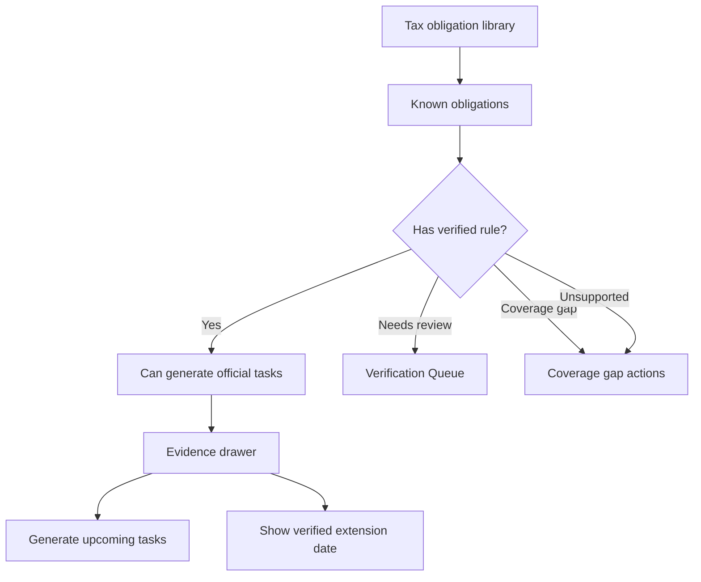

# Tax Obligation Library

## Goal

Maintain a structured federal/state tax obligation library that distinguishes known tax obligations from verified schedulable deadline rules and replaces File In Time-style services with transparent obligations, rules, evidence, recurrence, and extension/date-change handling. Beta must not imply complete 50-state verified coverage; it must expose supported coverage, needs-review states, and coverage gaps.

## User Flow

1. User views coverage matrix.
2. User selects state and tax category.
3. User sees known obligations and their verification statuses.
4. Verified rules can explain deadlines, extensions, and recurrence.
5. Unsupported, needs-review, or coverage-gap obligations can be requested for coverage or handled with an entered deadline.
6. Upcoming official tasks are generated from maintained Verified rules, not manual rollover.

## Flow Diagram

## Pages

- `/coverage`
  - State and tax category matrix.
  - Obligation details.
  - Verification and monitor status.

## API

- `coverage.matrix`
- `coverage.getRule`
- `coverage.requestCoverage`
- `coverage.addEnteredDeadlineFromGap`
- `coverage.dismissGapForNow`

## Data Model

`tax_obligations`

- Jurisdiction.
- Jurisdiction level.
- Agency.
- Tax category.
- Obligation name.
- Applicable entity types.
- Known status.
- Coverage state: `supported | needs_review | coverage_gap | unsupported`.

`tax_rules`

- Verified or unverified rules attached to obligations.
- Filing/payment/extension marker.
- `dueDateRule`: structured JSON defining how to calculate due dates. See Due Date Rule Format in the technical plan.
- Extension or relief date rule when official evidence supports date changes (stored as `extensionRule` within `dueDateRule`).

Due date rule types supported in Beta:

- `fixed`: a specific month and day, with optional weekend/holiday adjustment.
- `quarterly`: per-quarter month and day, with optional `yearOffset` for Q4.
- `extensionRule`: optional field on any rule defining the extended due date.

`relative_to_fiscal_year_end` rules are deferred to P1.

## Profile to Rule Matching

When a filing profile is created or imported, the system matches it against verified tax rules to generate deadline tasks.

1. Determine jurisdictions: `["federal"] + profile.states`.
2. Find matching obligations where `jurisdiction` is in the profile's jurisdictions and `entityTypes` contains the profile's entity type.
3. Find verified rules for each matched obligation.
4. Calculate due dates using `calculateDueDate(rule.dueDateRule, taxYear)`.
5. Create deadline tasks with a composite uniqueness check on `(filingProfileId, taxRuleId, taxYear, quarter?)`.

Multi-state profiles match independently per state. Beta matches on `jurisdiction × entityType` only.

## Task Generation Window

Tasks are generated for the current tax year plus the next tax year. Tasks with due dates before today are generated and marked overdue. Tasks for prior tax years are not generated. On first login after a new tax year, the system generates next-year tasks if missing.

## Competitor Parity Notes

File In Time uses services to define work type, frequency, due dates, extension dates, and task rollover. DueDateHQ maps that useful model to obligations and tax rules, but keeps trust explicit:

- `Verified` rules can generate official tasks, extension dates, and upcoming recurring tasks.
- `Needs review`, `Source changed`, and `Unsupported` obligations remain visible but do not create official tasks.
- `Coverage gap` entries remain visible and support actions to request DueDateHQ verification, add an entered deadline, or ignore/dismiss for now.
- Entered deadlines remain entered deadlines and cannot masquerade as a verified service.
- Official recurring deadlines should be generated by maintained rules. Users should not perform manual rollover for official deadlines.

## Acceptance Criteria

- Library can represent federal and state obligations without promising complete verified 50-state coverage in Beta.
- Known obligations do not imply verified deadlines.
- Verified rules are explicitly linked to official sources.
- Supported sources/states are explicit.
- Coverage gaps are visible and actionable.
- Unsupported obligations can be shown without generating tasks.
- Verified extension and official relief/change dates are shown only when rule evidence supports them.
- Verified recurring rules can create upcoming official tasks without user rollover.
- Product copy explains coverage status clearly.

## Out of Scope

- Complete city and county tax coverage in initial Beta.
- Industry-specific rule automation.
- Guarantee that every known obligation has a verified rule.
- Extension form printing.
- User-created custom services that appear as verified official rules.
- Manual rollover for official recurring deadlines.
