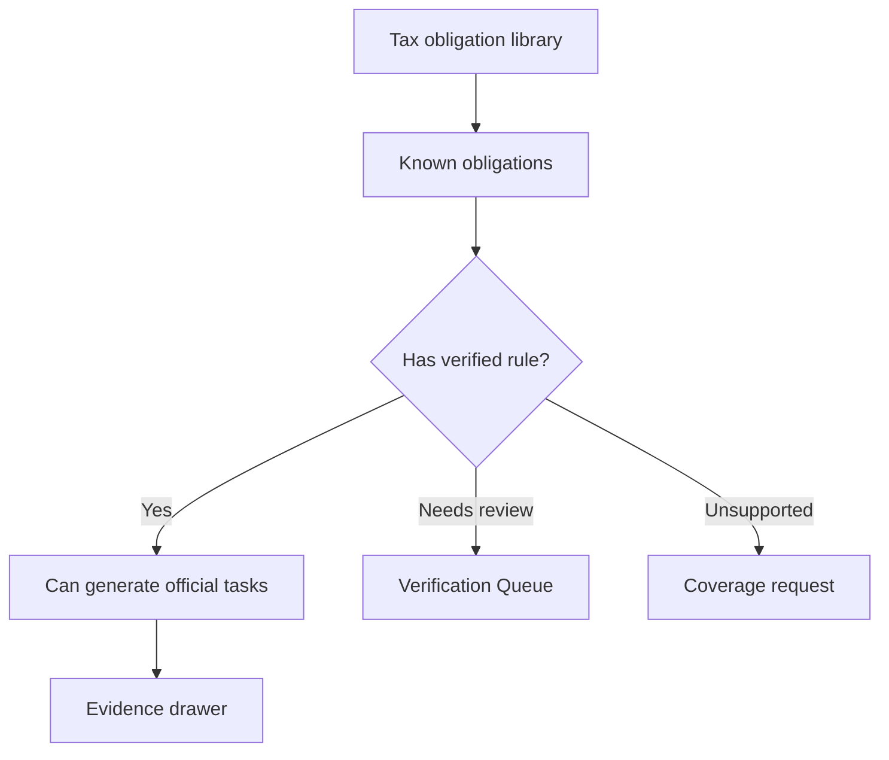

# Tax Obligation Library

## Goal

Maintain a structured 50-state tax obligation library that distinguishes known tax obligations from verified schedulable deadline rules.

## User Flow

1. User views coverage matrix.
2. User selects state and tax category.
3. User sees known obligations and their verification statuses.
4. Verified rules can explain deadlines.
5. Unsupported or needs-review obligations can be requested for coverage.

## Flow Diagram

## Pages

- `/coverage`
  - State and tax category matrix.
  - Obligation details.
  - Verification and monitor status.

## API

- `coverage.matrix`
- `coverage.getRule`
- `coverage.requestCoverage`

## Data Model

`tax_obligations`

- Jurisdiction.
- Jurisdiction level.
- Agency.
- Tax category.
- Obligation name.
- Applicable entity types.
- Known status.

`tax_rules`

- Verified or unverified rules attached to obligations.

## Acceptance Criteria

- Library can represent federal and 50-state obligations.
- Known obligations do not imply verified deadlines.
- Verified rules are explicitly linked to official sources.
- Unsupported obligations can be shown without generating tasks.
- Product copy explains coverage status clearly.

## Out of Scope

- Complete city and county tax coverage in initial Beta.
- Industry-specific rule automation.
- Guarantee that every known obligation has a verified rule.
