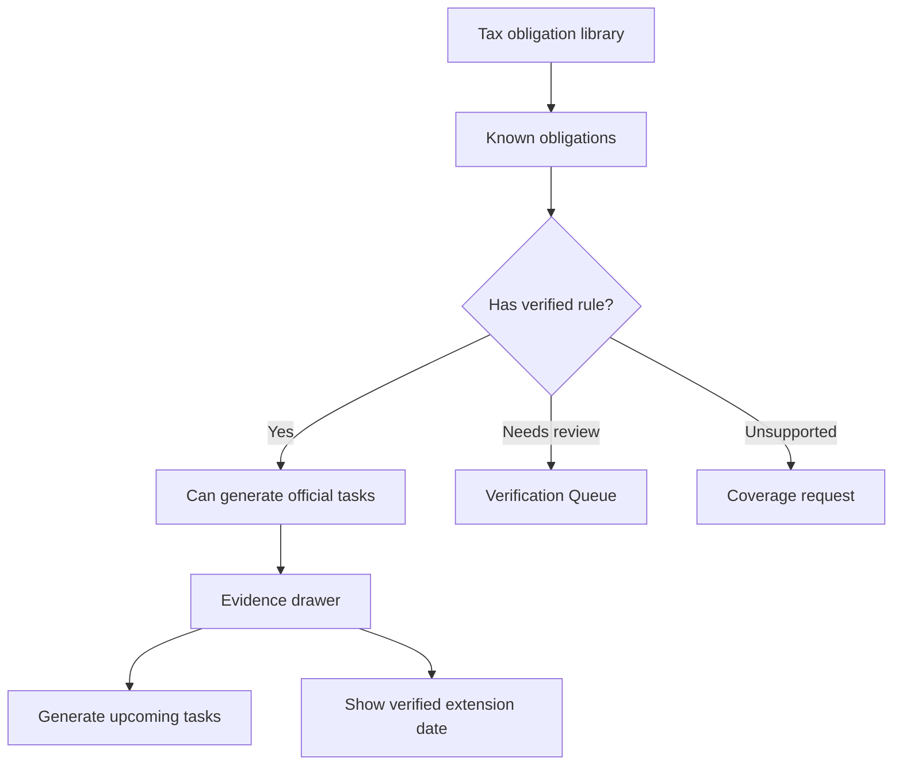

# Tax Obligation Library

## Goal

Maintain a structured 50-state tax obligation library that distinguishes known tax obligations from verified schedulable deadline rules and replaces File In Time-style services with transparent obligations, rules, evidence, recurrence, and extension handling.

## User Flow

1. User views coverage matrix.
2. User selects state and tax category.
3. User sees known obligations and their verification statuses.
4. Verified rules can explain deadlines, extensions, and recurrence.
5. Unsupported or needs-review obligations can be requested for coverage.
6. Upcoming official tasks are generated from maintained Verified rules, not manual rollover.

## Flow Diagram

## Pages

- `/coverage`
  - State and tax category matrix.
  - Obligation details.
  - Verification and monitor status.

## API

- `coverage.matrix`
- `coverage.getRule`
- `coverage.requestCoverage`

## Data Model

`tax_obligations`

- Jurisdiction.
- Jurisdiction level.
- Agency.
- Tax category.
- Obligation name.
- Applicable entity types.
- Known status.

`tax_rules`

- Verified or unverified rules attached to obligations.
- Filing/payment/extension marker.
- Recurrence pattern when the rule is recurring.
- Upcoming generation horizon.
- Extension due date rule when official evidence supports extension handling.

## Competitor Parity Notes

File In Time uses services to define work type, frequency, due dates, extension dates, and task rollover. DueDateHQ maps that useful model to obligations and tax rules, but keeps trust explicit:

- `Verified` rules can generate official tasks, extension dates, and upcoming recurring tasks.
- `Needs review`, `Source changed`, and `Unsupported` obligations remain visible but do not create official tasks.
- User-provided custom deadlines remain user-provided and cannot masquerade as a verified service.
- Official recurring deadlines should be generated by maintained rules. Users should not perform manual rollover for official deadlines.

## Acceptance Criteria

- Library can represent federal and 50-state obligations.
- Known obligations do not imply verified deadlines.
- Verified rules are explicitly linked to official sources.
- Unsupported obligations can be shown without generating tasks.
- Verified extension dates are shown only when the rule evidence supports them.
- Verified recurring rules can create upcoming official tasks without user rollover.
- Product copy explains coverage status clearly.

## Out of Scope

- Complete city and county tax coverage in initial Beta.
- Industry-specific rule automation.
- Guarantee that every known obligation has a verified rule.
- Extension form printing.
- User-created custom services that appear as verified official rules.
- Manual rollover for official recurring deadlines.
