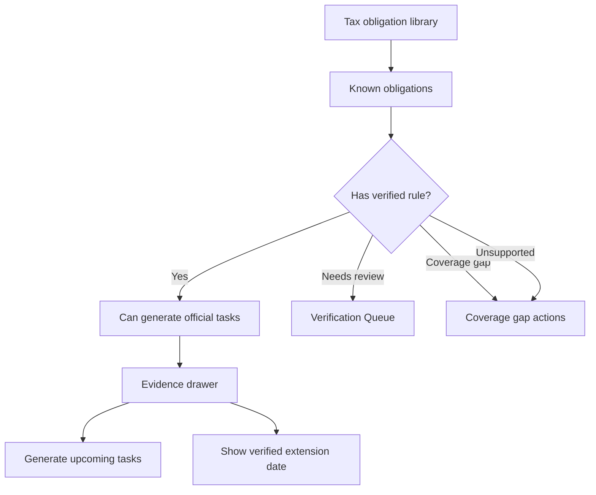

# Tax Obligation Library

## Goal

维护结构化的联邦/州税务义务库，区分已知税务义务和已核验可安排的 deadline rules，并用透明 obligations、rules、evidence、recurrence 和 extension/date-change handling 替代 File In Time-style services。Beta 不能暗示完整 50 州已核验覆盖；必须展示 supported coverage、needs-review states 和 coverage gaps。

## User Flow

1. 用户查看 coverage matrix。
2. 用户选择州和税种分类。
3. 用户看到已知义务及其核验状态。
4. Verified rules 可以解释截止日期、extensions 和 recurrence。
5. Unsupported、Needs review 或 coverage-gap 义务可以请求覆盖，或通过 entered deadline 处理。
6. Upcoming official tasks 从维护过的 Verified rules 生成，而不是依赖 manual rollover。

## Flow Diagram

## Pages

- `/coverage`
  - 州和税种分类矩阵。
  - 义务详情。
  - 核验和监听状态。

## API

- `coverage.matrix`
- `coverage.getRule`
- `coverage.requestCoverage`
- `coverage.addEnteredDeadlineFromGap`
- `coverage.dismissGapForNow`

## Data Model

`tax_obligations`

- Jurisdiction。
- Jurisdiction level。
- Agency。
- Tax category。
- Obligation name。
- Applicable entity types。
- Known status。
- Coverage state：`supported | needs_review | coverage_gap | unsupported`。

`tax_rules`

- 绑定到 obligations 的已核验或未核验规则。
- Filing/payment/extension marker。
- `dueDateRule`：定义如何计算到期日的结构化 JSON。详见技术方案中的 Due Date Rule Format。
- 官方证据支持 date changes 时的 extension 或 relief date rule（在 `dueDateRule` 中以 `extensionRule` 存储）。

Beta 支持的到期日规则类型：

- `fixed`：指定月份和日期，可选周末/节假日调整。
- `quarterly`：按季度的月份和日期，可选 Q4 `yearOffset`。
- `extensionRule`：任何规则上的可选字段，定义延期后的到期日。

`relative_to_fiscal_year_end` 规则推迟到 P1。

## Profile to Rule Matching

当 filing profile 创建或导入时，系统将其与 verified tax rules 匹配以生成 deadline tasks。

1. 确定管辖区：`["federal"] + profile.states`。
2. 查找匹配的 obligations，其中 `jurisdiction` 在 profile 的管辖区列表中，且 `entityTypes` 包含 profile 的 entity type。
3. 为每个匹配的 obligation 查找 verified rules。
4. 使用 `calculateDueDate(rule.dueDateRule, taxYear)` 计算到期日。
5. 使用 `(filingProfileId, taxRuleId, taxYear, quarter?)` 复合唯一性检查创建 deadline tasks。

多州 profiles 按州独立匹配。Beta 仅按 `jurisdiction × entityType` 匹配。

## Task Generation Window

Tasks 为当前税年加下一税年生成。到期日在今天之前的 tasks 生成后标记为逾期。不生成更早税年的 tasks。新税年首次登录时，系统自动生成缺失的下一年 tasks。

## Competitor Parity Notes

File In Time 使用 services 定义 work type、frequency、due dates、extension dates 和 task rollover。DueDateHQ 将这个有价值模型映射为 obligations 和 tax rules，但保持信任显式：

- `Verified` rules 可以生成 official tasks、extension dates 和 upcoming recurring tasks。
- `Needs review`、`Source changed`、`Unsupported` obligations 保持可见，但不创建 official tasks。
- `Coverage gap` entries 保持可见，并支持 request DueDateHQ verification、add entered deadline、ignore/dismiss for now。
- Entered deadlines 保持 entered deadline，不能伪装成 verified service。
- Official recurring deadlines 应由维护过的 rules 生成。用户不应该为 official deadlines 执行 manual rollover。

## Acceptance Criteria

- Library 可以表示 federal 和 state obligations，但 Beta 不承诺完整 50 州已核验覆盖。
- Known obligations 不等于 verified deadlines。
- Verified rules 明确链接官方来源。
- Supported sources/states 明确展示。
- Coverage gaps 可见且可操作。
- Unsupported obligations 可以展示但不生成任务。
- Verified extension 和 official relief/change dates 只有在 rule evidence 支持时展示。
- Verified recurring rules 可以在不需要 user rollover 的情况下创建 upcoming official tasks。
- 产品文案清楚解释覆盖状态。

## Out of Scope

- Beta 初期完整城市和县级税务覆盖。
- 行业特定规则自动化。
- 保证每个 known obligation 都有 verified rule。
- Extension form printing。
- 显示为 verified official rules 的用户自定义 services。
- Official recurring deadlines 的 manual rollover。
