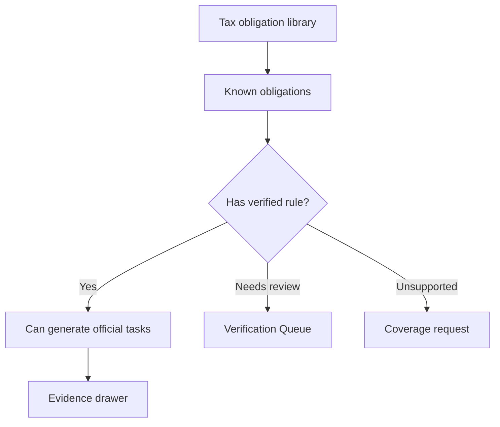

# Tax Obligation Library

## Goal

维护结构化的 50 州税务义务库，区分已知税务义务和已核验可安排的 deadline rules。

## User Flow

1. 用户查看 coverage matrix。
2. 用户选择州和税种分类。
3. 用户看到已知义务及其核验状态。
4. Verified rules 可以解释截止日期。
5. Unsupported 或 Needs review 义务可以请求覆盖。

## Flow Diagram

## Pages

- `/coverage`
  - 州和税种分类矩阵。
  - 义务详情。
  - 核验和监听状态。

## API

- `coverage.matrix`
- `coverage.getRule`
- `coverage.requestCoverage`

## Data Model

`tax_obligations`

- Jurisdiction。
- Jurisdiction level。
- Agency。
- Tax category。
- Obligation name。
- Applicable entity types。
- Known status。

`tax_rules`

- 绑定到 obligations 的已核验或未核验规则。

## Acceptance Criteria

- Library 可以表示 federal 和 50-state obligations。
- Known obligations 不等于 verified deadlines。
- Verified rules 明确链接官方来源。
- Unsupported obligations 可以展示但不生成任务。
- 产品文案清楚解释覆盖状态。

## Out of Scope

- Beta 初期完整城市和县级税务覆盖。
- 行业特定规则自动化。
- 保证每个 known obligation 都有 verified rule。
