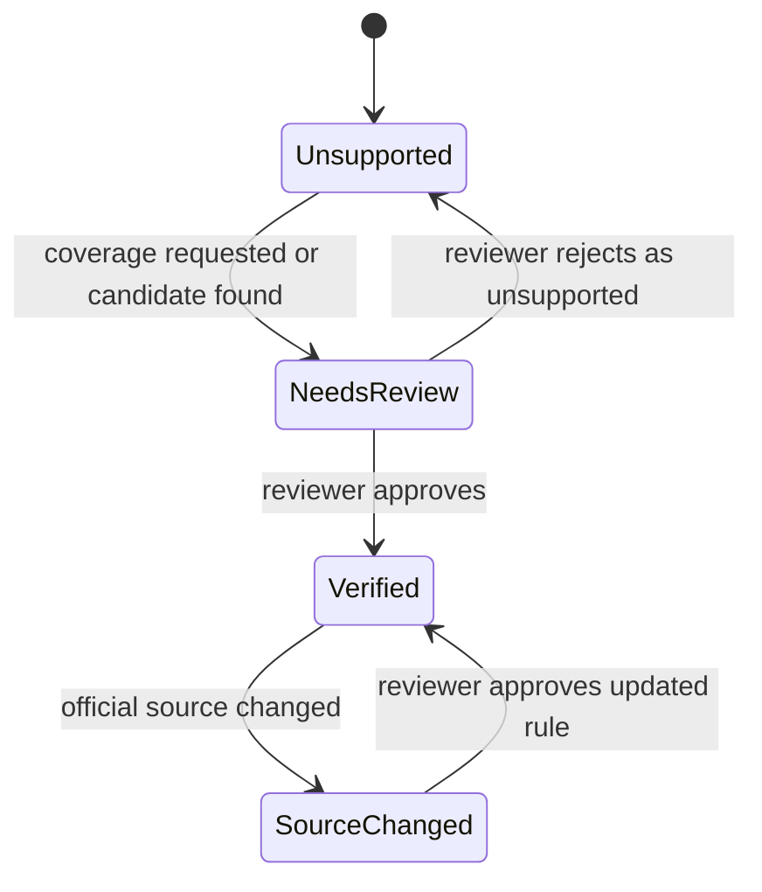

# Tax Rule Verification

## Goal

Define the verification status system that controls whether a tax rule can generate official deadline tasks and how users understand rule trust.

This is a core DueDateHQ improvement over File In Time: task dates are not trusted because they exist in a bundled service table. They are trusted only when the official source, calculation, reviewer action, date event history, and rule version are visible.

## User Flow

1. User sees a deadline or coverage entry.
2. User sees verification status.
3. User opens evidence.
4. User understands source, rule, calculation, and last verification.
5. Internal reviewer can verify, reject, or re-verify a rule.

## Flow Diagram

## Pages

- Dashboard evidence drawer.
- `/coverage` rule detail.
- `/verification` internal queue.

## API

- `tasks.getEvidence`
- `verificationQueue.list`
- `verificationQueue.approveCandidate`
- `verificationQueue.rejectCandidate`
- `verificationQueue.markReviewed`

## Data Model

`tax_rules.verificationStatus`

- `verified`
- `needs_review`
- `source_changed`
- `unsupported`

Evidence fields:

- Source name.
- Source URL.
- Rule summary.
- Due date rule.
- Current due date.
- Original due date.
- Optional firm target date, clearly labeled as firm planning metadata.
- Last verified at.
- Source last checked at.
- Source last changed at.
- Current version.
- Previous version.
- Verification notes.
- Date event history: official extension, official relief/change, user-provided adjustment, firm target change.

Manual deadlines use `deadline_tasks.sourceType = user_provided` and are not tax rule verification statuses.

Unsupported, needs-review, source-changed, manual, and user-provided items must remain transparent to the user, but they must not be presented as verified official deadlines.

Extension handling is separate from verification status and task work-progress status. Extension is a derived date state from `deadline_date_events` with `official_extension` type. A task's work-progress status (`not_started`, `in_progress`, `waiting_on_client`, `done`) is independent of whether its due date has been extended.

Firm target dates are not part of official rule verification. They can appear in Evidence for planning context, but must never be confused with official due dates.

## Status Rules

`Verified` requires:

- Official source exists.
- Rule applies to jurisdiction, entity, tax category, and tax year context.
- Calculation rule is stored.
- Review is completed.
- Source has not changed since verification.

`Needs review` applies when:

- Candidate rule exists but is not reviewed.
- Source is unclear.
- User reports issue.
- Rule has expired review window.

`Source changed` applies when:

- Previously verified source content changes.
- Source URL changes, redirects, or fails.
- New official notice appears.

`Unsupported` applies when:

- Obligation is known but DueDateHQ cannot schedule it safely.

## Acceptance Criteria

- Only `verified` rules generate official deadline tasks.
- `needs_review` rules do not generate official tasks.
- `source_changed` rules do not generate new official tasks.
- `unsupported` obligations only appear in coverage.
- Evidence drawer can explain status and source lineage.
- Evidence drawer shows current due date, original due date, optional firm target date, date event history, rule versioning, and source last checked/changed timestamps for official tasks.
- Manual or user-provided deadlines are clearly marked outside the verification status taxonomy.
- Official extensions and relief/change updates are recorded as date events rather than silent overwrites.

## Out of Scope

- Fully automated legal/tax interpretation.
- User override that labels a system rule as verified.
