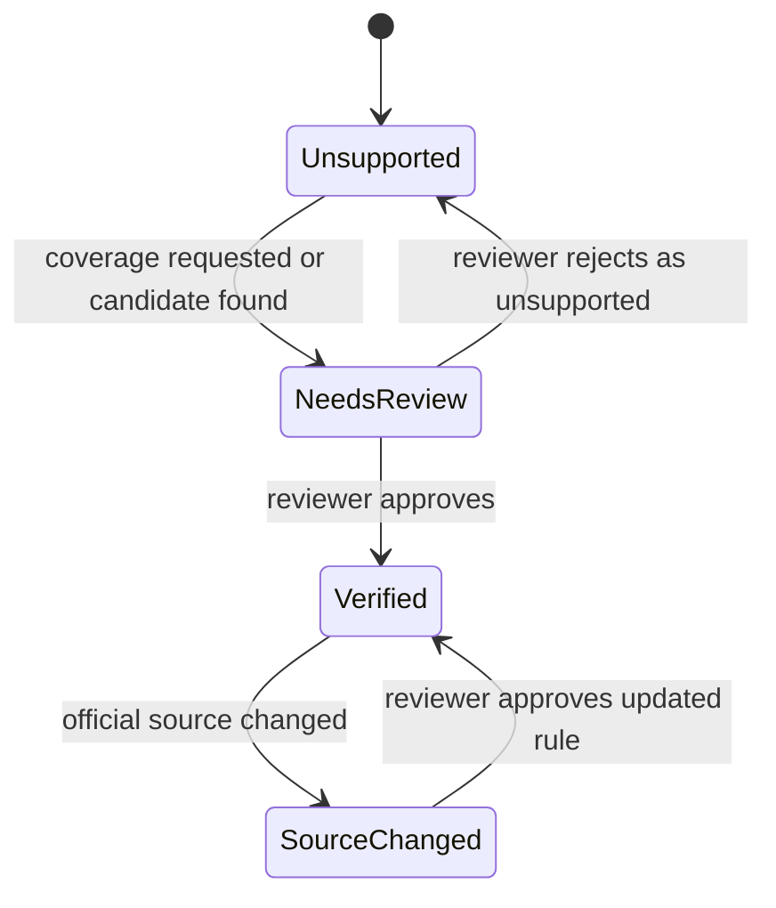

# Tax Rule Verification

## Goal

定义税务规则核验状态系统，控制某条税务规则是否能生成官方 deadline task，并帮助用户理解规则可信度。

这是 DueDateHQ 相比 File In Time 的核心改进：任务日期不是因为存在于 bundled service table 中就可信，而是只有在官方来源、计算逻辑、审核动作、date event history 和规则版本都可见时才可信。

## User Flow

1. 用户看到一个 deadline 或 coverage entry。
2. 用户看到 verification status。
3. 用户打开 evidence。
4. 用户理解来源、规则、计算逻辑和最后核验时间。
5. 内部审核员可以 verify、reject 或 re-verify 规则。

## Flow Diagram

## Pages

- Dashboard evidence drawer。
- `/coverage` rule detail。
- `/verification` internal queue。

## API

- `tasks.getEvidence`
- `verificationQueue.list`
- `verificationQueue.approveCandidate`
- `verificationQueue.rejectCandidate`
- `verificationQueue.markReviewed`

## Data Model

`tax_rules.verificationStatus`

- `verified`
- `needs_review`
- `source_changed`
- `unsupported`

Evidence fields：

- Source name。
- Source URL。
- Rule summary。
- Due date rule。
- Current due date。
- Original due date。
- 可选 firm target date，并明确标记为 firm planning metadata。
- Last verified at。
- Source last checked at。
- Source last changed at。
- Current version。
- Previous version。
- Verification notes。
- Date event history：official extension、official relief/change、user-provided adjustment、firm target change。

Manual deadlines 使用 `deadline_tasks.sourceType = user_provided`，不是 tax rule verification status。

Unsupported、needs-review、source-changed、manual 和 user-provided items 必须对用户透明，但不能被呈现为 verified official deadlines。

Firm target dates 不属于 official rule verification。它们可以出现在 Evidence 中作为规划上下文，但绝不能和 official due dates 混淆。

## Status Rules

`Verified` 要求：

- 存在官方来源。
- 规则适用于对应 jurisdiction、entity、tax category 和 tax year context。
- 保存了计算规则。
- Review 已完成。
- 来源自核验后未变化。

`Needs review` 适用于：

- 存在候选规则但未 review。
- 来源不清楚。
- 用户报告问题。
- 规则超过复核窗口。

`Source changed` 适用于：

- 之前已核验来源内容发生变化。
- 来源 URL 变化、重定向或失败。
- 出现新的官方通知。

`Unsupported` 适用于：

- 义务已知，但 DueDateHQ 无法安全安排。

## Acceptance Criteria

- 只有 `verified` rules 生成官方 deadline tasks。
- `needs_review` rules 不生成官方任务。
- `source_changed` rules 不生成新的官方任务。
- `unsupported` obligations 只显示在 coverage。
- Evidence drawer 可以解释状态和来源链路。
- Evidence drawer 为 official tasks 展示 current due date、original due date、可选 firm target date、date event history、rule versioning 和 source last checked/changed timestamps。
- Manual 或 user-provided deadlines 必须在 verification status taxonomy 之外明确标记。
- Official extensions 和 relief/change updates 记录为 date events，而不是静默覆盖。

## Out of Scope

- 完全自动化法律/税务解释。
- 允许用户把系统规则覆盖标记为 verified。
